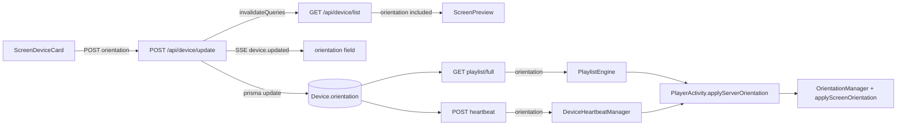

# Impact Report: Device Orientation Not Applying to TV / Live Preview

**Date:** 2026-07-22  
**Scope:** Device Engine V2 orientation (Dashboard → API → Player)  
**Risk class:** Process / runtime behavior change (signage display orientation)

## Problem

Dashboard Orientation dropdown can show Vertical and save successfully, but the physical TV stays landscape and the live preview snaps back to landscape.

## Root cause

| # | Break | Severity |
|---|-------|----------|
| A | Android player never consumes server `orientation` from `playlist/full` or heartbeat; only local SharedPreferences | **Primary (TV)** |
| B | `GET /api/device/list` omits `orientation` → React Query refetch resets UI/preview to `horizontal` | **Primary (preview)** |
| C | SSE `device.updated` references undefined `screenId` / `screenOrientation` → broadcast silently fails | Secondary |

Persistence on `Device.orientation` via `POST /api/device/update` already works. Player-facing DTOs already include `orientation`; the client ignores them.

## What could break

1. **TV / tablet display rotation** — devices that previously ignored server orientation will start rotating when Dashboard changes it (intended). Local on-device orientation dialog still works; server value wins on next poll if different.
2. **Dashboard device list consumers** — new `orientation` field on list DTO (additive; should not break typed clients that ignore unknown fields).
3. **SSE admin listeners** — payload shape corrected to emit real `orientation` (and drop undefined `screenId`).

## Why

Server already returns orientation on playlist/full and heartbeat, but Android parsers drop it. List DTO omission undoes optimistic Dashboard state after invalidate.

## Impact scope

- Device list API response shape (additive field)
- SSE `device.updated` payload
- Android PlaylistEngine / Heartbeat / PlayerActivity / OrientationManager
- Screen device card live preview (via corrected list data)

Out of scope / unchanged: Prisma schema, playlist assignment, media `displayOrientation`, legacy `Screen` model sync.

## Smallest safe patch

1. **Core:** Add `orientation` to `/api/device/list` formatter; fix SSE to use `updatedDevice.orientation`.
2. **Android:** Parse `orientation` from playlist/full + heartbeat; map `vertical`→`PORTRAIT`, `horizontal`→`LANDSCAPE`; persist via `OrientationManager` and call existing `applyScreenOrientation`.

No migration. No new endpoints. Poll intervals unchanged (≤10s playlist / ≤30s heartbeat).

## No-parallel-stack proof

Uses existing Device.orientation column, existing update/list/playlist/full/heartbeat routes, and existing OrientationManager + applyScreenOrientation. No second orientation store or alternate player config channel.

## Implementation (applied)

| File | Change |
|------|--------|
| `src/routes/deviceEngine.js` | List DTO includes `orientation`; SSE uses `updatedDevice.orientation` |
| `src/lib/deviceProjection.js` | Projection includes `orientation` |
| `OrientationManager.kt` | `modeFromServer` / `applyServerOrientation` |
| `PlaylistEngine.kt` | Parse + callback for top-level `orientation` |
| `DeviceHeartbeatManager.kt` | Parse + callback for heartbeat `orientation` |
| `PlayerActivity.kt` | Wire callbacks → apply orientation; TV imageView rotation |
| `ScreenDeviceCard.tsx` | Optimistic cache patch so preview does not flicker |

## Data flow (fixed)

## Verification

1. Set Orientation → Vertical on a Screen device card → preview stays portrait after refresh.
2. Confirm `GET /api/device/list` device entry has `"orientation":"vertical"`.
3. Within ~10s (playlist poll) or ~30s (heartbeat), TV applies portrait media rotation without restart.
4. Switch back to Horizontal → player and preview return to landscape.
5. Kill/relaunch player app → orientation matches server after first poll.
