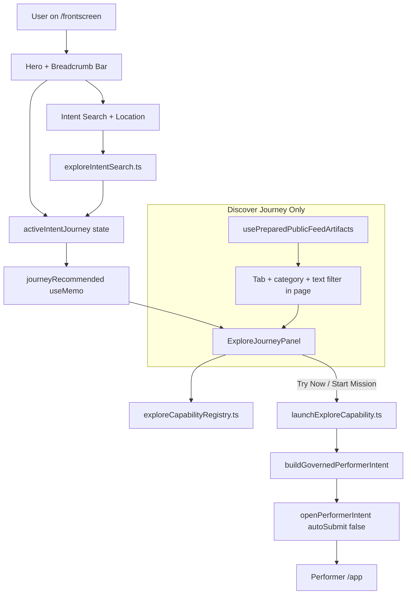

# Explore Phase 2 — Intent Cluster Resolver & Unified Results

**Date:** 2026-06-07  
**Scope:** Additive recommendation pipeline only. No Explore → Performer boundary changes.

---

## 1. Current Architecture Map

### Key files today

| Layer | File | Role |
|-------|------|------|
| Page | `pages/public/ExploreDiscoveryPage.tsx` | Journey state, search, marketplace filter, wires panel |
| UI | `components/explore/ExploreIntentBreadcrumbBar.tsx` | Sticky journey selector |
| UI | `components/explore/ExploreJourneyPanel.tsx` | Recommended → Capabilities → Templates → Marketplace → Start Mission |
| UI | `components/explore/ExploreCapabilityCard.tsx` | Capability presentation |
| UI | `components/explore/ExploreResultCard.tsx` | Marketplace card (Link only) |
| Registry | `lib/explore/exploreCapabilityRegistry.ts` | Single source of capability definitions |
| Search | `lib/explore/exploreIntentSearch.ts` | Goal patterns + keyword scoring → capabilities |
| Journey | `lib/explore/exploreJourney.ts` | Journey metadata, `inferJourneyFromSearch` |
| Handoff | `lib/explore/launchExploreCapability.ts` | **Only** execution bridge → `openPerformerIntent` |
| Types | `lib/explore/exploreTypes.ts` | `ExploreTab`, `ExploreIntentJourney` |

### What is NOT touched by Explore today

- Mission planning APIs (`orchestra/start`, `missions/plan`)
- Draft/store/campaign creation endpoints
- Console mission state machine
- Workflow orchestration

Home (`/`) uses `PublicFeed.tsx` + feed artifacts — separate route, no shared page component with Explore.

---

## 2. Files to Create

| File | Purpose |
|------|---------|
| `src/lib/explore/exploreIntentClusterRegistry.ts` | Normalized intent cluster definitions |
| `src/lib/explore/exploreIntentResolver.ts` | Query → clusters + confidence (deterministic scoring) |
| `src/lib/explore/exploreTemplateRegistry.ts` | Template recommendations (route-only, no execution) |
| `src/lib/explore/exploreMarketplaceMatcher.ts` | Artifact → cluster matching |
| `src/lib/explore/exploreUnifiedResultBuilder.ts` | Single builder: capabilities, marketplace, templates, performerActions |
| `src/lib/explore/exploreTelemetry.ts` | Fire-and-forget explore event instrumentation |
| `src/lib/explore/exploreUnifiedResultBuilder.test.ts` | Phase 2 acceptance tests |

---

## 3. Files to Modify

| File | Change | Risk |
|------|--------|------|
| `exploreCapabilityRegistry.ts` | Add `intentClusters: string[]` to type + each entry | Low — additive field |
| `exploreIntentSearch.ts` | Delegate cluster resolution; keep exported API | Low — backward compatible |
| `exploreTypes.ts` | Add `ExploreTemplate`, `ExploreUnifiedResults` types | Low |
| `ExploreDiscoveryPage.tsx` | Replace `journeyRecommended` with unified builder; wire telemetry | Medium — recommendation source only |
| `ExploreJourneyPanel.tsx` | Accept `templates` + `performerActions` props; template click handler | Low — layout unchanged |
| `ExploreResultCard.tsx` | Optional `onClick` telemetry callback | Low |
| `launchExploreCapability.ts` | Add `explore_performer_started` telemetry | Low |

**Not modified:** Home feed, Performer console, `openPerformerIntent.ts`, governance helpers.

---

## 4. Boundary Risks — Explore vs Performer

### Performer Boundary Protection Checklist

| Risk | Current state | Phase 2 guard |
|------|---------------|---------------|
| Creates missions | Explore never calls mission APIs | **No new API calls** |
| Creates drafts/stores/campaigns | Only via Performer after handoff | Templates route through `launchExploreCapability` only |
| Starts workflows automatically | `autoSubmit: false` in `launchExploreCapability` | **Unchanged**; templates use same path |
| Generates plans | Performer intake only | Resolver is keyword/registry only — no LLM |
| Manages mission state | Console only | Explore state is UI-only (`activeIntentJourney`, search) |
| Replaces Performer UI | Explore navigates to `/app` | **No console components in Explore** |

### Allowed Explore actions (unchanged)

- `discover_filter` — UI tab/category/search filter only
- `navigate` — href routing (e.g. Content Studio)
- `openPerformerIntent(...)` via `launchExploreCapability` with governance + `autoSubmit: false`

### Highest-risk mistake to avoid

Putting unified result "launch" logic that calls mission APIs, `autoSubmit: true`, or intake submission directly from Explore.  
**Mitigation:** All template/performer action clicks go through existing `launchExploreCapability` / `handleCapabilityAction`.

---

## 5. Safe Implementation Order

1. **Cluster registry** — pure data, no consumers yet  
2. **Intent resolver** — unit tests for query → clusters  
3. **Capability `intentClusters`** — extend registry entries  
4. **Template registry** — linked capability IDs for routing  
5. **Marketplace matcher** — artifact scoring by cluster  
6. **Unified result builder** — compose all sources; full tests  
7. **Explore telemetry** — isolated module, fire-and-forget  
8. **Wire page + panel** — swap recommendation generation only  
9. **Regression tests** — existing `exploreIntentSearch.test.ts` still passes  

Each step is independently testable before UI wiring.

---

## 6. Test Plan

### Unit tests (`exploreUnifiedResultBuilder.test.ts`)

| Query | Expected capabilities (titles) | Expected templates | Expected marketplace signal |
|-------|-------------------------------|--------------------|----------------------------|
| `need more customers` | Launch Campaign, Create Video, Create Loyalty Program | Restaurant Growth Campaign (optional) | — |
| `open a bakery` | Create Store | Bakery Launch Pack | food_discovery artifacts prioritized |
| `book a service` | Services (discover) | — | service_discovery artifacts prioritized |

### Boundary tests

- Mock `launchExploreCapability` — verify `autoSubmit: false` on performer routes
- Verify unified builder exports no functions that import mission/orchestra APIs

### Regression

- `exploreIntentSearch.test.ts` — still passes (API unchanged)
- Home route unchanged (no imports from explore unified builder)
- Journey layout unchanged (same section order in `ExploreJourneyPanel`)

### Manual QA

1. `/frontscreen` — select Grow, search "need more customers" → Recommended updates, Try Now opens Performer (not auto-run)
2. Select Create, search "open a bakery" → Create Store + Bakery Launch Pack visible
3. Select Find, search "book a service" → service marketplace + Services capability
4. Home `/` — unchanged feed behavior

---

## Audit Verdict: **PASS — safe to implement**

Phase 2 is additive, registry-driven, and preserves the single handoff point (`launchExploreCapability`). No business logic or Performer execution paths change.
