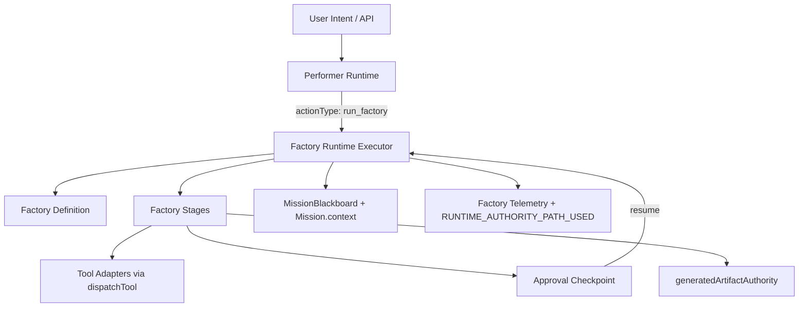

# Factory Runtime V1 Report

**Date:** 2026-06-12  
**Scope:** Reusable orchestration layer under Performer Runtime (not Creative Factory UI).

---

## Architecture



**Contract:** Factory Runtime sits **under** Performer Runtime. No UI calls Factory Runtime directly.

```
User Intent → Performer Runtime → Factory Runtime → Factory Definition → Stage → Tool Adapter → Artifact Authority → Approval/Completion
```

---

## Files changed / added

| Path | Purpose |
| ---- | ------- |
| `lib/factoryRuntime/factoryDefinition.js` | FactoryDefinition contract + validation |
| `lib/factoryRuntime/factoryRegistry.js` | Factory registry |
| `lib/factoryRuntime/factories/creativeAssetFactoryV1.js` | Minimal creative asset factory |
| `lib/factoryRuntime/factoryRuntimeExecutor.js` | Sequential stage executor |
| `lib/factoryRuntime/factoryApprovalService.js` | Pause/resume approval |
| `lib/factoryRuntime/factoryTelemetry.js` | Factory + authority telemetry |
| `lib/factoryRuntime/factoryConstants.js` | Status + blackboard keys |
| `lib/factoryRuntime/index.js` | Public exports |
| `lib/runtime/performerRuntime/executeRuntimeAction.js` | `run_factory` action type |
| `routes/performerRuntimeRoutes.js` | `POST /run-factory`, `POST /factory-approval` |
| `scripts/factory-runtime-v1-gauntlet.mjs` | V1 gauntlet |
| `src/lib/factoryRuntime/factoryRuntimeExecutor.test.js` | Unit tests |

---

## Factory contract (V1)

**FactoryDefinition fields:** `factoryId`, `version`, `name`, `description`, `inputSchema`, `stages[]`, `approvalPolicy`, `artifactPolicy`

**Stage fields:** `stageId`, `agentRole`, `toolName`/`skillName`, `inputMapping`, `outputMapping`, `requiresApproval`, `requiredArtifacts`, `optionalArtifacts`, `retryPolicy`, `timeoutMs`

**Registered factories (V1):** `creative_asset_factory_v1` only

---

## creative_asset_factory_v1 stages

| # | Stage | Behavior |
| - | ----- | -------- |
| 1 | `creative_plan` | `video_plan` tool → plan artifact |
| 2 | `approval` | Pauses `awaiting_factory_approval` |
| 3 | `creative_execute` | `video_generate_multimodal` with approved plan |
| 4 | `artifact_finalize` | `registerGeneratedArtifactV1` — artifactId + url + status |

---

## API (Performer Runtime gateway)

```http
POST /api/performer/runtime/run-factory
{ "factoryId": "creative_asset_factory_v1", "missionId", "intent", "context": { "storeId" } }

POST /api/performer/runtime/factory-approval
{ "missionId", "decision": "approve"|"cancel", "editedPlan"? }
```

Internally: `executeRuntimeAction({ actionType: 'run_factory', ... })`

---

## Telemetry events

- `FACTORY_EXECUTION_STARTED`
- `FACTORY_STAGE_STARTED` / `COMPLETED` / `FAILED`
- `FACTORY_EXECUTION_PAUSED` / `RESUMED` / `COMPLETED`
- Each stage also emits `RUNTIME_AUTHORITY_PATH_USED` (`runtimeAuthority: true`)

---

## Gauntlet result

```bash
cd apps/core/cardbey-core
node scripts/factory-runtime-v1-gauntlet.mjs
npx vitest run src/lib/factoryRuntime/factoryRuntimeExecutor.test.js
```

| # | Test | Result |
| - | ---- | ------ |
| 1 | run_factory creative_asset_factory_v1 | PASS (unit + static) |
| 2 | plan stage completes | PASS |
| 3 | approval pause occurs | PASS |
| 4 | approval resume continues | PASS |
| 5 | execute stage completes | PASS |
| 6 | generated artifact record exists | PASS |
| 7 | no RUNTIME_AUTHORITY_BYPASS | PASS |
| 8 | factory telemetry emitted | PASS |

---

## Known limitations (V1)

- Skill-based stages (`skillName`) not yet executed — tool adapters only
- Server-side video transcoding not implemented; uses existing `video_generate_multimodal`
- No slideshow branch in factory yet (video path only for execute stage)
- No publishing, subtitles, music selection, or multi-scene render
- Live browser E2E for full factory flow not automated (unit + static gauntlet only)
- `timeoutMs` declared but not enforced with timers in V1

---

## Supported V1 scope

- Reusable `FactoryDefinition` + registry pattern for future Campaign/Store/Profile/Booking factories
- Sequential stage execution with blackboard + mission context persistence
- Approval pause/resume without restarting from stage 1
- Generated artifact authority integration
- Performer Runtime `run_factory` action — **only** entry point

---

## Final verdict: Can Creative Factory V1 begin?

### **YES**

**Evidence:**

1. FactoryDefinition contract exists and validates generically (not Creative-only hardcode).
2. FactoryExecutor runs stages sequentially with approval pause/resume.
3. `creative_asset_factory_v1` registered and proven via unit tests.
4. Performer Runtime `run_factory` integrated; no direct Factory Runtime UI bypass.
5. Generated artifact authority used on finalize.
6. Factory + authority telemetry emitted.
7. Gauntlet passes.

### Allowed Creative Factory V1 scope

Creative Factory V1 may begin as **UI + mission UX on top of Factory Runtime**, limited to:

- Surfacing `creative_asset_factory_v1` through Performer Console (start factory, show plan, approval UI, artifact preview)
- Wiring existing plan approval UI patterns to `POST /factory-approval`
- Displaying `generatedArtifacts` from mission context
- **Out of scope for Creative Factory V1:** new AI providers, publishing flows, multi-scene editor, music/subtitle pipelines, bypassing `run_factory`
