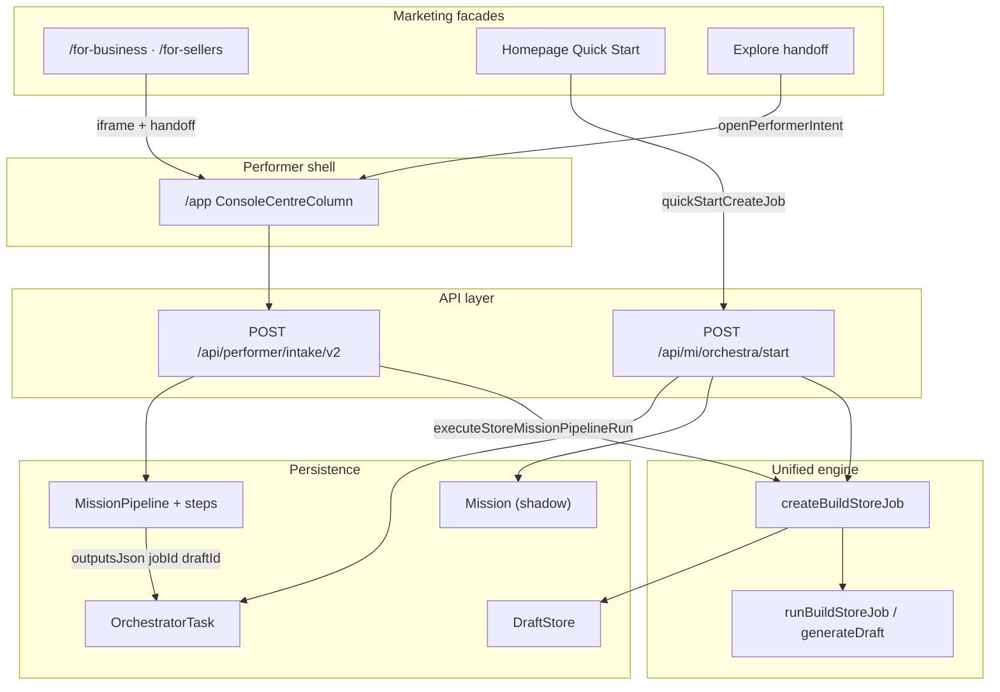

# Impact Report — Single Runway Convergence Patch

**Date:** 2026-06-12  
**Status:** PROPOSED — no code changes in this deliverable  
**Objective:** Define the smallest safe patch to remove runway drift while preserving all working behavior.

---

## Executive Summary

Cardbey’s **store build engine is already unified** (`createBuildStoreJob` → `runBuildStoreJob` in `orchestraBuildStore.js`). Drift is in **wrappers, records, provenance, and progress UI**:

| Layer | State |
|-------|--------|
| Build engine | Unified |
| Mission lifecycle | Split (`MissionPipeline` vs orchestra-only `OrchestratorTask` + shadow `Mission`) |
| Provenance | Mechanism labels only (`intake_v2_autosubmit`), not entry surfaces |
| Progress UI | Timer-driven on `/for-business` / `/for-sellers` |

**Recommended patch (smallest safe):**

1. **Patch A — Mission Provenance Contract** (additive, all entry doors, no behavior change).
2. **Patch B — Real Progress UI** (marketing page only; use existing `GET /api/missions/:id/state` + optional `missionProjectionSource`).
3. **Patch C — Homepage Quick Start: Option 2** (keep `POST /api/mi/orchestra/start` as legacy facade; persist provenance + optional MissionPipeline shadow link; defer full Intake V2 migration).

**Risk level:** Low–Medium (additive metadata + isolated UI).  
**Rollback:** Revert provenance writes (fields ignored by existing readers); revert marketing progress component.

---

## 1. Current Architecture Map

### 1.1 Entry door inventory

Two backend **execution patterns** dominate store creation:

| Pattern | API | Creates MissionPipeline? | Creates Mission? | Creates OrchestratorTask? | Uses Intake V2? | Uses createBuildStoreJob / runBuildStoreJob? |
|---------|-----|--------------------------|------------------|---------------------------|-----------------|---------------------------------------------|
| **A — Orchestra runway** | `POST /api/mi/orchestra/start` | No | Yes (shadow via `getOrCreateMission(job.id)`) | Yes (`entryPoint: build_store`) | No | Yes |
| **B — Performer / mission pipeline** | `POST /api/performer/intake/v2` → `executeStoreMissionPipelineRun` | Yes (`type: store`) | Yes (linked) | Yes (`missionId` on task) | Yes | Yes |
| **C — Checkpoint pipeline** | Intake V2 → `structured_store_build` tool | Yes (pre-existing steps) | Yes | Yes | Triggered from pipeline | `createBuildStoreJob` + **`generateDraft`** (not `runBuildStoreJob`) |

Canonical build contract: `apps/core/cardbey-core/src/lib/storeMission/buildStoreInputV1.js`.

---

### 1.2 Per-entry-door table

| Entry Door | Frontend File(s) | API Endpoint | MissionPipeline? | Mission? | Intake V2? | createBuildStoreJob / runBuildStoreJob? | Provenance Stored? |
|------------|-------------------|--------------|------------------|----------|------------|----------------------------------------|-------------------|
| **Performer Console (NL chat)** | `useIntakeV2.ts`, `ConsoleCentreColumn.tsx` | `POST /api/performer/intake/v2` | Yes (on `create_store`) | Yes | Yes | Yes | Partial — `metadataJson.source`: `intake_v2_autosubmit` / `intake_v2_shortcut`; frontend `sourceContext` in session only |
| **Performer Console (structured form)** | `createStoreFormAdapter.ts`, `ConsoleCentreColumn.tsx` | Same V2 | Yes | Yes | Yes | Yes | Partial — `sourceContext.storeCreateForm`; backend mechanism label |
| **Performer Console (`?newStore=1`)** | `canonicalNavBuilders.ts`, `ConsoleCentreColumn.tsx` | V2 on submit | Yes | Yes | Yes | Yes | Partial — `originSurface: performer` (client); backend mechanism label |
| **Performer Console (vision / menu / QR orb)** | `visionMissionBridge.ts`, `ConsoleCentreColumn.tsx` | V2 (auto-submit) | If classified `create_store` | If build runs | Yes | If store build | Partial — `originSurface: vision_orb`; `actionType: qr` / `menu` (client); backend mechanism label |
| **Performer Console (voice orb)** | `ConsoleCentreColumn.tsx` | V2 | Yes | Yes | Yes | Yes | Partial — `originSurface: voice_orb` (client) |
| **Performer Console (business card extract)** | `ConsoleCentreColumn.tsx` | `POST /api/missions/extract-card` then V2 | Yes | Yes | Yes | Yes | `metadata.source: intake_v2_business_card` |
| **For Business / For Sellers** | `BusinessEntryRuntimePage.tsx` → `businessEntryBridge.ts` → hidden iframe `/app?…&source=business-entry&autoLaunch=1` | Indirect → V2 after Performer auto-launch | Yes (after intake) | Yes | Yes | Yes (if classified create) | Frontend only — `source: business-entry`, `traceId`, `category` in sessionStorage; **not persisted to MissionPipeline** |
| **Homepage Quick Start** | `FeaturesPage.tsx`, `CreatePage.tsx`, `HomeCreateEntryCard.tsx`, `DashboardQuickStartCard.tsx` → `quickStart.ts` | `POST /api/mi/orchestra/start` | **No** | Yes (shadow) | **No** | Yes | Partial — `sourceType`, `goal`, `generationRunId`; `originSurface: mi_orchestra_start` in logs only; sessionStorage `cardbey.create.entry.v1` |
| **Explore (capability / recommendation)** | `launchExploreCapability.ts`, `openPerformerIntent.ts` | Handoff → Performer → V2 | Yes (after confirm + intake) | Yes | Yes | Yes | Partial — `originSurface: explore`, `sourceContext.sourceSurface` (client); backend mechanism label after intake |
| **QR Scan (store creation)** | Vision orb → Performer (no dedicated QR store API) | V2 | If classified | If build | Yes | If build | Client `visionOrb.actionType: qr`; backend mechanism label |
| **QR Scan (PWA install)** | `InstallPrompt.tsx`, `buildInstallUrl.ts` | None (install telemetry) | — | — | — | — | `pwa_qr_scan_landing` (not store creation) |
| **Device / Signage** | Device pairing UI; signage tools in V2 | Pairing APIs; V2 signage tools | No (store assumed) | Maybe (publish jobs) | Yes (signage) | No for store creation | Device context only |
| **Runtime prerequisite “Create store”** | `usePerformerConsole.ts` | `POST /api/runtime/missions/:id/prerequisites/resolve` | Yes (child pipeline) | Yes | Indirect | Later via child `POST /run` | `metadata.source: runtime_prerequisite` |
| **Mission Console / Agent Chat / Next Mission Launcher** | `missionOrchestra.ts`, `AgentChatView.tsx` | `POST /api/mi/orchestra/start` | No | Yes (shadow) | No | Yes | Client mission artifacts only |
| **Business Discovery generate-channel** | `BusinessDiscoveryPage.tsx` | `POST /api/discovery/business/:id/generate-channel` | No | Yes (shadow) | No | Yes | `originSurface: business_discovery` (logs) |
| **POST /api/business/create** (legacy API, unused in dashboard UI) | `api/businessCreate.ts` | `POST /api/business/create` | No | Yes (shadow) | No | Yes | `originSurface: business_api` |
| **POST /api/stores** (manual onboarding) | `useOnboardingState.ts` | `POST /api/stores` | No | No | No | **No** — direct `Business` row | `stylePreferences.creationOrigin` |
| **POST /ai/store/bootstrap** (legacy) | `CreateStoreWithAI.tsx` | `POST /ai/store/bootstrap` | No | No | No | No | `creationMethod` in body |
| **AI Operator tool** | Internal | `start_build_store` | No | Yes (shadow) | No | Yes | `originSurface: operator_tool` |

---

### 1.3 Convergence diagram (current)



---

## 2. Drift Classification

Legend: **PASS** = aligned with single-runway intent; **WARNING** = partial drift, acceptable short-term; **FAIL** = must fix for convergence/analytics.

### 2.1 By drift category

| Check | Verdict | Evidence |
|-------|---------|----------|
| **A. Duplicate runtime engine** | **PASS** | All primary store builds use `orchestraBuildStore.js`. Exception: checkpoint `structured_store_build` uses `generateDraft` directly (third variant, same draft service). |
| **B. Duplicate mission lifecycle** | **FAIL** | Quick Start / orchestra paths skip `MissionPipeline`. Two rehydration models: `GET /api/missions/:id/state` vs orchestra job polling (`/api/mi/orchestra/job/:id`). |
| **C. Missing provenance** | **FAIL** | Backend writes mechanism labels (`intake_v2_autosubmit`, `intake_v2_shortcut`). Entry surfaces (`for_business`, `homepage_quick_start`, etc.) exist only in frontend session/URL, not in durable metadata. |
| **D. Fake progress UI** | **FAIL** | `BusinessEntryMarketingLaunchStatus.tsx` uses 2.2s step carousel and hardcoded step indices. `BusinessEntryRuntimePage.tsx` forces `phase: active` after 8s without mission completion. |
| **E. Analytics blind spot** | **FAIL** | Cannot query `MissionPipeline.metadataJson` by entry surface. Orchestra-only runs invisible to pipeline analytics. |
| **F. Resume / rehydration risk** | **WARNING** | For Business: `missionId` written to sessionStorage when Performer gets `activeMission` (`ConsoleCentreColumn.tsx` ~2449–2457). Quick Start: rehydrates via `jobId` + `generationRunId` in localStorage, not mission pipeline state. Refresh on marketing page may show fake “active” progress while real state lives in iframe Performer. |

### 2.2 By entry door (summary)

| Entry Door | A | B | C | D | E | F |
|------------|---|---|---|---|---|---|
| Performer Console | PASS | PASS | WARNING | PASS | WARNING | PASS |
| For Business / For Sellers | PASS | PASS | FAIL | FAIL | FAIL | WARNING |
| Homepage Quick Start | PASS | **FAIL** | **FAIL** | PASS* | **FAIL** | WARNING |
| Explore | PASS | PASS | WARNING | PASS | WARNING | PASS |
| QR Scan (via vision) | PASS | PASS | WARNING | PASS | WARNING | PASS |
| Device / Signage | PASS | PASS | WARNING | PASS | WARNING | PASS |
| Orchestra-only (Agent Chat, Discovery, etc.) | PASS | **FAIL** | **FAIL** | PASS | **FAIL** | WARNING |

\*Quick Start uses real orchestra job polling in `QuickStartProgress.tsx` / review page — marketing For Business page does not.

---

## 3. Recommended Patch Plan

### Patch A — Mission Provenance Contract (Phase 1, lowest risk)

**Goal:** Additive metadata on all paths. No routing changes. Preserve existing `source` as `runtimeSource`.

#### 3.1 Shared type (new module)

Add `apps/core/cardbey-core/src/lib/missionEntryProvenance.js` (and mirrored TS types in dashboard if needed):

```ts
type MissionEntryProvenance = {
  entrySurface:
    | 'performer_console'
    | 'for_business'
    | 'homepage_quick_start'
    | 'explore'
    | 'qr_scan'
    | 'device'
    | 'unknown';

  entryMode:
    | 'chat'
    | 'quick_start'
    | 'business_onboarding'
    | 'scan'
    | 'signage'
    | 'unknown';

  intentSource:
    | 'performer'
    | 'business_entry'
    | 'homepage'
    | 'explore'
    | 'qr'
    | 'device'
    | 'unknown';

  originalSource?: string;
  entryPath?: string;
  category?: string;
  traceId?: string;
};
```

Helpers:

- `normalizeMissionEntryProvenance(input)` — validate enums, default `unknown`.
- `mergeProvenanceIntoMetadata(existing, provenance, runtimeSource)` — returns merged object.
- `provenanceFromOrchestraStartBody(body, req)` — map `sourceType`, `quickStart`, headers.
- `provenanceFromIntakeV2Context(body, performeeContext, frontendSourceContext)` — map business-entry, explore, vision orb.

#### 3.2 Persistence targets

| Store | Field | Notes |
|-------|-------|-------|
| `MissionPipeline.metadataJson` | Merge `entryProvenance` object + `runtimeSource` | Primary analytics source |
| `Mission.context` | `context.entryProvenance` | Legacy Mission row has no `metadataJson`; use nested JSON under `context` |
| `OrchestratorTask.request` | `request.entryProvenance`, `request.runtimeSource` | Orchestra-only runs |
| `DraftStore.input` | `input.entryProvenance` | Draft-level lineage for committed-store analytics |

Example persisted shape:

```json
{
  "runtimeSource": "intake_v2_autosubmit",
  "entryProvenance": {
    "entrySurface": "for_business",
    "entryMode": "business_onboarding",
    "intentSource": "business_entry",
    "entryPath": "/for-sellers",
    "category": "cafe",
    "traceId": "be-…"
  }
}
```

#### 3.3 Write points (minimal)

| Location | Change |
|----------|--------|
| `performerIntakeV2Routes.js` (~2442, ~4295) | Accept optional `entryProvenance` from intake body / `sourceContext`; set `runtimeSource` from current `source`; merge into `metadataJson` |
| `executeStoreMissionPipelineRun.js` (~300–314) | Propagate provenance from pipeline metadata into orchestrator task request + draft input patch |
| `miRoutes.js` `handleOrchestraStart` (~1062–1090, ~1328–1351) | Read provenance from body (`entryProvenance` or derived from `sourceType` + `session` hints); write to task.request + draft.input |
| `createBuildStoreJob` in `orchestraBuildStore.js` (~568) | Ensure `requestExtras.entryProvenance` flows into task.request |
| `useIntakeV2.ts` / `submitPerformerIntent` | Pass `entryProvenance` built from `sourceContext` (business-entry, explore, vision orb) |
| `quickStart.ts` (~898–974) | Add `entryProvenance: { entrySurface: homepage_quick_start, entryMode: quick_start, intentSource: homepage, entryPath }` to orchestra payload |
| `businessEntryRouting.ts` | Export mapper `buildBusinessEntryProvenance(payload, pathname)` for intake extras |

**Do not** rename or remove existing `metadataJson.source` — copy to `runtimeSource`.

---

### Patch B — Real Progress UI (Phase 1b, isolated)

Replace fake timers in marketing launch UI with runtime-derived state when `missionId` exists.

#### 3.4 Target files

- `BusinessEntryMarketingLaunchStatus.tsx` — primary fix
- Optional thin hook: `useBusinessEntryLaunchProgress.ts` (new, ~80 lines)

#### 3.5 Behavior contract

| Phase | UI behavior |
|-------|-------------|
| Before `missionId` | Allowed: indeterminate loading / slow timer (max 30s), “Starting your … mission” |
| After `missionId` | **No fake timer.** Poll `GET /api/missions/:id/state` every 3–5s OR start `missionProjectionSource.start(missionId)` |
| Terminal | Map `status` / `runState` to honest labels (see §5) |
| SSE | Prefer existing stream if marketing page can obtain stream token; optional — polling is sufficient for Phase 1b |

#### 3.6 Remove / gate fake transitions

- `BusinessEntryRuntimePage.tsx` ~88–95: **Remove** unconditional 8s `phase: active` timeout; set `active` only when `missionId` arrives (already partially done in `ConsoleCentreColumn.tsx` ~2449–2457).
- `BusinessEntryMarketingLaunchStatus.tsx` ~32–38: Timer only when `!launch.missionId`.

---

### Patch C — Homepage Quick Start facade (Phase 2, deferred full migration)

See §4 for Option 1 vs Option 2 decision.

---

## 4. Homepage Quick Start Decision

### Option 1 — Migrate Homepage Quick Start to Intake V2

**Proposed flow:**

`FeaturesPage → quickStartCreateJob → POST /api/performer/intake/v2 (structured) → MissionPipeline → executeStoreMissionPipelineRun → createBuildStoreJob/runBuildStoreJob`

| | |
|---|---|
| **Benefits** | Single mission lifecycle; single provenance path; single rehydration (`/state`, checkpoints, SSE); aligns with For Business / Explore |
| **Risks** | Breaks guest Quick Start if intake auth/classification differs; response shape change (`jobId`/`draftId`/`generationRunId`/`missionId`); navigation to review page depends on orchestra response today; personal-profile lane uses orchestra + missions/plan bridge; Phase F broker may block orchestra-with-mission in some envs |
| **Compatibility work** | Adapter in `quickStart.ts` to normalize V2 response to current `QuickStartResult`; map form/url/ocr/voice to intake payload; preserve `buildPreviewDraftUrl` / `buildDraftReviewUrl` contracts |
| **Estimated touch surface** | 8–12 files, high regression risk on highest-traffic funnel |

### Option 2 — Keep `/api/mi/orchestra/start` as legacy facade (recommended for smallest safe patch)

**Required additions (no route swap):**

1. Persist **Patch A** provenance on orchestra path (`entrySurface: homepage_quick_start`).
2. **Optional shadow link:** After orchestra start, create read-only `MissionPipeline` row OR set `OrchestratorTask.missionId` to a pipeline id when `BROKER_*` flags allow — **defer** if broker guards block; provenance alone satisfies analytics Phase 1.
3. Emit provenance on start response for client debug: `{ entryProvenance, missionId?, pipelineMissionId? }`.
4. Document migration TODO toward Option 1 behind `VITE_QUICKSTART_INTAKE_V2` feature flag.

| | |
|---|---|
| **Benefits** | Minimal diff; preserves guest flow, review navigation, overlay polling; no intake classification variance on homepage |
| **Risks** | Dual lifecycle remains until Option 1; analytics for Quick Start requires querying `OrchestratorTask.request.entryProvenance` **or** dual query until pipeline shadow exists |
| **Estimated touch surface** | 4–6 files for provenance only; +3–5 if pipeline shadow added later |

### Recommendation

**Ship Option 2 first (Patch A + provenance on orchestra/start).** Plan Option 1 as Phase 3 behind a feature flag after provenance and progress UI are validated in production.

---

## 5. Real Progress UI Patch (detail)

### 5.1 Label mapping (honest, backend-driven)

Map from `MissionProjection` / `GET /state` snapshot:

| Backend signal | User-facing label |
|----------------|-------------------|
| Initial / `requested` / `planned` | Request received |
| Pipeline created, no steps running | Mission created |
| `executing`, step planning / classify | Planning store |
| `executing`, `structured_store_build` or orchestra job running | Building draft |
| `runState: blocked_on_checkpoint` / `awaiting_input` | Waiting for checkpoint |
| `status: completed` | Completed |
| `status: failed` | Failed |
| `status: awaiting_confirmation` | Needs attention |

Do **not** show “Preparing menu system” unless a step with that label exists in pipeline steps.

### 5.2 Existing clients to reuse

| Client | Path | Use for marketing progress |
|--------|------|----------------------------|
| `missionProjectionSource.ts` | SSE + poll `GET /api/missions/:id/state` | Preferred when `missionId` known |
| `API.missionPipelineState(missionId)` | `apiPaths.ts` | Direct poll fallback |
| `useOrchestraJob.ts` | Orchestra job polling | **Not** for For Business (orchestra bypassed) |

### 5.3 Files to change

- `BusinessEntryMarketingLaunchStatus.tsx`
- `BusinessEntryRuntimePage.tsx` (remove 8s fake active phase)
- New optional: `useBusinessEntryLaunchProgress.ts`
- Tests: `businessEntryMarketingLaunch.test.ts` (new)

---

## 6. Runtime Safety Requirements

The patch **must not**:

| Requirement | How patch complies |
|-------------|-------------------|
| Create new runtime | Reuses `createBuildStoreJob` / `runBuildStoreJob` / existing intake |
| Create new planner | No change to agent planner |
| Create new store builder | No change to `draftStoreService` generation |
| Create new mission queue | No new queue; optional read-only pipeline shadow deferred |
| Break For Business launch | Handoff + iframe unchanged; only additive metadata + UI reads state |
| Break guest auth | Orchestra path unchanged; provenance is extra JSON fields |
| Break hidden iframe handoff | No URL contract change |
| Break Performer console resume | Provenance merge is additive on metadata |
| Change public UI copy unnecessarily | Progress labels may change to honest states; marketing headlines unchanged |

**Governance:** Explore / PIL handoffs remain `autoSubmit: false`. No silent publish.

**Phase F broker:** Do not pass `missionId` into orchestra/start on new code paths; provenance-only changes avoid `guardPhaseFOrchestraStart` blocks.

---

## 7. Test Plan

### 7.1 For Business → Cafe

1. Open `/for-business`, select Cafe, submit mission.
2. Assert hidden iframe loads `/app?…source=business-entry`.
3. After intake, assert `MissionPipeline` row exists (`type: store`).
4. Assert `metadataJson.entryProvenance.entrySurface === 'for_business'`.
5. Assert `metadataJson.runtimeSource` matches mechanism (`intake_v2_autosubmit` or shortcut).
6. Assert `metadataJson.entryProvenance.category === 'cafe'`.
7. Open Performer via “Open full Performer console” — same `missionId`.

### 7.2 Homepage Quick Start

1. Submit form on FeaturesPage / `/#create`.
2. Assert `POST /api/mi/orchestra/start` (no intake call).
3. Assert `OrchestratorTask.request.entryProvenance.entrySurface === 'homepage_quick_start'`.
4. Assert draft + job created; review navigation still works.
5. Document: no `MissionPipeline` **until** optional shadow Phase 2 — test asserts provenance on task/draft.

### 7.3 Performer Console direct

1. Type “Create a cafe in Melbourne” in Performer.
2. Assert pipeline + `entrySurface === 'performer_console'`, `entryMode === 'chat'`.

### 7.4 Business progress UI

1. Before `missionId`: indeterminate loading allowed; no false “done” steps.
2. After `missionId`: timer stopped; labels update from `/state`.
3. On `completed`: show Completed; no spinner.
4. On `failed`: show Failed.

### 7.5 Refresh recovery

1. Launch from For Business; note `missionId` in sessionStorage marketing launch state.
2. Refresh `/for-business` — progress reflects backend state, not 8s fake active.

### 7.6 Analytics query

SQL / admin script examples:

```sql
-- MissionPipeline by entry surface (after Patch A)
SELECT metadataJson->'entryProvenance'->>'entrySurface' AS surface, COUNT(*)
FROM "MissionPipeline"
WHERE type = 'store'
GROUP BY 1;

-- Orchestra-only Quick Start (until pipeline shadow)
SELECT request->'entryProvenance'->>'entrySurface' AS surface, COUNT(*)
FROM "OrchestratorTask"
WHERE "entryPoint" = 'build_store'
GROUP BY 1;
```

### 7.7 Automated test files (proposed)

| Test | Location |
|------|----------|
| Provenance merge helper | `apps/core/cardbey-core/src/lib/missionEntryProvenance.test.js` |
| Intake V2 persists provenance | Extend `performerIntakeV2MissionCreateBusy.test.js` |
| Orchestra start provenance | Extend `orchestra-job-auto-run.test.js` |
| Marketing progress hook | `useBusinessEntryLaunchProgress.test.ts` |
| Business entry routing provenance mapper | Extend `businessEntryRouting.test.ts` |

---

## 8. Recommended Patch Option

| Phase | Patch | Scope |
|-------|-------|-------|
| **Phase 1** | Patch A — Provenance contract | Core + dashboard pass-through; all entry doors |
| **Phase 1b** | Patch B — Real progress UI | Marketing pages only |
| **Phase 2** | Patch C — Option 2 orchestra facade | Provenance on orchestra + response echo; migration TODO |
| **Phase 3 (future)** | Option 1 Quick Start → Intake V2 | Feature-flagged; after Phase 1–2 stable |

---

## 9. Exact Files to Touch

### Phase 1 — Provenance (touch)

**Core (new + modify):**

- `apps/core/cardbey-core/src/lib/missionEntryProvenance.js` **(new)**
- `apps/core/cardbey-core/src/lib/missionEntryProvenance.test.js` **(new)**
- `apps/core/cardbey-core/src/routes/performerIntakeV2Routes.js`
- `apps/core/cardbey-core/src/lib/storeMission/executeStoreMissionPipelineRun.js`
- `apps/core/cardbey-core/src/routes/miRoutes.js`
- `apps/core/cardbey-core/src/services/draftStore/orchestraBuildStore.js`
- `apps/core/cardbey-core/src/lib/missionPipelineService.js` (merge helper on create if centralizing)

**Dashboard (pass-through only):**

- `apps/dashboard/cardbey-marketing-dashboard/src/lib/quickStart.ts`
- `apps/dashboard/cardbey-marketing-dashboard/src/lib/businessEntryRouting.ts`
- `apps/dashboard/cardbey-marketing-dashboard/src/app/console/performer/useIntakeV2.ts`
- `apps/dashboard/cardbey-marketing-dashboard/src/lib/performerIntake/types.ts` (optional type export)
- `apps/dashboard/cardbey-marketing-dashboard/src/lib/explore/launchExploreCapability.ts` (or equivalent explore handoff)

### Phase 1b — Progress UI (touch)

- `apps/dashboard/cardbey-marketing-dashboard/src/pages/business/BusinessEntryMarketingLaunchStatus.tsx`
- `apps/dashboard/cardbey-marketing-dashboard/src/pages/business/BusinessEntryRuntimePage.tsx`
- `apps/dashboard/cardbey-marketing-dashboard/src/hooks/useBusinessEntryLaunchProgress.ts` **(new, optional)**

---

## 10. Exact Files NOT to Touch

Do **not** modify in Phase 1–1b (avoid regression):

| Area | Files / systems |
|------|-----------------|
| Build engine internals | `draftStoreService.js` generation logic, `generateVideoViaKling.js`, skill executors |
| Planner / agent | `agentOrchestrator.js`, `agentPlanner`, `missions/plan` resolver |
| Auth | `routes/auth.js`, guest session creation |
| Iframe URL contract | `businessEntryBridge.ts` `buildPerformerBackgroundLaunchUrl`, `useBusinessEntryBackgroundLauncher.ts` |
| Governance | `safeExecutionGovernance.ts`, PIL observation engine |
| Broker / Phase F flags | `phaseFBypassGuards.js`, `brokerRunwayGuard.js` (unless explicitly enabling shadow pipeline) |
| Public marketing copy | `businessEntryReadyRunwayCopy.ts` headlines (unless aligning status labels only) |
| Quick Start navigation | `buildDraftReviewUrl`, `buildPreviewDraftUrl`, `StoreDraftReview.tsx` (Phase 1) |
| Prisma schema | No migration required — JSON fields only |
| Explore governance | `autoSubmit: false` paths in `launchExploreCapability.ts` |
| Device pairing | Device routes and pair modals |
| i18n contract | `i18nContract.test.ts` and locale files (no copy churn) |

---

## 11. Risk Level

| Phase | Risk | Rationale |
|-------|------|-----------|
| Patch A — Provenance | **Low** | Additive JSON; readers ignore unknown keys; existing `source` preserved as `runtimeSource` |
| Patch B — Progress UI | **Low–Medium** | Isolated to marketing components; failure mode = fallback to honest “Loading…” not wrong completion |
| Patch C — Orchestra facade metadata | **Low** | No route change |
| Future Option 1 — Quick Start migration | **High** | Touches highest-traffic funnel + response contracts |

**Overall Phase 1–1b: Low–Medium.**

---

## 12. Rollback Plan

1. **Provenance:** Revert commits touching provenance helpers and write points. Existing flows ignore missing `entryProvenance`; `runtimeSource` optional.
2. **Progress UI:** Revert `BusinessEntryMarketingLaunchStatus.tsx` and `BusinessEntryRuntimePage.tsx` to timer behavior.
3. **Database:** No schema rollback needed. Optionally NULL out `entryProvenance` keys via one-off script if analytics pollution is a concern (unlikely in staging).
4. **Feature flags:** If Option 1 attempted later, disable `VITE_QUICKSTART_INTAKE_V2` to restore orchestra path.
5. **Verification after rollback:** Run existing e2e `foundation1-closeout`, `m2-unification-closeout`, `orchestra-job-auto-run` tests.

---

## 13. Open Questions (for user ack before implementation)

1. Should `for_sellers` map to `entrySurface: for_business` or a distinct `for_sellers` enum value? (Report assumes `for_business` with `entryPath` distinguishing `/for-sellers`.)
2. Is optional **MissionPipeline shadow** for orchestra Quick Start required in Phase 1, or is provenance on `OrchestratorTask` sufficient for analytics?
3. Should checkpoint pipeline (`structured_store_build`) set `entryMode: business_onboarding` when spawned from For Business, or always `chat`?

---

*End of impact report. No code changes applied.*
