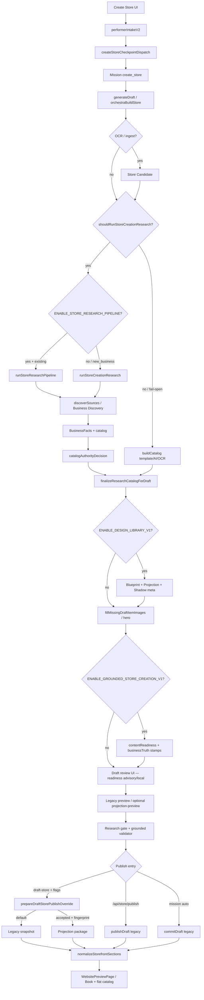

# Impact Report: Store Creation End-to-End Capability Audit

**Date:** 2026-08-02  
**Scope:** Full Store Creation capability — Create Store → Business Discovery → Grounded Truth → Content Readiness → Owner Review → Design Library → Preview → Publish → Renderer  
**Constraint:** Audit only. No fixes implemented. Conclusions are evidence-based from execution paths, feature flags, and code references.  
**Verdict:** **PARTIALLY_READY** (non-prod / staging with flags on); **NOT_READY** for production of the intended architecture as a whole.

**Related docs:**
- `docs/IMPACT_REPORT_GROUNDED_STORE_CREATION_V1.md`
- `apps/core/cardbey-core/docs/IMPACT_REPORT_PERFORMER_RESEARCH_GROUNDED_CATALOG.md`
- `apps/core/cardbey-core/docs/PLAN_STOREFRONT_DESIGN_LIBRARY_PHASE0.md`

---

## Executive summary

Business Discovery (via store-creation research / Places / website extract / OCR text) remains the primary acquisition layer on the Performer create-store path when research runs. Grounded Store Creation, Content Readiness, Owner Review, and Design Library are **downstream / parallel consumers**, not replacements — but several of them are **flag-gated off by default in production**, and the **live renderer + default publish path still treat legacy draft/template structures as authoritative**.

The intended spine is implemented as **metadata and gates** more than as a single operational cutover. The largest architectural gaps are:

1. No single **Canonical Business Truth** object — item-level `businessTruth` + `BusinessFacts` + draft preview compete.
2. Design Library **does not read** `businessTruth`; it consumes classified catalog roles.
3. Public renderer **discards** projection section types via `normalizeStorefrontSections` and forces generic **Book** CTAs.
4. Production defaults leave grounded creation + Design Library family **off**, so inventing/template catalog + legacy snapshot remain the effective path.

---

## Intended architecture

```text
User
  │
  ▼
Create Store
  │
  ▼
Business Discovery
(Google Places, Official Website, OCR, Business Profile,
 Website Crawl, Images, Products, Services, Policies)
  │
  ▼
Grounded Business Truth
(Canonical facts + provenance + confidence)
  │
  ▼
Content Readiness
(What is complete / missing)
  │
  ▼
Owner Review
(Approve only uncertain content)
  │
  ▼
Storefront Design Library
(Blueprint + Projection + Theme)
  │
  ▼
Preview
  │
  ▼
Publish Validation
  │
  ▼
Published Store
```

**Contract:** Business Discovery = authoritative acquisition. Grounded / Readiness / Owner Review / Design Library = downstream consumers. Bypassing or degrading Discovery is a regression.

---

## Current architecture (as implemented)

```text
Performer UI / StoreCreationDraft
  → POST /api/performer/intake/v2
  → dispatchCreateStoreCheckpointPipeline
  → Mission (create_store) + executeMission / deferred run
  → orchestraBuildStore / generateDraft (draftStoreService)
       ├─ [conditional] Store Candidate (OCR/ingest)
       ├─ [conditional] runStoreCreationResearch
       │     ├─ [flag] runStoreResearchPipeline (existing business)
       │     └─ discoverSources → extractBusinessFacts → catalog
       ├─ [fail-open] buildCatalog template/AI/OCR/seed
       ├─ [flag DL] classify → commerce → blueprint → projection → shadow
       ├─ [flag grounded] applyContentReadiness / invent-stop / media gate
       └─ media fill (stock/seed unless grounded rejects)
  → Draft ready + StoreDraftReview UI
  → Publish forks:
       A) POST /api/store/publish → publishDraft (legacy snapshot; research + grounded gates)
       B) POST /api/draft-store/:id/publish → prepareDraftStorePublishOverride
            → default legacy; rare accepted-projection package
       C) Mission auto-publish → commitDraft (legacy)
  → Public: CanonicalStorefrontRenderer → WebsitePreviewPage
            → normalizeStorefrontSections (legacy types only)
```

**Parallel entry (not Performer intake):** Discover product (`discoveryRoutes` → `importBusiness` / `generate-channel` → `createBuildStoreJob`) — thinner candidate payload, same orchestra/generate spine.

---

## Actual execution diagram



---

# Phase A — Stage-by-stage execution path

| Stage | Entered? | Skipped / conditional? | Feature flag? | Fail mode | Output produced? | Output consumed? |
|-------|----------|------------------------|---------------|-----------|------------------|------------------|
| **Create Store** | Yes — primary Performer path | Auth / duplicate name / needs_form | — | Soft fail → form / `create_store_failed` | Intent + draft form | Checkpoint dispatch |
| **Mission** | Yes | Deferred run on soft fail | — | Mission create/run failure surfaced | Mission + checkpoint steps | `executeMission` / orchestra |
| **Store Candidate** | Conditional | Only OCR/card/ingest/pending artifact | — | Persist non-fatal | `StoreCandidate` + extraction artifact | Handoff metadata / Ask panels |
| **Business Discovery** | Yes when research runs | Places needs API key; Discover import is parallel product path | Places env; research conditions | Empty sources → fallback | Discovered sources / candidates | Facts extractor / research agent |
| **Research** | Conditional | Name ≥2 + website/location/phone/email/category/OCR/social | `ENABLE_STORE_RESEARCH_PIPELINE` wraps entity path | **Fail-open** — never abort store creation | `BusinessResearchResult` | Catalog authority / finalize |
| **Canonical Business Truth** | Partial | Item stamps when grounded on | `ENABLE_GROUNDED_STORE_CREATION_V1` | Flag off → no invent-stop | Per-item `businessTruth` + readiness meta | Owner UI / grounded publish gate |
| **Catalog** | Always | Authority: research → preload → template/AI/OCR | Staging: `PERFORMER_STAGE_SOURCED_CATALOG_PENDING_REVIEW` | Research fail → **fail-open** template | Draft products + `catalogSource` | Preview, DL, media, publish |
| **Media** | Always (post-catalog) | Grounded rejects weak matches | Grounded + min score | Missing → readiness `needs_media` | `imageUrl` / hero | Preview / readiness |
| **Content Readiness** | When grounded on (write); client can synthesize | Flag-gated on server stamp | `ENABLE_GROUNDED_STORE_CREATION_V1` | Flag off → absent / null validator | `meta.contentReadiness` | UI + publish (if flag on) |
| **Owner Review** | When `ownerReviewRequired` or item pending | Research confirm API; item approve local→save | Staging + grounded | Publish **fail-closed** if research pending | Mission `ownerConfirmed` / draft patches | Publish gate |
| **Blueprint Recommendation** | When DL on | After catalog stamp | `ENABLE_DESIGN_LIBRARY_V1` | Skip if off | `meta.designLibraryBlueprintRecommendation` | Projection (needs selected blueprint) |
| **Projection** | When DL on + blueprint meta | Validation fail → do not attach | DL + shadow flags | Fail-safe discard invalid | `meta.designLibraryStorefrontProjection` | Shadow / acceptance / preview / cutover |
| **Preview** | Always legacy; projection optional | Preview/acceptance/render flags | DL preview family | Flags off → legacy only | Draft ready + optional projection APIs | Owner UI |
| **Publish Validator** | Yes on publish | Grounded only if flag on | Grounded; research gate always relevant | Research/grounded **fail-closed**; projection invalid → legacy | Block reasons / warnings | Publish |
| **Publish** | Yes — forked | Projection cutover rare | `PUBLISH_SNAPSHOT_V1` + projection publish/acceptance | Cutover fail → legacy | Published business | Public renderer |

**Key orchestration symbols**

| Role | Path | Symbol |
|------|------|--------|
| Intake | `apps/core/.../routes/performerIntakeV2Routes.js` | `POST /api/performer/intake/v2` |
| Checkpoint | `.../lib/intake/createStoreCheckpointDispatch.js` | `dispatchCreateStoreCheckpointPipeline` |
| Store candidate | `.../lib/intake/storeCandidate.js` | `assembleStoreCandidate` |
| Generate | `.../services/draftStore/draftStoreService.js` | `buildCatalogForStoreReactStep`, `generateDraft` |
| Orchestra | `.../services/draftStore/orchestraBuildStore.js` | `createBuildStoreJob`, `runBuildStoreJob` |
| Research | `.../lib/storeCreationResearch/businessResearchAgent.js` | `runStoreCreationResearch` |
| Pipeline | `.../lib/storeResearch/runStoreResearchPipeline.js` | `runStoreResearchPipeline` |
| Discovery sources | `.../lib/storeCreationResearch/sourceDiscoveryService.js` | `discoverSources` |
| Finalize + DL attach | `.../services/draftStore/researchCatalogDraft.js` | `finalizeResearchCatalogForDraft`, stamp helpers |
| Grounded | `.../services/draftStore/groundedStoreCreation.js` | `applyGroundedCatalogPolicy` |
| Readiness | `.../services/draftStore/contentReadinessModel.js` | `buildContentReadinessModel` |
| Publish | `.../services/draftStore/publishDraftService.js` | `publishDraft` |
| Cutover | `.../lib/storefrontDesignLibrary/publishCutover/prepareDraftStorePublishOverride.js` | `prepareDraftStorePublishOverride` |

---

# Phase B — Business Discovery audit

Acquisition is real and wired through `discoverSources` → `extractBusinessFacts` → `buildResearchBackedStore`. There is **no multi-page website spider**. Policies are **not acquired**. Places photos are thin. OCR on the research path is **text-in**, not vision-in.

| Capability | Implemented? | Used in store creation? | Produces output? | Consumed downstream? | Status |
|------------|--------------|-------------------------|------------------|----------------------|--------|
| **Google Places** | Yes | Yes (`discoverSources`) | Yes when key set | Facts, website URL, hours, contact | **Env-gated** (`GOOGLE_PLACES_API_KEY`); silent skip if missing |
| **Official Website** | Yes | Yes | Yes | Schema/OG → facts + offers | Active when URL supplied or found via Places details |
| **Website Crawl** | Partial | Yes | Yes (single URL) | Catalog + facts | **Partial** — one-page fetch + JSON-LD/HTML extract, not site spider |
| **OCR** | Partial | Yes | Yes if text provided | Facts + catalog lines (`needsOwnerReview`) | **Text-in** on research; vision/OCR persistence is separate intake path |
| **Business Profile** | Yes (BSL) | Yes | Yes | Catalog meta / presentation | Semantic profile, not full truth object |
| **Business Facts** | Yes | Yes | Yes | Profile + catalog + debugger | Core merge layer (`BusinessFacts`) |
| **Products** | Yes | Yes | Conditional | Draft catalog | Offers/OCR; retail kind |
| **Services** | Yes | Yes | Conditional | Draft catalog | Default booking/service kind |
| **Policies** | No acquisition | No | No | Readiness flag only | **Missing** |
| **Media** | Partial | Partial | Website OG/schema photos; Places search omits photos | Heavy post-fill (stock/seed) | **Partial + post-fill** |
| **Branding** | Minimal | Minimal | Logo/hero enrichment | Readiness / UI modal | **Not discovery-primary** |
| **Social links** | Yes | Yes | Yes | `catalog.profile` | schema `sameAs` / Places-website / user input |
| **Location** | Yes | Yes | Yes | Profile / contact | Places address/geo + website |
| **Contact** | Yes | Yes | Yes | Profile / readiness | Phone/email/website |
| **Business hours** | Yes | Yes | Yes | Profile | Places details + schema `openingHours` |

**Evidence (acquisition entry):**
- `apps/core/cardbey-core/src/lib/storeCreationResearch/sourceDiscoveryService.js` — `discoverSources`
- `apps/core/cardbey-core/src/lib/businessDiscovery/businessDiscoverySources.runtime.js` — Places / website extract
- Discover product API: `apps/core/cardbey-core/src/routes/discoveryRoutes.js`

---

# Phase C — Canonical Business Truth

### What exists

| Object | Location | Covers |
|--------|----------|--------|
| **`BusinessTruth`** (item/hero stamp) | `contentReadinessModel.js` → `createBusinessTruth` | source, sourceRef, confidence, reviewStatus, mediaStatus, publishEligibility, status, requiresConfirmation |
| **`BusinessFacts`** | `storeCreationResearch/types.js` | name, category, description, address, phone, email, website, hours, social, images, services/products/menuItems, reviews, evidence |
| **`BusinessEvidence`** | storeResearch reconciler | Profile fields + catalogItems + conflicts + confidence |
| **`BusinessProfile` (BSL)** | `businessSemantic/types.js` | Commerce/semantic modes — not fact store |
| **`BusinessDiscoveryCandidate`** | businessDiscovery types | Search/import identity — not full truth |

### What does **not** exist

- No symbol `CanonicalBusinessTruth` / `groundedBusinessTruth`
- No single authoritative object covering identity + contact + services + products + media + branding + policies + locations + provenance + confidence + review status as one business-level source of truth

### Authoritative vs competing

| Layer | Role today |
|-------|------------|
| Research `BusinessFacts` / catalog | Acquisition-backed facts when research succeeds |
| Draft preview / `products[]` | **Practical authority** for UI + publish snapshot |
| Item `businessTruth` | Provenance stamp — only when grounded flag on |
| Template/AI/OCR/`buildCatalog` | Competes on fail-open / flag-off |
| Design Library projection meta | Presentation advisory — parallel, does not own facts |
| Legacy website template foundation | Live structure authority |

**Verdict:** Business Truth is **not** yet a single authoritative object. Docs claim “Grounded Store Creation owns business truth”; code implements **item-level stamps on draft catalog**, default **off** in production.

---

# Phase D — Content Readiness

**Server:** `buildContentReadinessModel` / `applyContentReadinessToCatalog` — `contentReadinessModel.js`  
**Client mirror:** dashboard `contentReadinessModel.ts`

### Domains

| Domain | Computed from | Notes |
|--------|---------------|-------|
| Identity | Draft storeName / storeType | Not from `BusinessFacts` type directly |
| Catalogue | `contentOrigin` + `businessTruth.reviewStatus` / `needsOwnerReview` | sourced vs suggested_only vs pending |
| Media | Hero + item images + logo | Honest helpers |
| Contact | phone/email/address count | ≥2 → ready |
| Policies | `meta.policiesComplete` only | Almost always missing — **no acquisition** |
| Branding | logo + brandColors/tagline | Shallow |
| SEO | `meta.seoReady` only | Almost always missing |
| Hero / Images | Nested in media / ownerReviewSummary | Modeled, not top-level area keys |
| Pricing | **Not an area** | Honest presentation helpers only |

**Source of computation:** draft/preview + stamped item truths — **not** Design Library templates. Suggested/template origins map to `ai_inference` / `template_fallback`.

### Runtime effect

| Surface | Effect when grounded **on** | When grounded **off** |
|---------|-----------------------------|------------------------|
| Dashboard UI | Owner review summary, badges | Client may synthesize; largely advisory |
| Publish | Blocks suggested-only / unreviewed catalogue | Validator returns null — **no block** |
| Preview / renderer | Honest labels in review UI | Legacy presentation |
| Media fill | Reject weak semantic matches | Stock/seed fill unconstrained |

**Verdict:** Readiness is computed from draft/truth stamps (good), but **does not drive** public renderer structure, and **does not gate publish** unless `ENABLE_GROUNDED_STORE_CREATION_V1` is on.

---

# Phase E — Owner Review

| Action | Behaviour | Persistence |
|--------|-----------|-------------|
| **Approve item** | `acceptItemBusinessTruth` local patch in `StoreDraftReview` | Must Save draft / PATCH — **not auto-canonical** |
| **Reject** | Type supports `rejected`; mission research has `reject_fallback` | Mission path stronger than per-item draft reject |
| **Edit** | Local draft patch → save | Draft PATCH |
| **Replace image** | Product/hero UI replace | Local until Save |
| **Persist (research)** | `POST .../store-research/confirm` → `storeResearchReviewService` | Mission context + optional draft catalog patch |
| **Versioning** | No BusinessTruth version chain | Projection acceptance has its own version/fingerprint |
| **Fingerprint** | Catalog fingerprint at publish UI; projection fingerprint for DL | Separate systems |
| **Projection refresh** | Acceptance / preview flags | Not wired to item truth approve |
| **Publish validator refresh** | Research pending → 409; grounded blocks when flag on | Fail-closed for research |

**Approvals are:** local → draft on save; research confirmation is mission-persisted. **Not** a first-class canonical business-truth store with versioning.

**Missing persistence:** dedicated Business Truth document/version history; automatic projection recompute on item approve; universal reject UX for draft items.

---

# Phase F — Design Library integration

### Pipeline (advisory, on catalog finalize)

When `ENABLE_DESIGN_LIBRARY_V1` (`researchCatalogDraft.js` ~191–208):

1. `classifyResearchCatalogProducts` → `contentRole`
2. `applyDesignLibraryCommercePolicy` → CTA policy (e.g. `request_quote`)
3. `applyDesignLibraryBlueprintRecommendation`
4. `applyDesignLibraryStorefrontProjection`
5. `applyDesignLibraryRenderShadow`

Then (separate flag): `applyContentReadinessToCatalog`.

### Business Truth → Projection → Renderer?

| Question | Answer |
|----------|--------|
| Does Design Library read `businessTruth`? | **No** — 0 references under `storefrontDesignLibrary/**` |
| What does it consume? | Catalog `contentRole`, `contentOrigin`, `needsOwnerReview`, role confidence + Phase 3/4 meta |
| Intended flow | Business Truth → Classification → Design Library → Projection → Renderer |
| Actual public flow | **Template / flat catalog → normalizeStorefrontSections → WebsitePreviewPage** |
| `isDesignLibraryAuthoritative()` | **Always `false`** |

### Components

| Concern | Status |
|---------|--------|
| Blueprint scoring | Implemented; `authoritative: false` |
| Projection | Implemented in Core meta; roles mapped in `CONTENT_ROLE_TO_SECTION` |
| Theme / preview samples | Registered; not applied as live CSS |
| Legacy renderer | `cardbey-legacy-storefront-v1` capabilities — limited grouped services / footer |
| Website template foundation | Separate live structure authority |
| Industry blueprints (`industryBlueprints/*`) | Catalog packs — **not** StorefrontBlueprint |

**Verdict:** Design Library correctly implements an advisory **facts/roles → projection** sidecar. It does **not** consume Business Truth as defined by grounded stamps, and the live renderer does **not** consume projection.

---

# Phase G — Store Renderer (Modern Security Doors class)

### Projection (Core tests / fixtures) — works

MSD fixtures assert: `trade-lead-generation`, `request_quote`, policies → footer_only, careers → footer, services ≠ products (`storefrontProjectionPhase5.test.js`, classification fixtures).

### Live public path — projection lost

| Expected | Live behaviour | Loss point |
|----------|----------------|------------|
| Services → Services | Flat `products[]` / catalog section | Flat catalog + fixed band order |
| Policies → footer | Often catalog rows or dropped | `normalizeStorefrontSections` only keeps `hero \| usp_bar \| show \| featured \| catalog \| about \| social_proof \| contact` |
| Testimonials → trust | Not first-class section | Same normalize drop |
| Career → Careers | Not first-class | Same |
| Contact → Contact | Legacy contact section if present | Partial |
| Hero real media | `resolveStoreHeroMedia` from banner/hero fields | Not groundedMedia; stock fill common when grounded off |
| Products stay products / services stay services | Collapsed into one list | CatalogSection / groupDraftItemsByCategory |
| No generic Book for quote businesses | **Book / Book now** hardcoded in preview paths | `WebsitePreviewPage`, `StorePreviewPage`, `MiniWebsiteLayout`, `miniWebsiteNav` — DL CTA policy not wired live |
| No “Other (N)” | Unknown category → **Other** | `groupDraftItemsByCategory` / StorePreviewPage |

**Primary loss chain:**

```text
Projection sections (service-list, quote-cta, policy-links, …)
  → normalizeStorefrontSections  ← drops non-legacy types
  → WebsitePreviewPage fixed layout + CatalogSection
  → Book CTAs / Other grouping / flat products
```

There is **no** `StoreRenderer` / `groundedMedia` symbol. Live entry: `CanonicalStorefrontRenderer` → `WebsitePreviewPage`.

---

# Phase H — Publish pipeline

```text
POST /api/draft-store/:draftId/publish   [requires PUBLISH_SNAPSHOT_V1]
  → snapshotToPreviewShape (legacyPreview)
  → prepareDraftStorePublishOverride     [try/catch → legacy on error]
  → resolvePublishSnapshotSource         [fail-closed to legacy]
  → publishDraft(..., override)
       → getStoreResearchPublishBlockReason  (fail-closed if pending)
       → assertGroundedPublishAllowed        (only if grounded flag)
  → finalizePublishCutoverTelemetry

POST /api/store/publish
  → publishDraft (legacy snapshot) — research + grounded gates; **no** projection cutover

Mission auto-publish
  → commitDraft (legacy) — separate fork
```

| Component | Executed today? |
|-----------|-----------------|
| Content Readiness | Stamped when grounded on; advisory otherwise |
| Publish Validator (research) | Yes — fail-closed |
| Publish Validator (grounded) | Only if grounded flag on |
| Accepted Projection | Only if acceptance + DL flags |
| Projection Snapshot | Rare — all gates + fingerprint |
| Legacy Snapshot | **Default / production path** |
| Projection Publish | Flag + acceptance gated; `authoritative: false` |
| Metadata / provenance | `meta.designLibraryPublish` audit when cutover runs |

**Fail-closed reasons** (`resolvePublishSnapshotSource`): `publish_cutover_disabled` | `no_acceptance` | `acceptance_stale` | `projection_package_invalid` | else `accepted_projection_publish`.

**Even when projection publish succeeds**, public UI still runs through `normalizeStorefrontSections` — structural win is partial.

---

# Phase I — Feature flag matrix

| Flag | Purpose | Used? | Default (unset) | Effective in prod (unset) | Dead? |
|------|---------|-------|-----------------|---------------------------|-------|
| `ENABLE_STORE_RESEARCH_PIPELINE` | Entity/evidence pipeline wrap | Yes | on non-prod; **off prod** | Off | No |
| `ENABLE_GROUNDED_STORE_CREATION_V1` | Invent-stop, truth stamps, readiness write, media gate, publish block | Yes | **false** | Off | No |
| `GROUNDED_MIN_MEDIA_MATCH_SCORE` | Min semantic media match | Yes | `0.55` | N/A when grounded off | No |
| `PERFORMER_STAGE_SOURCED_CATALOG_PENDING_REVIEW` | Stage sourced catalog while review pending | Yes | on non-prod; **off prod** | Off | No |
| `ENABLE_DESIGN_LIBRARY_V1` | Advisory DL Phases 1–5 | Yes | on non-prod/staging; **off prod** | Off | No |
| `ENABLE_STOREFRONT_PROJECTION_SHADOW_V1` | Shadow VM compare | Yes | requires DL; non-prod on | Off | No |
| `ENABLE_STOREFRONT_PROJECTION_PREVIEW_V1` | Owner projection preview API | Yes | requires DL; non-prod on | Off | No |
| `ENABLE_STOREFRONT_PROJECTION_ACCEPTANCE_V1` | Per-draft accept/reject | Yes | requires DL; non-prod on | Off | No |
| `ENABLE_STOREFRONT_PROJECTION_PREVIEW_RENDER_V1` | Accepted projection as preview primary | Yes | requires DL; non-prod on | Off | No |
| `ENABLE_STOREFRONT_PROJECTION_PUBLISH_V1` | Accepted projection as publish snapshot | Yes | requires DL; non-prod on | Off | No |
| `isDesignLibraryAuthoritative()` | Global DL authority | Yes (guard) | **always false** | Never | Intentional non-cutover |
| `PUBLISH_SNAPSHOT_V1` | Enables draft-store publish route | Yes | (env) | Must be on for cutover route | No |
| `BUE_PIPELINE_ENABLED` | Business Understanding on create | Yes | **true** | On | No |
| `BUE_BRAND_VISION_ENABLED` | Vision brand enrich | Yes | **true** | On | No |
| `ENABLE_TYPED_CATALOG_COMPILER` / `ENABLE_SEMANTIC_CATALOG_QA` | Adjacent catalog QA | Partial | feature config | Varies | Partial |
| `ENABLE_DESIGN_LIBRARY_AI_CLASSIFIER` | AI classifier hook | Reserved | returns null | Ineffective | Effectively dead |
| `GOOGLE_PLACES_API_KEY` | Places acquisition | Yes | unset → skip | Skip if missing | No |
| `BYPASS_KERNEL_FOR_CREATE_STORE` | Intake diag bypass | Diag | — | — | Dev aid |

**Pattern:** Research pipeline + catalog staging + Design Library family default **on in non-prod/staging**, **off in production**. Grounded creation defaults **off everywhere**.

---

# Phase J — Capability gap analysis

| Capability | Status | Evidence | Missing |
|------------|--------|----------|---------|
| Business discovery | **Operational** (when research runs + Places configured) | `discoverSources`, Places, website | Unified product entry with Performer; photos; policies |
| Website crawl | **Partial** | Single-page `extractFromWebsite` | Multi-page / sitemap crawl |
| Products | **Operational conditional** | `serviceMenuExtractor` / offers | Fail-open invent when research empty + grounded off |
| Services | **Operational conditional** | Same | Same |
| Media | **Partial** | Website OG; post-fill stock | Places photos; grounded media default off |
| Policies | **Missing acquisition** | Readiness `policiesComplete` only | Extractor + truth field |
| Branding | **Partial** | Enrichment + UI modal | Discovery-primary branding facts |
| Blueprint | **Advisory implemented** | Phase 4 scorer | Live application |
| Projection | **Advisory implemented** | Phase 5 projector | Live renderer consumption |
| Preview | **Dual** | Legacy always; projection preview flagged | Unified projection-first preview in prod |
| Owner review | **Partial** | Mission confirm + local item approve | Canonical persist / versioning / projection refresh |
| Publish validation | **Partial** | Research gate always; grounded flagged | Grounded default off; projection honesty post-normalize |
| Publish | **Legacy authoritative** | `publishDraft` / `commitDraft` | Projection cutover + renderer alignment |
| Grounded media | **Implemented behind flag** | `scoreSemanticMediaMatch` | Production enable + soak |
| Readiness | **Implemented behind flag** | `buildContentReadinessModel` | Drive publish/preview by default; SEO/policies acquisition |
| Renderer | **Legacy** | `WebsitePreviewPage` + normalize | Role-aware sections + quote CTAs |
| Persistence | **Draft + mission** | PATCH draft; mission research | Canonical Business Truth store |
| Projection acceptance | **Implemented behind flags** | Phase 7 | Prod flags + UX soak |
| Projection publish | **Implemented behind flags** | Phase 8B fail-closed | Renderer still drops section types |

---

# Phase K — Regression analysis

These are architectural regressions relative to the **intended** research-first → truth → projection → publish spine (not necessarily relative to last commit).

| Regression | Cause | Impact | Files / symbols | Recommended fix (do not implement in this audit) |
|------------|-------|--------|-----------------|--------------------------------------------------|
| Research bypassed / fail-open to invented catalog | Explicit catch in `buildCatalogForStoreReactStep`; grounded invent-stop off by default | Stores look complete with fabricated items | `draftStoreService.js`, `buildCatalog.js`, `groundedStoreCreation.js` | Enable grounded in staging; fail-closed incomplete offering when research empty for existing businesses |
| Website extraction not structurally rendered | Projection meta unused by public UI | Roles flatten; policies/careers lost | `normalizeStorefrontSections.ts`, `WebsitePreviewPage.tsx` | Honor projection section types or adapt VM → legacy sections losslessly |
| Projection ignored at publish (prod defaults) | Flags off; `isDesignLibraryAuthoritative() === false` | Publish snapshot legacy | `flags.js`, `resolvePublishSnapshotSource.js` | Controlled enable of acceptance + publish + renderer |
| Renderer still legacy | Canonical path wraps WebsitePreviewPage | Quote businesses get Book; Other buckets | `CanonicalStorefrontRenderer.tsx`, `MiniWebsiteLayout.tsx`, `StorePreviewPage.tsx` | Wire `resolveCtaDecision` / projection roles into live CTA + sections |
| Readiness computed but unused (prod) | Grounded flag default false | No publish block for suggested-only | `features.js`, `groundedPublishValidator.js` | Enable grounded after soak; surface readiness on all create paths |
| Owner approval not canonically persisted | Local patch until Save; no truth version store | Approvals can be lost; projection not refreshed | `StoreDraftReview.tsx`, `acceptItemBusinessTruth` | Persist reviewStatus server-side; invalidate projection fingerprint |
| Business Truth duplicated / competing | Facts + item truth + draft + evidence | Ambiguous authority | `BusinessFacts`, `createBusinessTruth`, draft preview | Promote single business-level truth document |
| Legacy draft still authoritative | Template foundation + legacy snapshot default | Intended architecture not live | `websiteTemplateFoundation`, `publishDraft`, `commitDraft` | Cutover publish + renderer together |
| Business Discovery skipped (new business / no signals) | `shouldRunStoreCreationResearch` false; new_business → legacy research with fallback | Template catalog without acquisition | `runStoreResearchPipeline.js`, research gates | Force discovery attempt when name+location present; incomplete state if none |
| Mission auto-publish fork | `commitDraft` bypasses projection cutover | Field lineage depends on publish leg | `orchestraBuildStore.js`, grounded impact report §2 | Unify publish through one validator + snapshot path |
| Design Library ≠ Business Truth consumer | Parallel bounded contexts | Classification without review/provenance coupling | `researchCatalogDraft.js`, DL modules | Feed reviewStatus/confidence into projection visibility |

---

# Phase L — Final architecture assessment

### Explicit answers

| Question | Answer |
|----------|--------|
| Is Business Discovery still the first-class acquisition layer? | **Yes, when research runs** — `discoverSources` remains the acquisition spine. It can be skipped (insufficient signals) or fail-open to template. Discover product import is a thinner parallel entry. |
| Is Grounded Store Creation wrapping Discovery or replacing it? | **Wrapping / gating** — invent-stop, truth stamps, media gate, publish validator. **Not** a replacement for Discovery. Default **off**. |
| Is Business Truth the single source of truth? | **No.** Item-level stamps + `BusinessFacts` + draft preview compete. No Canonical Business Truth object. |
| Is the renderer consuming projection or legacy draft? | **Legacy draft / template sections.** Projection is advisory meta / rare publish package then re-normalized. |
| Is the publish pipeline consuming projection or legacy? | **Legacy by default.** Projection only when DL + acceptance + publish flags + fingerprint + valid package on draft-store publish route. |
| What % of the intended architecture is operational? | See estimates below. |

### Operational estimates (production defaults / unset flags)

| Capability | Est. operational | Notes |
|------------|------------------|-------|
| Business Discovery | **70%** | Places/website/OCR/facts work when configured; no policies; single-page crawl; photos thin |
| Grounded Business Truth | **25%** | Model + stamps exist; no canonical object; flag default off |
| Content Readiness | **35%** | Model complete for core areas; SEO/policies placeholders; unused in prod publish |
| Owner Review | **45%** | Mission research confirm solid; item approve local→draft; weak versioning |
| Design Library | **55%** | Phases 1–6 implemented as advisory; not authoritative |
| Projection | **50%** | Built & tested (incl. MSD); not live-rendered |
| Preview | **40%** | Legacy solid; projection preview flagged / non-prod |
| Publish | **40%** | Legacy publish works; projection cutover rare; forked paths |
| Renderer | **20%** | Projection roles lost; Book/Other regressions |
| **Overall intended architecture** | **~40%** | Acquisition spine real; truth→readiness→projection→renderer→publish cutover incomplete |

With **all non-prod flags on** (staging pattern), overall rises to roughly **~55–60%** — still blocked by renderer normalize + Book CTAs + lack of canonical truth + policies acquisition.

### Production readiness verdict

| Verdict | Applies when |
|---------|--------------|
| **NOT_READY** | Intended architecture as a whole for production cutover |
| **PARTIALLY_READY** | Current shippable create-store (research + legacy preview/publish) with known invent/flatten risks |
| **PILOT_READY** | Staging with grounded + DL + acceptance + publish flags on, for **selected** existing businesses with Places/website — **after** renderer CTA/section fixes |
| **PRODUCTION_READY** | Not met |

**Official audit verdict for the intended architecture:** **PARTIALLY_READY** (capability exists in layers) / **NOT_READY** for production of the full Truth → Projection → Renderer → Publish spine.

---

## Dead code / duplicate paths

| Pair | Status |
|------|--------|
| Legacy `storeCreationResearch` vs `storeResearch` pipeline | Both live; pipeline wraps legacy |
| Design Library blueprints vs `industryBlueprints/*` | Different jobs; naming collision risk |
| Design Library themes vs websiteTemplateFoundation | Themes advisory; foundation live |
| Projection Render VM vs WebsitePreviewPage | Shadow/preview only |
| Phase 8A previewRendering vs public | Isolated by design |
| Phase 8B projection publish vs legacy snapshot | Competing; legacy wins by default |
| Business Truth vs Design Library roles | Parallel; DL does not read Truth |
| `resolveStoreCommerce` / Book heuristics vs `resolveCtaDecision` | Competing CTA authorities |
| StorePreviewPage vs WebsitePreviewPage / MiniWebsite | Dual UIs; both Book + Other |
| Contents Studio `DesignLibrary.tsx` | Unrelated name collision |
| `ENABLE_DESIGN_LIBRARY_AI_CLASSIFIER` | Returns null — reserved/dead |
| Mission `commitDraft` vs UI `publishDraft` vs draft-store cutover | Triple publish fork |

---

## Missing integrations (priority order)

1. **Live renderer consumes projection roles** — stop dropping section types in `normalizeStorefrontSections`; map services/policies/testimonials/careers/contact correctly.
2. **Live CTA authority** — wire `resolveCtaDecision` (`request_quote` etc.) into WebsitePreviewPage / StorePreviewPage / MiniWebsite; remove forced Book for quote businesses.
3. **Enable grounded path in staging soak** — invent-stop + readiness publish gate + media match; then production.
4. **Canonical Business Truth document** — business-level object with provenance/confidence/review; draft items reference it; DL consumes reviewStatus.
5. **Policies (+ SEO) acquisition** — extract and stamp; stop readiness placeholders-only.
6. **Unify publish** — one path through research gate + grounded gate + optional accepted projection; retire silent `commitDraft` bypass or apply same gates.
7. **Owner review persistence** — server-side item approve/reject with versioning; projection fingerprint invalidation.
8. **Website crawl depth** — multi-page for services/products/policies when single page insufficient.
9. **Places media** — include photos in field mask / details; prefer over stock when grounded.
10. **Production flag matrix** — explicit ops checklist; do not rely on non-prod defaults.

---

## Remaining work (priority order)

| P | Workstream | Outcome |
|---|------------|---------|
| P0 | Renderer + CTA cutover for projection roles | MSD-class stores render correctly |
| P0 | Grounded invent-stop soak → enable | Stop fabricated catalogues in prod |
| P1 | Canonical Business Truth persistence | Single authority; end competing drafts |
| P1 | Owner review server persistence + projection refresh | Approvals durable; publish honesty |
| P1 | Unify publish forks | Same gates everywhere |
| P2 | Policies/SEO acquisition | Readiness meaningful |
| P2 | Deeper website crawl + Places media | Richer Discovery |
| P2 | Design Library reads Truth review/confidence | Presentation respects provenance |
| P3 | Global authority decision (`isDesignLibraryAuthoritative`) | Only after P0–P1 proven |
| P3 | Retire / quarantine dead classifier & duplicate naming | Reduce cognitive load |

---

## Checklist (audit)

- [x] Phase A — execution path traced with enter/skip/flag/fail modes
- [x] Phase B — Discovery capabilities matrix
- [x] Phase C — Truth object inspection
- [x] Phase D — Content Readiness
- [x] Phase E — Owner Review
- [x] Phase F — Design Library
- [x] Phase G — Renderer / MSD-class loss points
- [x] Phase H — Publish pipeline
- [x] Phase I — Feature flags
- [x] Phase J — Capability gaps
- [x] Phase K — Regressions
- [x] Phase L — Architecture assessment + % estimates
- [x] No fixes implemented

---

## Appendix — key code references

```text
# Intake / mission
apps/core/cardbey-core/src/lib/intake/createStoreCheckpointDispatch.js
apps/dashboard/.../lib/performerIntakeAdapters/storeCreationDraftSubmit.ts
apps/dashboard/.../app/console/performer/usePerformerConsole.ts

# Discovery / research
apps/core/cardbey-core/src/lib/storeCreationResearch/sourceDiscoveryService.js
apps/core/cardbey-core/src/lib/storeCreationResearch/businessResearchAgent.js
apps/core/cardbey-core/src/lib/storeResearch/runStoreResearchPipeline.js
apps/core/cardbey-core/src/lib/businessDiscovery/

# Catalog / truth / readiness
apps/core/cardbey-core/src/services/draftStore/draftStoreService.js
apps/core/cardbey-core/src/services/draftStore/buildCatalog.js
apps/core/cardbey-core/src/services/draftStore/researchCatalogDraft.js
apps/core/cardbey-core/src/services/draftStore/groundedStoreCreation.js
apps/core/cardbey-core/src/services/draftStore/contentReadinessModel.js
apps/core/cardbey-core/src/services/draftStore/groundedPublishValidator.js

# Design Library
apps/core/cardbey-core/src/lib/storefrontDesignLibrary/flags.js
apps/core/cardbey-core/src/lib/storefrontDesignLibrary/projection/
apps/core/cardbey-core/src/lib/storefrontDesignLibrary/publishCutover/

# Publish / render
apps/core/cardbey-core/src/services/draftStore/publishDraftService.js
apps/core/cardbey-core/src/routes/draftStore.js
apps/dashboard/.../lib/normalizeStorefrontSections.ts
apps/dashboard/.../pages/public/WebsitePreviewPage.tsx
apps/dashboard/.../components/storefront/CanonicalStorefrontRenderer.tsx

# Flags
apps/core/cardbey-core/src/config/features.js
```
