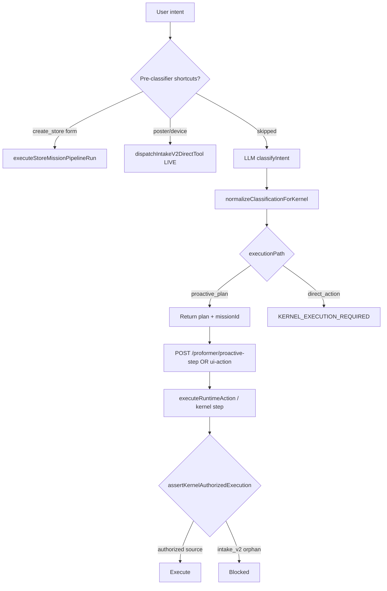

# P0 Impact Analysis — Runtime Kernel Mandatory

**Date:** 2026-06-13  
**Priority:** P0 — Make Runtime Kernel mandatory, remove shortcuts  
**Status:** **Partial P0 already landed** in core (see `docs/RUNTIME_KERNEL_MANDATORY_REPORT.md`). This document compares **historical baseline**, **today**, and **full P0 target** for the six critical flows.

---

## Executive summary

| Dimension | Historical (pre-P0) | Today (partial P0) | Full P0 target |
|-----------|---------------------|--------------------|----------------|
| Classifier/registry `direct_action` | ~69 tools | **0** — all `proactive_plan` | `proactive_plan` only |
| Intake `direct_action` dispatch | Live | **Blocked** → `KERNEL_EXECUTION_REQUIRED` | Same |
| `skipDirectGuard` | Used on 6+ paths | **Removed** (stripped at compatibility layer) | Gone |
| `BROKER_BLOCK_DIRECT_ACTION` | Default off | **Default on** | On |
| Kernel mandatory | Off | **Default on** (`kernelMandatory.js`) | On |
| Store-create shortcut pipeline | Live | **Still live** (structured exception) | Kernel-only |
| Poster pre-classifier dispatch | Live | **Still live** | Kernel-only |
| Publish / delete | Hybrid API + confirmation | **Unchanged** (already governed) | Kernel UI gateway |
| Creative Factory | Broker-blocked → fixed | **Kernel-authorized** (`intake_v2_factory_intent`) | Same |

**Biggest remaining gaps:** (1) store-create pre-classifier bypass, (2) poster/device pre-classifier `dispatchIntakeV2DirectTool`, (3) intake confirm path still calls legacy dispatch, (4) dead `if (false && direct_action)` block to delete.

---

## Authority stack (evidence)



| Gate | File | Lines | Default |
|------|------|-------|---------|
| Kernel mandatory | `kernelMandatory.js` | 27-29 | ON |
| `KERNEL_EXECUTION_REQUIRED` | `kernelMandatory.js` | 99-103 | — |
| Authorized sources | `kernelMandatory.js` | 61-77 | allowlist |
| Normalize `direct_action` → `proactive_plan` | `kernelMandatory.js` | 111-120 | — |
| Intake hard block | `performerIntakeV2Routes.js` | 4071-4089 | — |
| Broker direct block | `brokerRunwayGuard.js` | 33-50 | ON (`brokerFlags.js` 26-31) |
| Shortcut gate | `performerIntakeV2Routes.js` | 1972-1980 | Clears shortcuts when kernel on |

---

# Part 1: Current State Analysis

> **Note:** “Before P0” = historical baseline. **“Today”** reflects the repo as of this report (partial enforcement already merged).

---

## Flow: Store Creation

| Field | Before P0 | Today (partial P0) |
|-------|-----------|-------------------|
| **Current path** | Mixed — shortcut + `direct_action` autosubmit | **Mixed** — shortcut pipeline **still live**; LLM path → `proactive_plan` |
| **Bypasses** | | |
| `direct_action` in classifier | ✓ (`intakeClassifier.js` prompt) | Normalized away (`3922`, `kernelMandatory.js:111-120`) |
| `skipDirectGuard` | ✓ (pipeline, skills) | ✗ removed |
| Pre-classifier shortcut | ✓ `detectIntent` / `resolveCreateStoreShortcut` | ✓ **preserved** for structured create (`1972-1980`, `storeCreateIntentFastPath.js:278-283`) |
| `_autoSubmit: true` | ✓ server + form (`3048-3057`, `createStoreFormAdapter.ts:44`) | ✓ shortcut telemetry (`2649`); autosubmit **dead block** (`4203+` inside `if (false)`) |
| Other | `executeStoreMissionPipelineRun` direct | `intake_v2_shortcut_contract` (`2589-2603`) |
| **Execution time** | Not instrumented in repo | Same |
| **Success rate** | Not instrumented in repo | Same |
| **User experience** | Form → checkpoint cards → owner steps | **Unchanged** for structured form; NL-only create may get **plan card** instead of auto-pipeline |
| **Code evidence** | `performerIntakeV2Routes.js:2445-2670`, `executeStoreMissionPipelineRun.js` | Same + `normalizeClassificationForKernel` at `3922` |

---

## Flow: Store Publishing

| Field | Before P0 | Today (partial P0) |
|-------|-----------|-------------------|
| **Current path** | Mixed — Performer chip + API | **Hybrid** — UI runtime gateway + stores API |
| **Bypasses** | | |
| `direct_action` / `publish_store` chip | ✓ `POST_BUILD_CHIP_HANDLERS` (`646-650`) | Chip handler in **dead** `if (false)` block (`4119+`) |
| `skipDirectGuard` | Sometimes on intake runtime | ✗ |
| Pre-classifier shortcut | ✗ | ✗ |
| `_autoSubmit` | Sometimes on CTAs | **false** in `actionCatalog.ts` / governance |
| Other | Raw `POST /api/stores/publish` | `wrapHybridRoute` + `assertUiWriteAuthority` (`stores.js:4080-4088`) |
| **Execution time** | Not instrumented | Same |
| **Success rate** | Not instrumented | Same |
| **User experience** | Publish button → live store | `StorePublishButton` → `executeUiAction` → `/api/performer/runtime/ui-action` → hybrid 428/confirm |
| **Code evidence** | `publishStore.js`, `uiRuntimeActionService.js:185-192`, `hybridRouter.js:195-212` | Same |

---

## Flow: Store Deletion

| Field | Before P0 | Today (partial P0) |
|-------|-----------|-------------------|
| **Current path** | API direct (some envs) | **API + hybrid confirmation** |
| **Bypasses** | | |
| `direct_action` | ✗ (not intake-routed) | ✗ |
| `skipDirectGuard` | ✗ | ✗ |
| Pre-classifier shortcut | ✗ | ✗ |
| `_autoSubmit` | ✗ | ✗ |
| Other | Missing `confirmed: true` risk | `wrapHybridRoute(..., requireConfirmation: true)` (`stores.js:4254-4292`) |
| **Execution time** | Not instrumented | Same |
| **Success rate** | Not instrumented | Same |
| **User experience** | Modal → DELETE with `{ confirmed: true }` | `confirmedDelete` (`api.ts:884-886`, `DeleteConfirmationModal.tsx`) |
| **Code evidence** | `stores.js:4254-4292`, dashboard `AccountUserMenu.tsx:125-131` | Same |

---

## Flow: Campaign Creation

| Field | Before P0 | Today (partial P0) |
|-------|-----------|-------------------|
| **Current path** | Mixed — `proactive_plan` + orchestration + direct deploy | **Plan-first** + kernel proactive-step confirm |
| **Bypasses** | | |
| `direct_action` for `launch_campaign` | ✓ classifier | Registry → `proactive_plan` only (`intakeToolRegistry.js`) |
| `skipDirectGuard` | ✓ on some runtime paths | ✗ |
| Pre-classifier shortcut | ✓ `campaign_orchestration` early exit (`1230-1238`, `3081-3099`) | **Still live** (orchestration missions) |
| `_autoSubmit` | On some CTAs | **false** — `safeExecutionGovernance.ts`, `actionCatalog.ts:190-198` |
| Other | Image → hardcoded 3-step plan (`3548-3577`) | Same |
| **Execution time** | Not instrumented | Same |
| **Success rate** | Not instrumented | Same |
| **User experience** | Proactive plan card → step confirm → channel panel | `performerProactiveStepRoutes.js:450-517` for `launch_campaign` |
| **Code evidence** | `performerIntakeV2Routes.js:3924-4068`, `dispatchCampaignOrchestrationFromIntake` (`265-322`) | Same |

---

## Flow: Content Upload

| Field | Before P0 | Today (partial P0) |
|-------|-----------|-------------------|
| **Current path** | Mixed — tool opens UI, stores API uploads | **UI-first** — tool returns `open_ui`; mutations via store routes |
| **Bypasses** | | |
| `direct_action` `upload_store_asset` | ✓ dispatch | Normalized; chip handler **dead** (`647`, `4119+`) |
| `skipDirectGuard` | ✓ intake `performerRuntime.execute` (`1018`) | Dead path under `if (false)` |
| Pre-classifier shortcut | ✗ | ✗ |
| `_autoSubmit` | ✗ | ✗ |
| Other | Direct hero/logo POST without authority | `assertUiWriteAuthority` on upload routes (`stores.js:2488+`) |
| **Execution time** | Not instrumented | Same |
| **Success rate** | Not instrumented | Same |
| **User experience** | Chip → hero/logo panel → `POST /:storeId/upload/*` | `uploadStoreAsset.js:6-20` → `open_ui` |
| **Code evidence** | `stores.js:2488-2763`, `streamOriginArtifactAction.ts:61-62` | Same |

---

## Flow: Product Catalog Edit

| Field | Before P0 | Today (partial P0) |
|-------|-----------|-------------------|
| **Current path** | Mixed — tool opens import UI + `PATCH draft/catalog` | **CRUD API** + `open_ui` tool |
| **Bypasses** | | |
| `direct_action` `replace_store_catalog` | ✓ dispatch | Normalized; chip handler **dead** |
| `skipDirectGuard` | ✓ (legacy intake path) | Dead under `if (false)` |
| Pre-classifier shortcut | ✗ | ✗ |
| `_autoSubmit` | ✗ | ✗ |
| Other | `PATCH draft/catalog` without UI authority | `stores.js:2305-2486` — auth only, no `assertUiWriteAuthority` |
| **Execution time** | Not instrumented | Same |
| **Success rate** | Not instrumented | Same |
| **User experience** | Menu import / draft review → catalog patch | `replaceStoreCatalog.js:6-21`, `StoreDraftReview.tsx` |
| **Code evidence** | `stores.js:2305+`, `api.ts:922-934` | Same |

---

# Part 2: Expected State After Full P0

All flows should execute only through:

1. Intent → 2. Context → 3. Memory → 4. Planning (`proactive_plan`) → 5. Reasoning → 6. Capability selection → 7. **Runtime Kernel** → 8. Execution → 9. Observation

---

## Flow: Store Creation (target)

| Field | Expected |
|-------|----------|
| **Path** | Kernel only |
| **Flow** | Intake classifies → `proactive_plan` (store build steps) → mission pipeline via `run_mission_until_blocked` / kernel steps → checkpoint UI |
| **Execution time** | ~+2–5s (plan materialization; estimate — not measured) |
| **Success criteria** | Same checkpoint completion; no `intake_v2_shortcut_contract` direct pipeline |
| **Required changes** | Remove shortcut block `2445-2670`; route structured form through kernel mission create + `executeMissionStep`; migrate `createStoreFormAdapter` `autoSubmit` to plan + confirm |

---

## Flow: Store Publishing (target)

| Field | Expected |
|-------|----------|
| **Path** | Kernel via `ui_runtime_action` only |
| **Flow** | Intent → plan (if from chat) → user confirm → `executeUiRuntimeAction({ action: 'publish_store', confirmed: true })` |
| **Success criteria** | No Performer `publish_store` direct dispatch; hybrid 428 until confirmed |
| **Required changes** | Already largely compliant; wire any remaining chat chips to proactive plan |

---

## Flow: Store Deletion (target)

| Field | Expected |
|-------|----------|
| **Path** | Hybrid API (not intake kernel) — destructive, confirmation required |
| **Success criteria** | `confirmed: true` on DELETE; governance trace |
| **Required changes** | Optional: route through `ui_runtime_action` for unified audit |

---

## Flow: Campaign Creation (target)

| Field | Expected |
|-------|----------|
| **Path** | Kernel proactive steps |
| **Flow** | `proactive_plan` → step 1..N via `performer_proactive_step` → `launch_campaign` channel confirm |
| **Success criteria** | No `campaign_orchestration` bypass unless explicitly kernel-owned |
| **Required changes** | Audit `dispatchCampaignOrchestrationFromIntake`; ensure orchestration uses `run_mission_until_blocked` with authorized source |

---

## Flow: Content Upload (target)

| Field | Expected |
|-------|----------|
| **Path** | Plan → UI action → store upload API with `assertUiWriteAuthority` |
| **Success criteria** | No `dispatchIntakeV2DirectTool` for upload tools |
| **Required changes** | Add `assertUiWriteAuthority` to any upload routes missing it |

---

## Flow: Product Catalog Edit (target)

| Field | Expected |
|-------|----------|
| **Path** | Plan → draft review UI → `PATCH draft/catalog` |
| **Success criteria** | Catalog mutations auditable; temp-draft only |
| **Required changes** | Add UI write authority to `PATCH draft/catalog`; kernel step for menu extract |

---

# Part 3: Gap Analysis

| Flow | Will break (full P0)? | Why | Severity (1–5) | Fix effort (1–5) |
|------|----------------------|-----|----------------|------------------|
| **Store creation** | **Yes** (partial today) | Structured shortcut still bypasses kernel (`2445-2670`) | 5 | 4 |
| **Store publishing** | **No** | Already hybrid + UI runtime | 1 | 1 |
| **Store deletion** | **No** | API confirmation enforced | 1 | 1 |
| **Campaign creation** | **Low** | Plan path works; orchestration shortcut may need audit | 3 | 3 |
| **Content upload** | **Low** | Performer chips dead; UI/API path works | 2 | 2 |
| **Product catalog edit** | **Low** | API path works; authority gap on catalog PATCH | 2 | 2 |
| **Creative Factory video** | **No** (fixed) | `intake_v2_factory_intent` in kernel allowlist | 1 | 1 |
| **Poster shortcuts** | **Yes** | Pre-classifier still calls `dispatchIntakeV2DirectTool` (`2335`, `2389`) | 4 | 3 |
| **Intake confirm path** | **Yes** | `/intake/v2/confirm` → `dispatchIntakeV2DirectTool` (`4999`) | 4 | 3 |

---

# Part 4: Specific Breaking Changes

## 4.1 By bypass type

| Bypass type | Used by (evidence) | After full P0 | Migration |
|-------------|-------------------|---------------|-----------|
| `direct_action` (classifier) | LLM prompt legacy text (`intakeClassifier.js:139+`) | Normalized → `proactive_plan` | **Done** (`3922`) |
| `direct_action` (dispatch) | Dead block `4092+`; confirm `4999`; poster `2335` | `KERNEL_EXECUTION_REQUIRED` or broker block | Remove/migrate confirm + poster |
| `skipDirectGuard: true` | Removed from executor; stripped in `compatibilityLayer.js:20-22` | Blocked / stripped | **Done** |
| Pre-classifier shortcuts | `create_store` `2445+`, poster `2332+`, device `1923+` | Disabled except kernel-routed | Migrate create_store to kernel mission |
| `_autoSubmit: true` | Form adapter, shortcut telemetry | Requires plan + confirm | Set form to plan handoff |
| Factory before broker | `dispatchIntakeV2DirectTool` `824-848` | Kernel source `intake_v2_factory_intent` | **Done** |
| Broker guard | All legacy dispatch `856-868` | Still blocks non-authorized | Keep; factory exempt via source allowlist |

## 4.2 By file

| File | Current bypass | After full P0 | Action |
|------|----------------|---------------|--------|
| `kernelMandatory.js` | New authority layer | Source of truth | Maintain allowlist |
| `performerIntakeV2Routes.js` | Shortcuts `1921-2670`, poster `2332-2410`, dead `4092+`, confirm `4999` | No legacy dispatch | Delete dead block; migrate shortcuts |
| `intakeClassifier.js` | LLM still taught `direct_action` | Output normalized | Update prompt to `proactive_plan` only |
| `intakeToolRegistry.js` | 69× `proactive_plan` | Same | **Done** |
| `storeCreateIntentFastPath.js` | Preserves shortcut under kernel | Remove exception | Route through kernel mission API |
| `executeRuntimeAction.js` | Kernel auth + broker (`66-92`) | Gate all execution | Keep |
| `factoryIntentRouter.js` | `source: intake_v2_factory_intent` | Authorized | Keep |
| `stores.js` (delete/publish) | Hybrid confirmation | Required | Keep |
| `stores.js` (catalog PATCH) | No UI authority | Add guard | `assertUiWriteAuthority` |
| `performerProactiveStepRoutes.js` | Kernel-only steps | Primary execution path | Keep |
| `createStoreFormAdapter.ts` | `autoSubmit: true` | Plan + confirm | Change handoff |

---

# Part 5: Migration Action Items

## 5.1 Store Creation

**Current shortcut location:** `performerIntakeV2Routes.js` **2445–2670**

**What needs to change:**

```javascript
// CURRENT (bypass — still live under kernel mandatory)
if (shortcut?.type === 'create_store') {
  const pipeline = await createMissionPipelineForIntakeRoute(...);
  await ensureStructuredStoreCheckpointSteps(prisma, pipeline.id);
  const runResult = await executeStoreMissionPipelineRun({
    missionId: pipeline.id,
    auditSource: 'intake_v2_shortcut_contract',
    ...
  });
  return safeJson({ action: 'store_mission_started', missionId: pipeline.id, ... });
}

// TARGET (kernel path)
if (shortcut?.type === 'create_store') {
  const mission = await createKernelMission({ type: 'store', requiresConfirmation: true, ... });
  const plan = buildStoreCreationPlan({ intentMode, businessName, location });
  return safeJson({
    action: 'proactive_plan',
    missionId: mission.id,
    plan,
    response: 'Here is your store build plan. Confirm to start Step 1.',
  });
}
// Step execution: POST /api/performer/proactive-step → executeRuntimeAction
//   source: 'performer_proactive_step' (allowlisted)
```

**Files to touch:** `performerIntakeV2Routes.js`, `storeCreateIntentFastPath.js`, `createStoreFormAdapter.ts`, `useIntakeV2.ts` (handle plan not auto-pipeline)

---

## 5.2 Store Publishing

**Current:** Compliant via `StorePublishButton` → `uiRuntimeActionService` → hybrid confirm.

**Action:** Map any remaining Performer chat `publish_store` intents to `proactive_plan` with single final step + UI confirm. Remove references to dead `POST_BUILD_CHIP_HANDLERS.publish_store`.

---

## 5.3 Store Deletion

**Current:** Compliant.

**Action:** Optional — add `ui_runtime_action` wrapper for unified kernel audit trail.

---

## 5.4 Campaign Creation

**Current:** `proactive_plan` + `performerProactiveStepRoutes.js` for `launch_campaign`.

**Action:** Review `dispatchCampaignOrchestrationFromIntake` (`265-322`) — ensure `source: 'run_mission_until_blocked'` and kernel step ownership. Disable early orchestration shortcut if duplicate of plan path.

---

## 5.5 Content Upload

**Current:** `upload_store_asset` → `open_ui`; uploads via `stores.js` POST routes.

**Action:** Add kernel plan step “Upload hero/logo” → UI panel. Verify `assertUiWriteAuthority` on all upload endpoints.

---

## 5.6 Product Catalog Edit

**Current:** `replace_store_catalog` → `open_ui`; `PATCH draft/catalog`.

**Action:** Add `assertUiWriteAuthority({ mutationType: 'catalog_patch' })` on `stores.js:2305`. Proactive plan step for menu import.

---

## 5.7 Cross-cutting cleanup (P0 completion)

| # | Task | File | Priority |
|---|------|------|----------|
| 1 | Delete `if (false && direct_action)` dead block | `performerIntakeV2Routes.js:4092+` | P0 |
| 2 | Migrate poster shortcuts to plan or kernel step | `performerIntakeV2Routes.js:2332-2410` | P0 |
| 3 | Migrate `/intake/v2/confirm` to kernel dispatch | `performerIntakeV2Routes.js:4999` | P0 |
| 4 | Remove `shouldPreserveCreateStoreShortcutWhenKernelMandatory` exception | `storeCreateIntentFastPath.js:278-283` | P0 |
| 5 | Update classifier prompt — remove `direct_action` teaching | `intakeClassifier.js` | P1 |
| 6 | Run full vitest + E2E soak | `tests/runtime/kernelMandatory.test.js` | P0 |
| 7 | Canary with `EMERGENCY_BYPASS_KERNEL` rollback tested | `.env` | P0 |

---

## Verification commands

```bash
cd apps/core/cardbey-core

# Kernel enforcement
npx vitest run tests/runtime/kernelMandatory.test.js

# Factory still kernel-authorized
npx vitest run src/lib/factoryRuntime/factoryIntentRouter.brokerBypass.test.js

# Broker guard
npx vitest run src/lib/broker/brokerRunwayGuard.test.js

# No skipDirectGuard in production src
rg "skipDirectGuard" src/   # expect: 0 (only compatibility strip + comments)
```

---

## Related docs

- `docs/RUNTIME_KERNEL_MANDATORY_REPORT.md` — implementation status
- `docs/CREATIVE_FACTORY_ENTRYPOINT_FIX_REPORT.md` — factory kernel entry fix
- `docs/RUNTIME_AUTHORITY_CLOSURE_REPORT.md` — Stage A–E authority
- `apps/core/cardbey-core/docs/RUNTIME_OWNERSHIP_GAP_MAP.md` — bypass inventory

---

## Answers (evidence only)

1. **What blocked creative video before factory fix?** `guardBrokerDirectAction()` at start of `dispatchIntakeV2DirectTool` — fixed by factory-before-broker + `intake_v2_factory_intent` allowlist.
2. **What still bypasses kernel today?** Structured `create_store` shortcut (`2445-2670`), poster shortcuts (`2335`, `2389`), intake confirm dispatch (`4999`), campaign orchestration early dispatch (`1230+`).
3. **Is Runtime Authority still safe after factory fix?** Yes — factory uses allowlisted source; broker still blocks legacy `intake_v2` dispatch (`856-868`).
4. **Registry tool count:** 73 `toolName` entries; 0 registry tools on `direct_action` (only type definition at `intakeToolRegistry.js:21,33`).

---

# Part 5.8 — New Files Required (Full P0)

> **Convention note:** Existing kernel code lives at `src/kernel/transitions/`; tool handlers at `src/lib/tools/handlers/`; workers at `src/lib/runtime/workers/`. Proposed paths follow the user's kernel-handler pattern while reusing `executeMissionStep` (`performerRuntimeKernel.js:72`).

| File | Purpose | Effort |
|------|---------|--------|
| `src/kernel/handlers/createStoreHandler.js` | **New.** Kernel-authorized handler: validate form → `createMissionPipeline` → `ensureStructuredStoreCheckpointSteps` → return `proactive_plan` (no direct `executeStoreMissionPipelineRun` from intake) | 6h |
| `src/lib/runtime/workers/storeCreationWorker.js` | **New.** Worker invoked by `runtimeSkillExecutor` / graph scheduler; runs `structured_store_build` + `analyze_store` via `executeMissionStep({ source: 'runtime_mission_step' })` | 8h |
| `src/lib/intake/storeCreationKernelPlan.js` | **New.** Build normalized proactive plan from `storeCreateForm` (4 structured steps from `missionPipelineStructured.js:138-175`) | 4h |
| `src/kernel/handlers/posterMutationHandler.js` | **New.** Replace poster pre-classifier `dispatchIntakeV2DirectTool` (`performerIntakeV2Routes.js:2335,2389`) | 4h |
| `src/lib/intake/intakeConfirmKernelDispatch.js` | **New.** Confirm path wrapper → `executeMissionStep` instead of `dispatchIntakeV2DirectTool` (`4999`) | 4h |
| `src/lib/runtime/storeCreationRollback.js` | **New.** Surgical `ENABLE_STORE_CREATION_BYPASS` flag (narrower than `EMERGENCY_BYPASS_KERNEL`) | 2h |

**Files to modify (no new file):**

| File | Change | Effort |
|------|--------|--------|
| `performerIntakeV2Routes.js:2445-2670` | Replace shortcut block with `createStoreHandler` | 4h |
| `storeCreateIntentFastPath.js:278-283` | Remove `shouldPreserveCreateStoreShortcutWhenKernelMandatory` | 1h |
| `createStoreFormAdapter.ts:20,44` | `autoSubmit: false`; hand off plan confirm | 2h |
| `useIntakeV2.ts:1218+` | Handle `proactive_plan` for store create (not only `store_mission_started`) | 4h |
| `usePerformerConsole.ts:5706+` | Align store-create response handling | 2h |
| `performerProactiveStepRoutes.js:881` | Wire store checkpoint steps to `storeCreationWorker` when graph enabled | 3h |
| `stores.js:2305` | Add `assertUiWriteAuthority` on catalog PATCH | 2h |

**Total estimated effort:** **46–52 hours** (implementation + tests + soak).

---

# Part 5.9 — Testing Required

| Test | File | Status | Covers |
|------|------|--------|--------|
| Kernel mandatory enforcement | `tests/runtime/kernelMandatory.test.js` | **Exists** | `assertKernelAuthorizedExecution`, `EMERGENCY_BYPASS_KERNEL` (`tests/runtime/kernelMandatory.test.js:80`) |
| Store create fast path | `src/lib/intake/__tests__/storeCreateIntentFastPath.test.js` | **Exists** | Form/message classification (`:20-53`) |
| Intake create_store busy | `src/routes/__tests__/performerIntakeV2MissionCreateBusy.test.js` | **Exists** | Mission create contention |
| Website alias routing | `src/routes/__tests__/performerIntakeV2WebsiteAlias.test.js` | **Exists** | `create_store` not campaign |
| Structured checkpoint run | `src/lib/storeMission/executeStoreMissionPipelineRun.structured.test.js` | **Exists** | Phase 3 checkpoint mode |
| Runtime authority guard | `src/lib/runtime/performerRuntime/runtimeAuthorityGuard.test.js` | **Exists** | `intake_v2` blocked (`:34-50`) |
| Factory kernel entry | `src/lib/factoryRuntime/factoryIntentRouter.brokerBypass.test.js` | **Exists** | `intake_v2_factory_intent` allowlist |
| Broker guard | `src/lib/broker/brokerRunwayGuard.test.js` | **Exists** | `BROKER_BLOCK_DIRECT_ACTION` default on |
| **Store creation kernel path (NEW)** | `src/routes/__tests__/performerIntakeV2StoreKernel.test.js` | **Needed** | Form submit → `proactive_plan` → proactive-step → checkpoint |
| **Poster kernel migration (NEW)** | `src/routes/__tests__/performerIntakeV2PosterKernel.test.js` | **Needed** | Poster edit no longer hits `dispatchIntakeV2DirectTool` |
| **Intake confirm kernel (NEW)** | `src/routes/__tests__/performerIntakeV2ConfirmKernel.test.js` | **Needed** | `/intake/v2/confirm` uses `executeMissionStep` |
| **Dashboard adapter (NEW)** | `apps/dashboard/.../createStoreFormAdapter.test.ts` | **Needed** | `autoSubmit: false` + plan handoff |
| E2E soak | `apps/core/cardbey-core/docs/RUNTIME_STAGING_TEST_MATRIX.md` S1 | **Manual** | Full create → checkpoint → publish |

**Minimum pre-merge gate:**

```bash
cd apps/core/cardbey-core
npx vitest run \
  tests/runtime/kernelMandatory.test.js \
  src/lib/intake/__tests__/storeCreateIntentFastPath.test.js \
  src/routes/__tests__/performerIntakeV2WebsiteAlias.test.js \
  src/lib/storeMission/executeStoreMissionPipelineRun.structured.test.js \
  src/lib/factoryRuntime/factoryIntentRouter.brokerBypass.test.js \
  src/lib/broker/brokerRunwayGuard.test.js
# + new store/poster/confirm kernel tests after migration
```

---

# Part 6: Risk Assessment

| Flow | Risk of breaking | Likelihood | User impact | Mitigation | Fix effort |
|------|------------------|------------|-------------|------------|------------|
| **Store creation** | **High** | **High** (if shortcut removed without kernel handler) | Users cannot start store build; form submit returns plan card with no auto-pipeline | Surgical `ENABLE_STORE_CREATION_BYPASS` or `EMERGENCY_BYPASS_KERNEL`; keep `shouldPreserveCreateStoreShortcutWhenKernelMandatory` until handler ships | 20–24h |
| **Store publishing** | **Low** | **Low** | Publish button fails | Already on `ui_runtime_action` + hybrid (`stores.js:4080-4088`); rollback `DISABLE_KERNEL_MANDATORY` | 2h |
| **Store deletion** | **Low** | **Low** | Delete fails | `requireConfirmation: true` (`stores.js:4292`); client sends `confirmed: true` | 1h |
| **Campaign creation** | **Medium** | **Medium** | Campaign stuck at plan or orchestration | `dispatchCampaignOrchestrationFromIntake` (`265-322`, `1231`) uses mission pipeline — audit kernel source; proactive-step confirm (`performerProactiveStepRoutes.js:450-517`) | 8–12h |
| **Content upload** | **Low** | **Medium** (poster only) | Hero/logo upload via chat broken | Poster bypass (`2335`) → kernel handler; UI upload routes already guarded (`stores.js:2490`) | 6–8h |
| **Product catalog edit** | **Low** | **Low** | Menu import / catalog patch fails | `replace_store_catalog` → `open_ui` (`replaceStoreCatalog.js`); add authority on `stores.js:2305` | 4h |
| **Creative Factory video** | **Low** | **Low** | Video generation blocked | `intake_v2_factory_intent` in allowlist (`kernelMandatory.js:70`) | 1h |
| **Intake confirm** | **Medium** | **High** | Confirmed actions fail with broker/kernel block | Migrate `4999` to `executeMissionStep` | 4–6h |

### Risk matrix (Severity × Likelihood)

```
Likelihood →
          Low        Medium      High
Severity
  High    Publish    Campaign    Store creation
          Delete     Catalog     Intake confirm
  Med     Factory    Upload      Poster shortcuts
  Low     —          —           Dead code cleanup
```

**Highest-risk combination:** Store creation shortcut removal **without** `createStoreHandler.js` shipped — blocks primary onboarding flow.

---

# Part 7: Rollback Plan

> **Existing rollback (repo today):** `EMERGENCY_BYPASS_KERNEL=true` disables all kernel mandatory checks (`kernelMandatory.js:28`, `emergencyBypass.js:15`). Rollback time documented in `RUNTIME_KERNEL_MANDATORY_REPORT.md`: **< 5 minutes** (env + API restart).

### 7.1 Store creation (high risk)

**Option A — Catastrophic (exists today):**

```bash
# apps/core/cardbey-core/.env
EMERGENCY_BYPASS_KERNEL=true
# Re-enables ALL intake shortcuts via areIntakeShortcutsAllowed() (kernelMandatory.js:124-126)
```

Restart Core API. **Rollback time: ~3–5 minutes.**

**Option B — Surgical (recommended NEW flag, not yet in repo):**

```javascript
// src/lib/runtime/storeCreationRollback.js (proposed)
export function isStoreCreationBypassEnabled() {
  return envTruthy('ENABLE_STORE_CREATION_BYPASS', false);
}

// performerIntakeV2Routes.js — before createStoreHandler
if (isStoreCreationBypassEnabled() && shortcut?.type === 'create_store') {
  EMERGENCY_BYPASS.logBypass('store_creation_surgical', '/api/performer/intake/v2', actorId);
  // existing block 2445-2670 unchanged
  return handleStoreCreationShortcut(req, res, { shortcut, ... });
}
```

```bash
ENABLE_STORE_CREATION_BYPASS=true   # surgical — only store shortcut, kernel stays on for other flows
```

**Rollback time: ~3–5 minutes** (env + restart). **Does not** re-open poster/confirm/direct_action bypasses.

### 7.2 Store publishing

```bash
# If ui_runtime_action blocked unexpectedly:
DISABLE_KERNEL_MANDATORY=true
# Or bypass broker only:
BROKER_BLOCK_DIRECT_ACTION=false
```

**Procedure:** Set env → restart Core → verify `POST /api/stores/publish` returns 428 without confirm, 200 with `confirmed: true`. **~3 minutes.**

### 7.3 Store deletion

```bash
# No kernel rollback needed — not intake-routed.
# If hybrid confirmation broken:
DISABLE_KERNEL_MANDATORY=true
```

**Procedure:** Verify `DELETE /api/stores/:id` with `{ confirmed: true }` (`stores.js:4254`). **~2 minutes.**

### 7.4 Campaign creation

```bash
EMERGENCY_BYPASS_KERNEL=true
# OR disable orchestrator only:
DISABLE_RUNTIME_MISSION_ORCHESTRATOR=true
```

**Procedure:** Confirm `POST /api/performer/proactive-step` with `launch_campaign` step (`performerProactiveStepRoutes.js:451`). **~5 minutes.**

### 7.5 Poster / intake confirm

```bash
EMERGENCY_BYPASS_KERNEL=true
BROKER_BLOCK_DIRECT_ACTION=false
```

Restores `dispatchIntakeV2DirectTool` paths at `2335`, `2389`, `4999`. **~3 minutes.**

### Rollback procedure (operator checklist)

1. Identify failing flow from `SkillDispatchLog` / `[EMERGENCY_BYPASS_KERNEL]` logs (`emergencyBypass.js:24-26`).
2. Apply **surgical** flag if available; else `EMERGENCY_BYPASS_KERNEL=true`.
3. `pm2 restart cardbey-core` (or equivalent).
4. Smoke: form create store → checkpoint card visible.
5. Document incident in `docs/` impact report; schedule fix-forward.

---

# Part 8: Before/After Comparison Table

> **Metrics note:** No production success-rate or latency telemetry exists in this repo. Values marked **N/A** cannot be cited from code. **Estimates** are architectural (API hop count, step count).

| Metric | Before P0 (historical) | Today (partial P0) | After full P0 (expected) | Delta (est.) |
|--------|------------------------|--------------------|--------------------------|--------------|
| Store creation success rate | N/A | N/A | N/A (target: parity with shortcut) | — |
| Store creation time (user-perceived) | N/A | N/A | +2–8s (extra plan confirm hop) | +2–8s |
| Publish success rate | N/A | N/A | N/A | — |
| API calls per store creation (client→server) | **1** (`POST intake/v2` auto-runs pipeline) | **1** (same shortcut) | **2+** (intake plan + proactive-step per owner confirm) | +1 to +N |
| Internal DB writes per store create | **3+** (pipeline + steps + run) | **3+** | **3+** (same; execution via kernel step) | ~0 |
| Structured checkpoint steps | **4** (`missionPipelineStructured.js:138-175`) | **4** | **4** | 0 |
| Registry tools on `direct_action` | ~69 | **0** | **0** | −69 |
| `skipDirectGuard` occurrences in `src/` | 6+ | **0** (stripped `compatibilityLayer.js:20-22`) | **0** | −6+ |
| Live `dispatchIntakeV2DirectTool` call sites | **5** (`2335,2389,4649,4999` + factory path) | **4** (factory uses kernel source) | **0–1** (factory only if authorized) | −3 to −4 |
| Unique execution entry paths | **~14** (see below) | **~10** | **~6** | −4 to −8 |
| `BROKER_BLOCK_DIRECT_ACTION` default | off | **on** (`brokerFlags.js:26-31`) | on | — |
| Kernel mandatory default | off | **on** (`kernelMandatory.js:27-29`) | on | — |

### Unique execution entry paths (grep evidence)

| # | Path | File:line | Before | Today | After P0 |
|---|------|-----------|--------|-------|----------|
| 1 | Intake shortcut `create_store` | `performerIntakeV2Routes.js:2589` | ✓ | ✓ | ✗ |
| 2 | Intake `direct_action` dispatch | `performerIntakeV2Routes.js:4071-4089` | ✓ | blocked | blocked |
| 3 | Poster pre-classifier dispatch | `performerIntakeV2Routes.js:2335,2389` | ✓ | ✓ | ✗ |
| 4 | Intake confirm dispatch | `performerIntakeV2Routes.js:4999` | ✓ | ✓ | ✗ |
| 5 | Campaign orchestration early exit | `performerIntakeV2Routes.js:1231` | ✓ | ✓ | kernel-owned |
| 6 | `executeMissionStep` (kernel) | `performerRuntimeKernel.js:72` | partial | ✓ | ✓ primary |
| 7 | `performer_proactive_step` route | `performerProactiveStepRoutes.js:881` | partial | ✓ | ✓ |
| 8 | `ui_runtime_action` publish | `uiRuntimeActionService.js` | partial | ✓ | ✓ |
| 9 | Hybrid store API | `stores.js:4080,4254` | ✓ | ✓ | ✓ |
| 10 | Factory intent router | `factoryIntentRouter.js` | blocked→fixed | ✓ | ✓ |
| 11 | `missionsRoutes` store run | `missionsRoutes.js:532` | ✓ | ✓ | ✓ (kernel API) |
| 12 | `stores.js` mission run | `stores.js:698` | ✓ | ✓ | ✓ |
| 13 | Intake V1 store run | `performerIntakeRoutes.js:1490` | ✓ | ✓ | deprecate |
| 14 | Dead `if (false)` direct block | `performerIntakeV2Routes.js:4092` | ✓ | dead | delete |

---

# Output Summary (Parts 1–8)

## Executive summary (2–3 sentences)

**Partial P0 is already live:** kernel mandatory defaults ON, all 73 intake registry tools route through `proactive_plan`, and unauthorized `direct_action` returns `KERNEL_EXECUTION_REQUIRED`. **Full P0 completion** requires migrating the **store-create shortcut** (`performerIntakeV2Routes.js:2445-2670`), **poster shortcuts** (`2335,2389`), and **intake confirm** (`4999`) to kernel handlers — estimated **46–52 hours**. Publish and delete flows are already governed and low-risk; store creation is the only **high-severity** break if migrated without `createStoreHandler.js` and surgical rollback.

## Breaking changes list (file:line)

| Location | Bypass | After full P0 |
|----------|--------|---------------|
| `performerIntakeV2Routes.js:2445-2670` | `executeStoreMissionPipelineRun` shortcut | `createStoreHandler` → `proactive_plan` |
| `performerIntakeV2Routes.js:2335,2389` | Poster `dispatchIntakeV2DirectTool` | `posterMutationHandler` |
| `performerIntakeV2Routes.js:4999` | Confirm `dispatchIntakeV2DirectTool` | `executeMissionStep` |
| `performerIntakeV2Routes.js:4092+` | Dead direct_action handlers | Delete |
| `storeCreateIntentFastPath.js:278-283` | Shortcut preservation exception | Remove |
| `createStoreFormAdapter.ts:20,44` | `autoSubmit: true` | `autoSubmit: false` |
| `stores.js:2305` | Catalog PATCH no UI authority | `assertUiWriteAuthority` |

## Migration checklist (prioritized)

| P | Task | Effort | Owner |
|---|------|--------|-------|
| P0 | Ship `createStoreHandler.js` + wire intake | 10h | Core |
| P0 | Ship `storeCreationWorker.js` | 8h | Core |
| P0 | Dashboard `autoSubmit: false` + plan UX | 6h | Dashboard |
| P0 | Poster + confirm kernel migration | 10h | Core |
| P0 | Delete dead `if (false)` block | 2h | Core |
| P0 | Add surgical `ENABLE_STORE_CREATION_BYPASS` | 2h | Core |
| P0 | New integration tests (store/poster/confirm) | 8h | Core |
| P1 | Classifier prompt: remove `direct_action` | 2h | Core |
| P1 | Catalog PATCH UI authority | 2h | Core |
| P1 | Campaign orchestration kernel audit | 8h | Core |
| P2 | Deprecate Intake V1 store path (`performerIntakeRoutes.js:1490`) | 4h | Core |

## Risk matrix summary

- **Critical:** Store creation (High severity × High likelihood during migration).
- **Moderate:** Intake confirm, poster shortcuts, campaign orchestration.
- **Low:** Publish, delete, catalog CRUD, creative factory.
