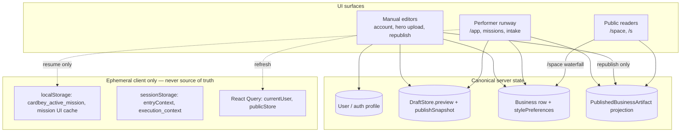

# V1 Manual vs Performer State Boundary

**Phase:** B only (no Phase C).  
**Core rule:** Manual UI = fast direct editing. Performer = orchestration / automation / mission execution. **One canonical state** — no parallel `manualState` vs `performerState` models.

---

## 1. Architecture (three layers)

| Layer | Role | Must not |
|-------|------|----------|
| **Manual** | PATCH/POST canonical APIs; invalidate `currentUser` / refetch draft | Create missions for simple saves |
| **Performer** | Intake v2, pipelines, multi-step tools; writes IDs into draft/mission outputs | Be the only path for avatar/name/hero URL edits |
| **Canonical** | DB + publish snapshot + artifact projection | Be overwritten by stale localStorage |
| **Ephemeral** | Resume orb, handoff context, UI cache | Define business name, hero, or slug for public URLs |

---

## 2. Canonical state map (single source of truth)

| Domain | Canonical write | Canonical read (owner/editor) | Public read |
|--------|-----------------|-------------------------------|-------------|
| **Personal profile** | `PATCH /api/auth/profile`; media: `POST /api/auth/profile/media`; uploads: `POST /api/uploads/create` | `useCurrentUser` → `GET` current user | `/space/personal` via user + `GET /api/auth/profile/media` |
| **Account settings** | Same profile + contact fields on `/api/auth/profile` | Account sections | N/A |
| **Business identity (live)** | On publish/republish: `Business` + `PublishedBusinessArtifact` | Store context, dashboard store routes | `GET /api/public/stores/:slug` → artifact projection |
| **Storefront draft** | `patchDraftPreview` (core); hero: `PATCH /api/stores/:id/draft/hero`, upload routes | `GET /api/draft-store/:draftId` + `publishState` | **Not** served on `/s/:slug` until republish |
| **Publish snapshot** | `PATCH /api/draft-store/:id/publish-snapshot`; publish: `POST .../publish` or mini-website publish | `WebsitePreviewPage`, republish handler | Becomes artifact on successful publish |
| **Mission execution** | `MissionPipeline`, `OrchestratorTask`, intake v2 | Mission console, `/app?missionId=` | Indirect via draft/business IDs in artifacts |

**Draft vs live hero (intentional):**

- **Editor** (`/preview/website/:draftId`) reads **DraftStore.preview** (+ local `heroImageUrl` until refetch).
- **Live site** (`/s/:slug`) reads **PublishedBusinessArtifact** (or `Business` fallback).
- **Republish** copies draft (+ snapshot sync) → live projection. Mismatch before republish is expected, not duplicate state models.

---

## 3. Area audit (current codebase)

### 3.1 Personal profile

| Component | Path | Write API | Refresh after save |
|-----------|------|-----------|-------------------|
| `AccountPersonalProfileSection` | `src/pages/account/AccountPersonalProfileSection.tsx` | `PATCH /api/auth/profile`, `uploadMediaFile` | `invalidateQueries(CURRENT_USER_QUERY_KEY)`, `authchange` |
| `AccountOwnerIdentitySections` | `src/pages/account/AccountOwnerIdentitySections.tsx` | profile + media library | same pattern |
| `SpacePage` personal | `src/pages/SpacePage.tsx` | read-only display | `resolvePersonalSpaceData` + `buildPersonalSpace` |

**Gap:** `/dashboard/account` composition may live outside sparse `src` tree; sections are canonical when mounted.

### 3.2 Account settings

Contact, media library, QR — all manual, backend-backed. QR is client-only (no profile write).

### 3.3 Business profile / space

| Component | Write | Read |
|-----------|-------|------|
| `SpacePage` | None in-page (Performee opens `/app`) | `resolveBusinessSpaceData` waterfall |
| `spaceAdapter.buildBusinessSpace` | Pure mapper | Merges store list + resolved payload |

**Resolve order** (`resolveSpaceData.ts`):

1. `GET /api/store/:id/preview` — live-oriented preview blob  
2. `GET /api/store/:id/context`  
3. `GET /api/public/stores/:slug` — **published artifact** (best parity with `/s/:slug`)  
4. Session `stores` list (names only)

**Risk:** `/space/:businessId` may show **live preview** while website editor shows **draft hero** until republish. Prefer owner messaging (“Edit & republish”) not a second state model.

**Gap:** `OwnerProfileSection` imported by `WebsitePreviewPage` — ensure store owner fields PATCH draft/business via existing store routes (see `STEP2_UPLOAD_IMPLEMENTATION.md`).

### 3.4 Store setup checklist

Not present in current dashboard `src` snapshot. When restored, checklist must **read** `DraftStore` + `Business` + mission `artifacts` (storeId, draftId), not a separate checklist JSON file.

### 3.5 Storefront draft / published snapshot

| Flow | Files | Canonical |
|------|-------|-----------|
| Load editor | `WebsitePreviewPage`, `loadDraftFromServer` | `GET /api/draft-store/:id` (+ `publishState`) |
| Hero edit | `HeroImageEditor` (wired; path `@/components/mini-website/HeroImageEditor`) | `PATCH .../draft/hero`, upload hero |
| Republish | `handleRepublishClick`, `publishSnapshotClient` | snapshot PATCH + `POST .../publish` |
| First publish | `PublishModal` | mini-website publish APIs |
| Theme picker | `WebsitePreviewPage` `selectedTemplate` | **Local only today** — should persist to `preview.website.theme` via draft PATCH when wired |

### 3.6 Artifact edits (hero, logo, media, QR, URL)

| Artifact | Manual path | Performer path |
|----------|-------------|------------------|
| Hero (store) | Hero editor → draft preview | `create_store` / website generation pipeline |
| Avatar (personal) | Account profile upload + save | Profile generation missions |
| Logo / business images | Store upload routes (core) | Generation / replace_catalog tools |
| QR | Client generate from handle | Promo/campaign missions |
| Published URL | Republish + slug on `Business` | Publish step in missions |
| Preview card | `WebsitePreviewPage` | Mission artifact links |

### 3.7 Performer mission outputs

| Entry | File | Creates mission? |
|-------|------|------------------|
| Floating orb | `PerformerFloatingOrb`, `launchPerformerEntrypoint` | No — navigates/resumes |
| Frontscreen handoff | `CardbeyFrontscreenTopNavPreview` | No — `navigate(/app?...)` |
| Space Performee | `SpacePage` | No — `launchPerformerEntrypoint` |
| Console send | `usePerformerConsole` (when present) | Yes — `POST /api/performer/intake/v2` |

**Server write-back (store create):** `executeStoreMissionPipelineRun` → `DraftStore.preview`, `MissionPipeline.outputsJson`. Publish/commit → `Business` + artifact.

**Client mission cache:** `cardbey.console.missions.v1`, `cardbey_active_mission` — **UI resume only**; cleared on `performAppSignOut`.

### 3.8 Public routes

| Route | Reader | Data source |
|-------|--------|-------------|
| `/s/:slug` | `PublicStorePage` + `getPublicStore` | Published artifact projection |
| `/space/personal` | `SpacePage` + adapters | User + profile media API |
| `/space/:storeId` | `SpacePage` + `resolveBusinessSpaceData` | Preview → context → public artifact |
| `/preview/website/:draftId` | `WebsitePreviewPage` | Draft store (+ optional `publishedPublicStore` prop) |

---

## 4. Classification (A / B / C)

### A — Manual-mode (no mission required)

Use `isManualDirectEdit()` in `src/lib/v1/editSurfaceClassification.ts`.

- Display name, bio, profile photo  
- Account contact settings  
- Personal media library CRUD  
- Business name/description/contact (when owner PATCH exists)  
- Logo / hero upload or URL on draft routes  
- Social links, simple catalog/menu fields  
- Theme/style selection (when persisted to `preview`)  
- Save draft metadata  
- Copy link / download QR  
- **Republish** prepared draft/snapshot changes (not AI-driven)

**After manual save:** invalidate React Query keys + dispatch `authchange` (profile) or refetch draft (`loadDraftFromServer`) — **not** `createMission`.

### B — Performer-runway (mission / intake)

Use `shouldRouteToPerformer()`.

- Create store/website from prompt  
- Generate profile from scan/input  
- Generate catalog, campaigns, slideshows, promos  
- Analyze store, improve copy/design at scale  
- AI-assisted republish or bulk cleanup  
- Multi-step business operations, external tools  

### C — Shared canonical (both paths converge)

Both A and B must read/write:

- `User` profile fields  
- `DraftStore.preview` JSON  
- `DraftStore.publishSnapshot` (when flag on)  
- `Business` + `stylePreferences`  
- `PublishedBusinessArtifact` projection (via publish only)  
- Media library records  

---

## 5. Duplicate / stale state risks

| Symptom | Likely cause | Fix direction |
|---------|--------------|---------------|
| Wrong avatar on account after upload | Missing `resolveMediaUrl` or no `authchange` | Fixed in profile section; always invalidate `currentUser` |
| Editor shows Publish, store is live | Temp draft load without `publishState` | Prefer `GET /api/draft-store/:id` first (done) |
| Hero differs editor vs `/s/:slug` | Draft not republished | Republish + snapshot hero sync (done) |
| `/space` hero ≠ `/s/:slug` | Space uses `store/.../preview` before public artifact | Document; optionally reorder resolver for published stores |
| Wrong business name on space | `stores` list stale vs resolved preview | Refetch `currentUser` after publish; merge resolved store in `SpacePage` |
| Mission resume wrong store | `cardbey_active_mission` TTL cache | Ephemeral only; artifacts must carry `storeId`/`draftId` |
| Theme changes lost on refresh | `selectedTemplate` local-only | Persist to `preview.website.theme` via draft PATCH |
| Two AI entrypoints | MiPanel + orb | Orb → `/app`; MiPanel legacy; hide duplicate FABs |

---

## 6. Guardrails (V1)

1. **No hidden missions** for manual saves (profile PATCH, hero PATCH, republish POST).  
2. **No Performer-only transient writes** — mission UI cache must not be the only copy of `storeId`/`draftId`.  
3. **No duplicate next-step cards** — manual publish bar (`WebsitePreviewToolbar`) vs mission step cards must not both claim “Publish” on same surface; mission console owns multi-step cards.  
4. **Sign-out clears ephemeral** — `performAppSignOut` clears mission keys + `authchange`; does not delete server draft.  
5. **Public never reads draft** — except explicit preview modes (`/preview/website`, `?preview=true` with local draft).  
6. **Performer unified runway** — public surfaces use `launchPerformerEntrypoint` only; do not reintroduce blue support bubble or parallel intake APIs on store pages.

---

## 7. Lightweight refresh contract (manual edits)

| Event | When | Consumers |
|-------|------|-----------|
| `authchange` | After `PATCH /api/auth/profile` | Header, `SpacePage` personal, account menu |
| `queryClient.invalidateQueries(['currentUser'])` | Profile / stores list | Same |
| `loadDraftFromServer()` / refetch draft | Hero persist, republish | `WebsitePreviewPage` |
| `refreshPublishStateFromServer()` | After publish/republish | Toolbar Live / Republish |
| `app:logout` | Sign out | Shell cleanup |

Do **not** start MI mission or intake on these events.

---

## 8. Validation checklist

- [ ] Change profile manually → `/space/personal` updates after save + navigation  
- [ ] Change business fields manually (when wired) → business space reflects resolved store  
- [ ] Change hero in editor → preview updates; `/s/:slug` updates only after **Republish**  
- [ ] Performer creates store → draft GET shows same store name/items as mission artifacts  
- [ ] Performer improves copy → manual editor fields match draft preview after refetch  
- [ ] Republish → `/s/:slug` matches latest artifact  
- [ ] Sign out → mission/session keys cleared; re-login loads server state  
- [ ] Orb opens `/app` without creating mission; resume uses `missionId` when active  

---

## 9. Files reference (implementation)

**Dashboard (present in tree):**

- `src/lib/v1/editSurfaceClassification.ts` — intent classification helpers  
- `src/lib/performer/launchPerformerEntrypoint.ts` — unified entry (no mission create)  
- `src/lib/appSignOut.ts` — ephemeral cleanup  
- `src/pages/account/*` — manual profile  
- `src/pages/public/WebsitePreviewPage.tsx` — draft editor + republish  
- `src/features/storeDraft/publishSnapshotClient.ts` — snapshot sync  
- `src/lib/space/resolveSpaceData.ts`, `spaceAdapter.ts` — public space projection  
- `src/components/publish/WebsitePreviewToolbar.tsx` — manual publish/republish UI  

**Core:**

- `services/draftStore/draftStoreService.js` — `patchDraftPreview`, live vs draft hero guard  
- `services/draftStore/buildDraftPublishState.js` — draft vs live diff  
- `services/draftStore/publishDraftService.js` — publish → Business + artifact  
- `services/publishedArtifactProjection/*` — public `/s/:slug` projection  
- `routes/stores.js` — hero/avatar upload + draft PATCH  
- `routes/draftStore.js` — GET draft + `publishState`  
- `routes/performerIntakeV2Routes.js` — Performer intake  

**Missing / rolled back (restore from git before relying on):**

- `src/app/console/missions/missionStore.ts` (re-export `missionUiCache`)  
- `src/lib/performer/openPerformerMission.ts`, `openPerformerConsole.ts`  
- `src/components/mini-website/HeroImageEditor.tsx`, `OwnerProfileSection.tsx`  
- `src/lib/storeContext.ts` (referenced by sign-out)  

---

## 10. Recommended follow-ups (minimal, Phase B)

1. Persist theme selection to `preview.website.theme` on template change (draft PATCH).  
2. For published businesses, consider resolving `/space/:id` via `GET /api/public/stores/:slug` **before** `store/.../preview` when slug known (align with `/s/:slug`).  
3. Restore missing dashboard modules so imports resolve in CI/staging build.  
4. Wire store setup checklist to read `publishState` + draft GET, not local checklist state.
