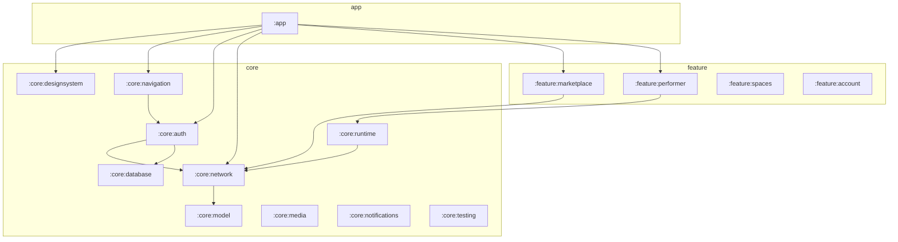

# Android Architecture

## Decision: `apps/android/` as standalone Gradle project

**Rationale:** The user-facing native app must not be a WebView wrapper. The existing Capacitor project serves a different purpose. The signage player (`com.cardbey.slide`) is device-specific. A dedicated `apps/android/` tree keeps Gradle, CI, and module boundaries isolated while matching the monorepo `apps/*` convention.

## Principles

1. **One Cardbey platform** — all consequential writes go through Core APIs, Performer Runtime, or governed UI-action endpoints.
2. **No execution runway duplication** — repositories route mutations; screens do not call legacy endpoints directly.
3. **Native UI** — Jetpack Compose + Material 3; WebView only for OAuth/payment/legal isolation.
4. **Backend is source of truth** — missions, spaces, and publish state are server-authoritative.

## Module diagram (target)



**Phase 1 ships:** `:app`, `:core:designsystem`, `:core:model`, `:core:network`, `:core:database`, `:core:auth`, `:core:navigation`, `:core:testing`.

Feature modules are added incrementally per vertical slice.

## Layering (per feature)

```
UI (Compose) → ViewModel → UseCase/Repository → Network/Local
```

- **ViewModels** expose `StateFlow` UI state; no business logic in Composables.
- **Repositories** are the only layer that calls Retrofit or Room.
- **Use cases** appear when a repository serves multiple ViewModels.

## Stack

| Concern | Library |
|---------|---------|
| UI | Jetpack Compose, Material 3 |
| DI | Hilt |
| Async | Kotlin Coroutines, StateFlow |
| HTTP | Retrofit, OkHttp, kotlinx-serialization |
| Local | Room, DataStore |
| Images | Coil (Phase 3+) |
| Video | Media3 (Phase 3+) |
| Camera | CameraX (Phase 5) |
| Background | WorkManager (Phase 7) |
| Push | FCM abstraction (Phase 7) |

## Environment configuration

Build flavors inject `BuildConfig` fields:

- `API_BASE_URL` — Core origin without `/api`
- `WEB_BASE_URL` — Public web origin for share/deep links
- `APP_LINK_HOST` — Verified App Links host

No production URLs in source except flavor defaults matching dashboard fallbacks.

## Governed action routing

```
Screen intent
  → ActionRouter.classify(action)
  → PerformerRepository.submitIntake()     // chat / plans
  → RuntimeRepository.uiAction()           // governed mutations
  → MissionRepository.confirm()            // approvals
  → PublishRepository.*                      // explicit publish APIs
```

High-risk keys mirror `runtimeActionTypes.js` (`publish_store`, `create_campaign`, etc.) and always require confirmation UI.

## Error model

Shared `CardbeyError` sealed hierarchy in `:core:model`:

`Auth`, `Permission`, `Validation`, `Connectivity`, `Timeout`, `RateLimit`, `Server`, `Mission`, `Upload`, `Media`, `Unsupported`, `Conflict`, `StaleState`, `ApprovalRequired`.

Each maps to user-facing copy with retry/safe-replay hints.
