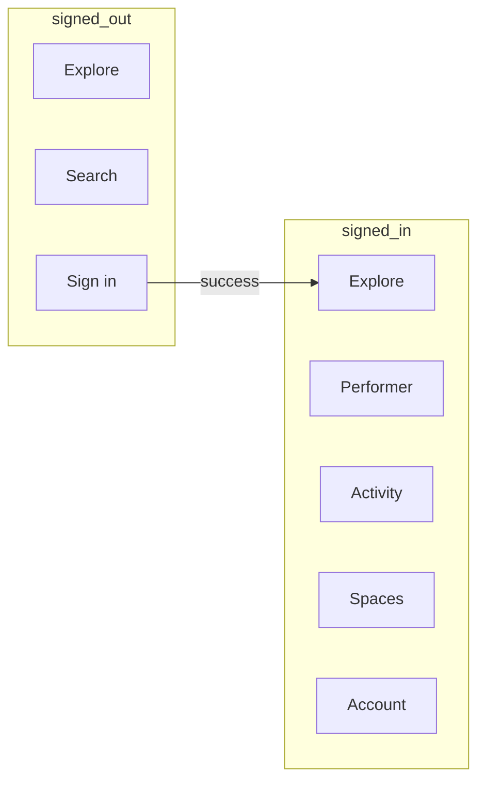

# Navigation

## Primary destinations

### Signed out

| Tab / entry | Route | API dependency |
|-------------|-------|----------------|
| Explore | `explore` | `/api/public/stores/feed` |
| Search | `search` | `/api/discovery/search` |
| Sign in | `sign_in` | `/api/auth/login` |
| Deep link | various | See deep-link table |

### Signed in

Bottom navigation (phone):

1. **Explore** — public marketplace (same feed, personalized when authed)
2. **Performer** — primary AI execution surface
3. **Activity** — mission history, approvals, notifications entry
4. **Spaces** — personal + business spaces, store context
5. **Account** — profile, settings, sign out

Tablet: navigation rail with same five destinations.

## Space model

```
Global marketplace (no space)
  └── User account
        ├── Personal space (`personal` / `me`)
        └── Business space (per store)
              └── Store operational context
```

Active space + store shown in Performer composer and governed action screens.

## Deep-link table

| Web path | Android route | Auth |
|----------|---------------|------|
| `/s/:slug`, `/store/:slug` | `store/{slug}` | Optional |
| `/u/:handle` | `profile/{handle}` | Optional |
| `/space/:spaceId` | `space/{spaceId}` | Optional |
| `/search?q=` | `search?q=` | Optional |
| `/p/promo/:publicId` | `promo/{publicId}` | Optional |
| `/p/:storeSlug/offers/:offerSlug` | `offer/{storeSlug}/{offerSlug}` | Optional |
| `/device/pair` | `device/pair` | Required |
| `/claim-business/:id` | `claim/{id}` | Required |
| Mission (query `missionId`) | `performer?missionId=` | Guest or auth |
| Password reset token | `auth/reset?token=` | — |
| Email verify | `auth/verify?token=` | — |

App Links host: `cardbey.com` (staging TBD). Custom scheme: `cardbey://` for dev.

## Modal patterns

- **Bottom sheet:** store picker, space switcher, quick actions
- **Full screen:** sign in, camera capture, artifact review
- **Dialog:** destructive confirmations, approval gates


