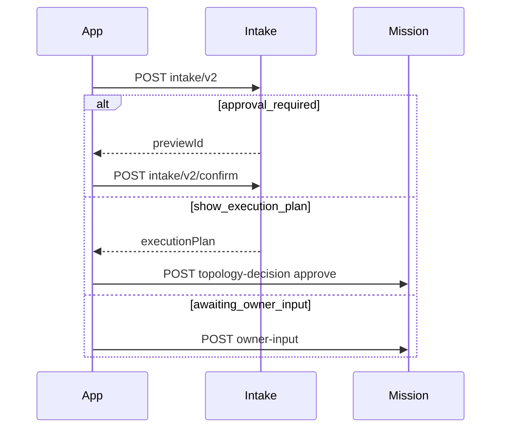

# Performer Runtime — Android Integration

## Entry point

`POST /api/performer/intake/v2` with body:

```json
{
  "userMessage": "string",
  "currentContext": {
    "storeId": "optional",
    "activeMissionId": "optional",
    "draftId": "optional",
    "spaceType": "personal|business",
    "spaceId": "optional"
  },
  "locale": "en",
  "attachments": []
}
```

Auth: `requireUserOrGuest` — Bearer JWT or guest session header.

## Response routing

Parse `action` field first. Do not render all fields as chat text.

| `action` | Android composable | Follow-up API |
|----------|-------------------|---------------|
| `clarify`, `clarify_store` | `ClarificationCard` | Re-submit intake with selection |
| `approval_required` | `ApprovalRequiredCard` | `POST /intake/v2/confirm` |
| `show_execution_plan` | `ExecutionPlanCard` | `POST /topology-decision` |
| `store_mission_started` | `MissionProgressCard` | Poll state / SSE |
| `resume_active_mission` | Resume banner | `GET /missions/:id/state` |
| `error`, `validation_error` | `ErrorRecoveryCard` | Retry intake |

`runtimeState` mirrors canonical states for progress UI.

## Mission stream client

Single abstraction: `MissionStreamClient`

```
connect(missionId, streamToken?)
  → SSE: GET /api/stream?key=agent-chat&missionId&streamToken
  → fallback: poll GET /missions/:id/blackboard?afterSeq=
```

Requirements:

- Exponential backoff reconnect (max 30s)
- Dedupe by event sequence / id
- Preserve ordering
- On background: disconnect SSE; on resume: rehydrate from `GET /state` + blackboard
- Never mark complete on stream disconnect alone

### Stream token

```
POST /api/agent-messages/stream-token
→ { streamToken, expiresIn }
```

## Confirmation flows



## Governed UI actions

`POST /api/performer/runtime/ui-action`

```json
{ "action": "publish_store", "payload": {}, "missionId": "", "storeId": "" }
```

High-risk actions return `requireConfirmation: true` — show approval UI before retry with `confirmed`.

## Mission persistence (local)

Room table `mission_cache`:

- `missionId`, `status`, `runtimeState`, `title`, `updatedAt`, `lastEventSeq`

Backend remains authoritative; cache for offline read and quick reopen.

## TypeScript reference

- `useIntakeV2.ts` — `IntakeV2Response`
- `canonicalRuntimeState.ts` — runtime state helpers
- `topologyReviewModel.ts` — plan review modes
- `apiPaths.ts` — path constants
