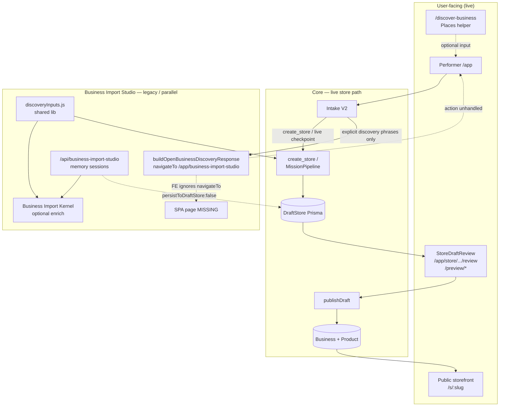
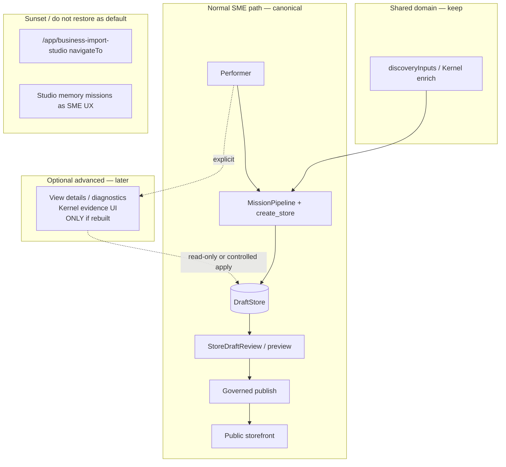

# Business Studio ↔ Performer ↔ DraftStore Relationship Audit

**Date:** 2026-07-21  
**Updated:** 2026-07-21 (legacy-intent cleanup implemented)  
**Scope:** Dependency trace + compatibility fix  
**Subject:** “Business Studio” / “Business Import Studio” / “Business Discovery Studio”  
(Not Creator Studio, Content Studio, Campaign Studio, Layout Studio, or Filter Studio.)

---

## Compatibility decision (implemented)

| Decision | Choice |
|---|---|
| Strategy | **B — retain compatibility alias**, normalize at **Core earliest boundary**, plus **dashboard belt-and-suspenders** for older Core payloads |
| SME-facing Studio UI | **Deprecated — not restored** |
| Canonical runway | **Performer → DraftStore → StoreDraftReview → Preview → Publish** |
| Studio HTTP API / Kernel / `discoveryInputs.js` | **Retained** (backend/diagnostic / shared enrich) |

### Legacy intent mapping

| User / payload | Normalized action |
|---|---|
| Explicit Studio phrases (`open business import studio`, …) | `create_store` Live checkpoint (no Studio `navigateTo`) |
| Same + existing `draftId` / `missionId` | `resume_active_mission` + `reviewHref` → `/app/store/draft/review?…` |
| Old Core `action: open_business_discovery_studio` | Dashboard `normalizeLegacyBusinessDiscoveryIntake` → `create_store` or resume |
| Old Core `navigateTo: /app/business-import-studio` | **Stripped**; never followed |
| `import my business` / `create a store` (non-Studio) | Unchanged Live Store Mission path |
| Generic unrelated intents | Unchanged |

### Files changed (cleanup)

| File | Change |
|---|---|
| `apps/core/.../businessDiscoveryRouting.js` | Compat handoff → Performer; no Studio URL |
| `apps/core/.../performerIntakeV2Routes.js` | Pass draft/mission context into handoff |
| `apps/dashboard/.../normalizeLegacyBusinessDiscoveryIntake.ts` | FE normalizer for old payloads |
| `apps/dashboard/.../useIntakeV2.ts` | Apply normalizer; resume opens StoreDraftReview |
| Tests | Core `businessDiscoveryRouting.test.js`; FE `normalizeLegacyBusinessDiscoveryIntake.test.ts` |

### Studio backend removed?

**No.** `/api/business-import-studio`, Kernel, `discoveryInputs.js` remain.

### Frontend route restored?

**No.** `/app/business-import-studio` was not added to `App.jsx`.

---

## Executive classification

**Business Import / Discovery Studio is best classified as:**

### **D + E (+ B for shared libraries)**

| Letter | Applies? | Meaning |
|---|---|---|
| **A** Active supported frontend alongside Performer | **No** | No mounted SPA route |
| **B** Backend/domain capability still used | **Partially** | Studio HTTP API + `discoveryInputs` + Kernel |
| **C** Feature-flagged frontend currently disabled | **No** | UI absent, not toggled |
| **D** Deprecated frontend with legacy navigation | **Yes — navigation refs cleaned** | Core no longer emits Studio `navigateTo` |
| **E** Partially replaced | **Yes** | Performer + StoreDraftReview |

**One-line verdict:** Studio SME UI remains deprecated. Legacy intents now land in Performer. Draft editing/publish stay on DraftStore surfaces.

---

## Answers to the ten explicit questions

### 1. Is Business Studio currently a live supported user-facing surface?

**No.**

### 2. Is it deployed in dashboard, Core, or another app?

| Layer | Deployed? |
|---|---|
| Dashboard SPA | **No UI** |
| Core API | **Yes** (`/api/business-import-studio`) |

### 3. Is it intended to coexist with Performer?

Advanced diagnostics only (optional later). **Not** a second onboarding runway.

### 4. Does Performer depend on Studio UI?

**No** — DraftStore / `create_store` / MissionPipeline.

### 5. Canonical review destination?

`/app/store/{temp\|draft}/review` via `buildDraftReviewUrl` / `buildPerformerDraftReviewHref`.

### 6. Which routes can send a user to a missing page?

| Path | After cleanup |
|---|---|
| Core Studio `navigateTo` | **Removed** from handoff |
| Manual `/app/business-import-studio` | Still 404 if typed (no route) — acceptable |
| Old cached Core responses | FE normalizer strips Studio URL |

### 7. Safest fallback?

Performer Live `create_store`; or StoreDraftReview when `draftId` exists.

### 8. Would removing Studio UI refs break publish?

**No.**

### 9. Replacement editor?

**Yes** — StoreDraftReview + preview.

### 10. Canonical architecture going forward?

Performer → DraftStore → StoreDraftReview → Preview → Publish.

---

## Future: Business Management Studio V1 (separate product)

**Do not restore** `/app/business-import-studio` or its import/onboarding semantics.

| Concept | Meaning |
|---|---|
| **Deprecated — Business Import Studio** | Separate import/onboarding runway (retired as SME entry) |
| **Future — Business Management Studio** | Structured management workspace for an **existing** draft/store |

### Suggested routes (not implemented here)

- `/app/store/:storeId/manage` (preferred — fits existing store dashboard), or  
- `/app/business/:businessId/studio`

### Entrance

1. After publish: dashboard **Manage business** → opens same canonical Business/DraftStore state.  
2. Before publish when detail correction is needed: StoreDraftReview **Edit details** → Studio in draft mode → return to review → publish.

### Interaction modes

| Mode | Role |
|---|---|
| Performer | “Do this for me.” |
| Business Management Studio | “Let me inspect and configure it precisely.” |

### Hard constraints

Business Management Studio must **never** create its own session model, business record, catalogue copy, or publishing pipeline. One runway; two complementary UIs over the same state.

```
User request → Performer → Canonical draft/state
                              ├─ structured mgmt → Business Management Studio
                              └─ review → StoreDraftReview → Preview/Publish
```

---

## Remaining cleanup (pilot)

| Item | Status |
|---|---|
| Legacy URL redirect `/app/business-import-studio` → Performer | **Implemented** (safety redirect + toast notice; not UI restore) |
| `isUnifiedPerformerDraft` Studio API regex | **Kept** — still forbids Studio API approve/prepare/execute recovery for unified drafts; valid while `/api/business-import-studio` is mounted |
| Core `businessDiscoveryRouting.js` untracked? | **Single intentional file** under `src/lib/intake/` — not a duplicate path; never previously in git index for this repo (local/untracked history). Safe to add in Core commit. |

---

## Classification rationale (A–E detail)

### Why not A
No SPA route, no page files, agent-first rules forbid Studio as mandatory normal path.

### Why B (partial)
- Mounted: `/api/business-import-studio/*` (`businessImportStudioRoutes.js`)  
- In-memory sessions: `sessionStore.js`  
- Execute defaults `persistToDraftStore: false`  
- Shared: `discoveryInputs.js` → Performer enrich  
- Kernel DraftStore adapter is **flagged** (`ENABLE_BUSINESS_IMPORT_KERNEL_V1` + `ENABLE_BUSINESS_IMPORT_DRAFTSTORE_ADAPTER_V1`), not Studio-UI-gated  

### Why not C
No `ENABLE_BUSINESS_IMPORT_STUDIO_UI` (or similar). Absence ≠ disabled flag.

### Why D
Legacy Studio SPA is gone; Core previously emitted Studio `navigateTo`. **Cleanup (2026-07-21):** Core + FE normalize to Performer; remaining risk is manual URL / stale external docs only.

### Why E
Agent-first lock + Live Store Creation recovery explicitly replaced Studio as the default create-store destination. Review/edit/publish live on DraftStore surfaces.

---

## Reference inventory (every Studio touchpoint)

### Frontend (dashboard submodule)

| File | Symbol / note | Route | Mounted? | Screen exists? | Reachable? | Tests | Required by Performer? | Disposition |
|---|---|---|---|---|---|---|---|---|
| `App.jsx` | No Studio route | — | N/A | **No** | Manual URL fails | — | No | Keep App as-is; do not re-add without product decision |
| `useIntakeV2.ts` | Applies `normalizeLegacyBusinessDiscoveryIntake`; resume opens StoreDraftReview | — | N/A | N/A | Yes | Indirect | No | **Done** — legacy Studio action normalized |
| `normalizeLegacyBusinessDiscoveryIntake.ts` | FE compat for old Core payloads | — | N/A | N/A | Yes | Unit tests | No | **Keep** |
| `isUnifiedPerformerDraft.ts` | Regex mentions studio approve/prepare/execute paths | API paths | N/A | N/A | Defensive only | Local | No | Keep or migrate when Studio API sunset |
| `ProactiveProductSelectionPanel.tsx` | `navigateToStudio` | Product-selection studio | Yes (other) | Different product | Yes | — | No | **Keep** (not Business Import Studio) |
| `features/business-import-studio/*` | — | `/app/business-import-studio` | **No** | **Missing** | No | Docs only | No | Do not recreate for Phase A |

### Core — navigation / intake

| File | Symbol | Route / action | Flag | Mounted | Screen | Reachable | Tests | Required by Performer? | Disposition |
|---|---|---|---|---|---|---|---|---|
| `businessDiscoveryRouting.js` | `buildOpenBusinessDiscoveryResponse` | `action: create_store` or `resume_active_mission`; **no** Studio `navigateTo` | None | Response only | StoreDraftReview when draft | Explicit phrases | Updated unit tests | No | **Done** — Performer handoff |
| `businessDiscoveryRouting.js` | `isExplicitOpenBusinessDiscoveryIntent` | Studio-like phrases only | None | — | — | Yes | Yes | No for normal create | Keep classifier |
| `performerIntakeV2Routes.js` | Early return on explicit discovery | Performer compat payload | None | Yes | — | Yes | Routing tests | No | **Done** |

### Core — Studio API / orchestration

| File | Symbol | Route | Flag | Mounted | Screen | Reachable | Tests | Required by Performer? | Disposition |
|---|---|---|---|---|---|---|---|---|
| `server.js` | `app.use('/api/business-import-studio', …)` | `/api/business-import-studio` | None on mount | **Yes** | N/A | HTTP yes | Studio E2E tests | **No** | Keep temporarily as diagnostic; or deprecate |
| `businessImportStudioRoutes.js` | start/approve/prepare/execute/replay | Same | execute forces `persistToDraftStore: false` | Yes | No SPA | API clients / curl | `studioE2E`, handoff tests | No | Keep/redirect policy: never auto-DraftStore from public execute |
| `businessImportStudio/orchestrator.js` | mission lifecycle `bim_*` | — | — | In-process memory | No | Via API | Yes | No | Keep as backend-only until sunset |
| `businessImportStudio/sessionStore.js` | `Map` sessions | — | — | Memory | No | Multi-instance unsafe | Yes | No | Not pilot-critical |
| `businessImportStudio/discoveryInputs.js` | normalize discovery | — | — | Lib | — | Via enrich | Yes | **Indirect yes** (enrich) | **Keep** (move under Kernel/storeMission naming later) |
| `enrichStoreMissionFromDiscovery.js` | imports discoveryInputs | — | Kernel flags | Yes | — | Performer enrich path | Integration tests | Optional enrich | **Keep** |

### Kernel ↔ DraftStore (related, not Studio UI)

| File | Note | Flag | Performer-required? | Disposition |
|---|---|---|---|---|
| `draftStoreAdapter.js` | Kernel → Prisma DraftStore | `ENABLE_BUSINESS_IMPORT_KERNEL_V1` + `ENABLE_BUSINESS_IMPORT_DRAFTSTORE_ADAPTER_V1` | No (off by default) | Leave off for Phase A |
| Studio execute | Always `persistToDraftStore: false` | — | No | Do not flip globally |

### Docs / reports (stale vs product)

| Doc | Claims Studio UI | Accuracy now |
|---|---|---|
| `docs/AUDIT_STORE_CREATION_RUNTIME_CONVERGENCE.md` | Page + Continue → Studio missions | **Stale** for UI |
| `docs/IMPACT_REPORT_business_import_studio_slice1.md` | Built `/app/business-import-studio` | Historical |
| `docs/PRODUCT_AGENT_FIRST_INTERACTION.md` | Advanced = Studio | Intent still valid; **UI missing** |
| `docs/IMPACT_REPORT_route_create_store_to_business_discovery.md` | create_store → Studio | **Superseded** by Live Performer runway recovery |
| Mission 1000 audit “Studio UI missing…” | Correct | Confirmed |

### Other “Studio” names (out of scope — do not confuse)

| Surface | Route / area | Relation to Business Import Studio |
|---|---|---|
| Creator Studio | `/creator-studio/*` | Separate creator product |
| Content / Contents Studio | `/app/contents-studio`, content-studio | Creative editing |
| Campaign Studio | `/campaigns/:id/studio` | Campaigns |
| Layout Studio | `/tools/layout-studio` | Layout |
| Core `routes/studio.js` | Generic studio handlers | Not Business Import |

---

## Flow traces (actual current behavior)

### 1. New business onboarding

```
Signup / guest
  → /app?entry=performer&onboarding=1&starter=create_store  (canonicalNavBuilders / paths)
  → Intake V2
      ├─ explicit “open business import studio” → Core Studio payload
      │     → useIntakeV2 default → “not sure how to help” (no navigation)
      └─ “create store” / create_store hint → Live Store Creation checkpoint (in chat)
  → user submits form / attachments
  → create_store tool → MissionPipeline → DraftStore (Prisma)
  → mission outcome CTA → buildDraftReviewUrl → /app/store/draft|temp/review
  → StoreDraftReview edit
  → publishStoreThroughRuntime / publishDraft (confirm)
  → Business + Product → /s/:slug
```

**Studio UI not on this path.**

### 2. Existing business edit

```
Performer / My Stores / Growth
  → edit intents against existing storeId / draftId
  → StoreDraftReview or store management APIs
  → publish / update
```

**No Studio dependency.**

### 3. Business import

```
A) Performer discovery bundle / URL / attachments
   → create_store or from-discovery API (orphaned FE for from-discovery)
   → optional Kernel enrich (discoveryInputs + Kernel; memory snapshots)
   → DraftStore → review → publish

B) Studio HTTP API (diagnostic)
   → /api/business-import-studio/missions → memory bim_* session
   → execute-runtime with persistToDraftStore:false → no DraftStore by default
   → [DISCONNECTED] no SPA to drive this for SMEs
```

---

## Mermaid — actual current architecture



---

## Mermaid — recommended architecture



**Policy:**

1. Never auto-route create-store to Studio.  
2. Fix Core `navigateTo` before any FE starts honoring it.  
3. Treat Studio API as non-pilot / diagnostic until durable + UI exist.  
4. Do not block Phase A pilots on Studio.

---

## Correction to Mission 1000 audit phrasing

| Audit phrase | More precise |
|---|---|
| “Studio UI missing while Core still navigates there” | Core **emits** a Studio `navigateTo`, but Intake V2 **does not navigate**; users get an unhandled-action message, not typically a 404 — unless they open the URL manually or a future client starts respecting `navigateTo`. |
| “Studio is the import blocker” | **Overstated** for normal pilots; Live Performer + DraftStore is the import/create path. |
| Studio as feature-flagged off | **Incorrect** — UI absent, not flagged. |

---

## Safe next actions (no code in this doc)

**Do not remove or redirect until product confirms.** Recommended order after approval:

1. Change `buildOpenBusinessDiscoveryResponse` to **omit dead navigateTo** (or point to `/app?…starter=create_store`) while keeping `stayInChat: true`.  
2. Add `useIntakeV2` case for `open_business_discovery_studio` → Live create_store guidance.  
3. Update `businessDiscoveryRouting.test.js`.  
4. Leave Studio API mounted until a deprecation notice; do not enable `persistToDraftStore: true` globally.  
5. Keep `discoveryInputs.js` / Kernel enrich.  
6. Mark stale docs that still require Studio for create_store.

---

## Summary table

| Concern | Status |
|---|---|
| Live SME create/import | Performer + DraftStore |
| Canonical review/edit | StoreDraftReview + preview routes |
| Canonical publish | publishDraft / publishStoreThroughRuntime |
| Business Import Studio UI | **Missing** |
| Studio API | Mounted, memory, no default DraftStore persist |
| Performer ↔ Studio UI dependency | **None** |
| Shared Studio libs | discoveryInputs → enrich |
| Missing-page risk | Manual URL + future navigateTo consumers |
| Safest fallback | Performer live create_store / draft review |
