# Mission 1000 — Flow Traces

**Audit date:** 2026-07-21  
**Purpose:** Document *actual* current end-to-end paths (not aspirational docs). Disconnected edges marked **[DISCONNECTED]**.

---

## Repository map (relevant)

```
apps/core/cardbey-core          API, Kernel, Prisma, workers
apps/dashboard/cardbey-marketing-dashboard   SPA (git submodule)
packages/api-client, template-engine, cors-headers
docs/, reports/                 many impact reports (not runtime)
render.yaml                     staging + production env flags
```

---

## Stage 0 — Entry → first import action

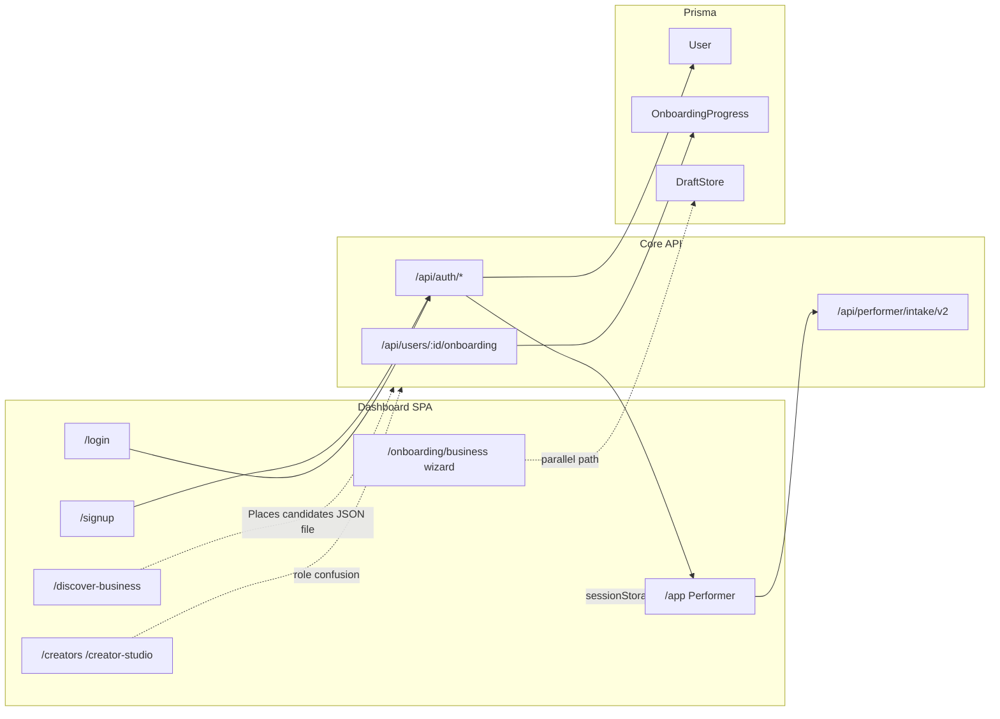

**Working:** Signup/login → Performer.  
**Disconnected / competing:** Business Builder wizard; Creator Studio as alternate “product”; no welcome email; onboarding progress multi-SOT.

---

## Stage 1 — Import paths

### A) Canonical Performer path (intended)

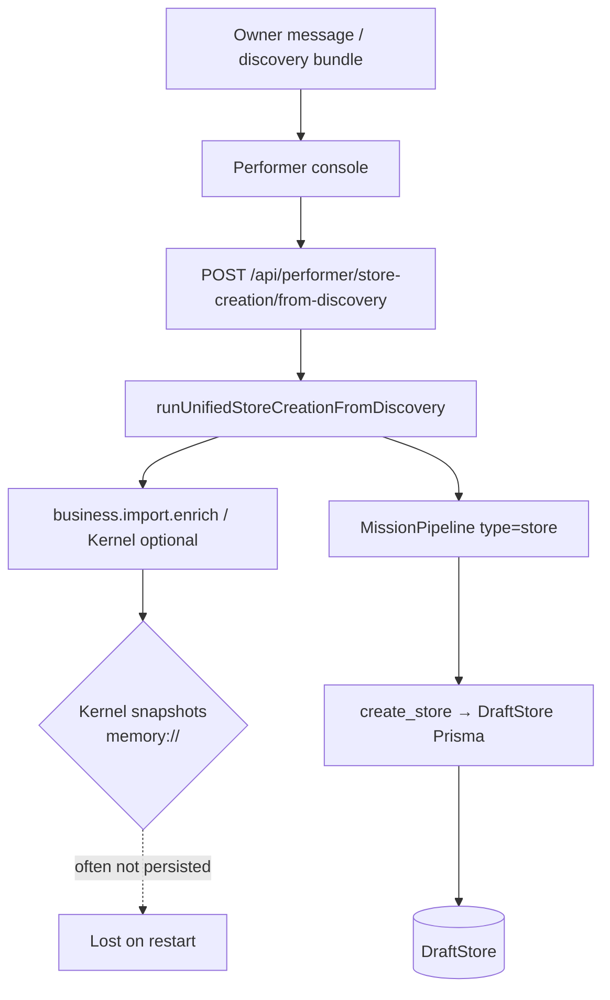

**Evidence:**  
`routes/performerStoreCreationRoutes.js`  
`lib/storeMission/runUnifiedStoreCreationFromDiscovery.js`  
`lib/capabilities/businessImportEnrich.js`  
`lib/businessImportKernel/sources/snapshotStore.js` (`memory://`)

### B) Business Import Studio (advanced) — **legacy; normalized away from SME path**

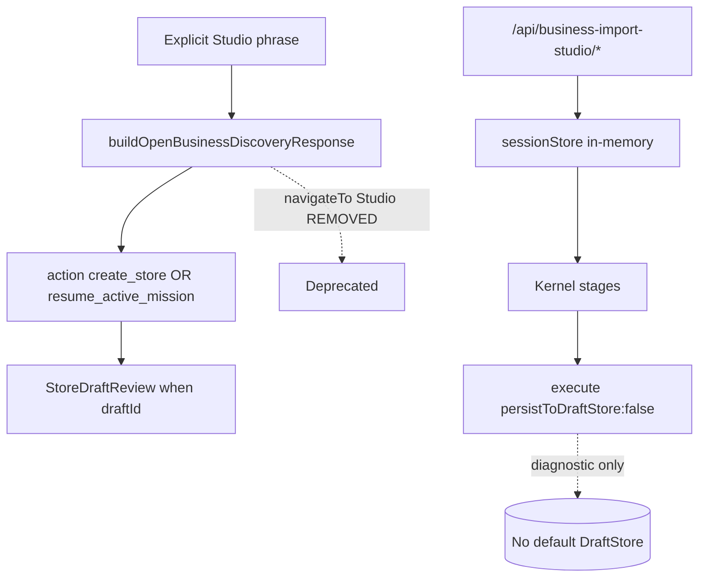

**Evidence:**  
`businessDiscoveryRouting.js` (Performer handoff; no Studio URL)  
`normalizeLegacyBusinessDiscoveryIntake.ts` (FE compat)  
`routes/businessImportStudioRoutes.js` (API retained)  
`App.jsx` — still no `/app/business-import-studio` route (by design)

### C) Parallel acquisition surfaces

| Input | Path | Durable? | Notes |
|---|---|---|---|
| Website URL | Kernel + Places UI | Partial | Places candidates file-backed |
| PDF/image | Kernel adapters + menu OCR API | Partial | Parallel stacks |
| Google Places | `/discover-business` → discovery APIs | Partial | Needs API key |
| FB/IG | classify only | No | **[DISCONNECTED]** |
| CSV | discovery-engine admin | Admin only | Not SME |
| Manual | ownerIntake fields | Yes → DraftStore | Works |

---

## Stage 2 — Presence

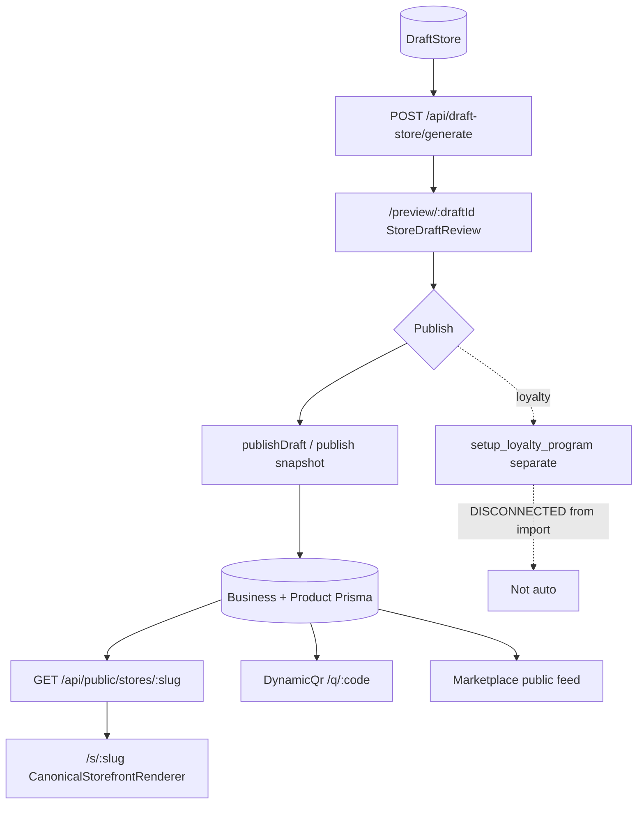

**Working:** Draft → publish → public URL → feed/QR.  
**Weak:** SEO/OG, auto loyalty, completeness after empty extraction.  
**Flags:** `PUBLISH_SNAPSHOT_V1` / `VITE_PUBLISH_SNAPSHOT_V1` dual path.

---

## Stage 3 — Content week

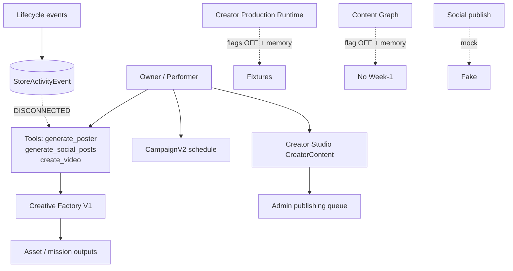

**Missing node:** orchestrator that builds 7-day branded plan from Business + catalog and returns approve UX.

---

## Stage 4 — Acquisition funnels

### A) Discovery / marketplace

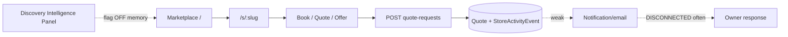

### B) QR

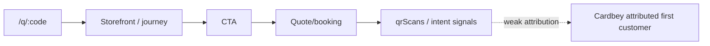

### C) Campaign

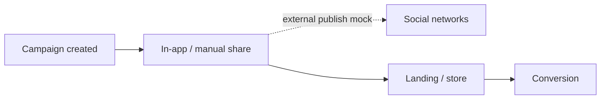

### D) Direct enquiry

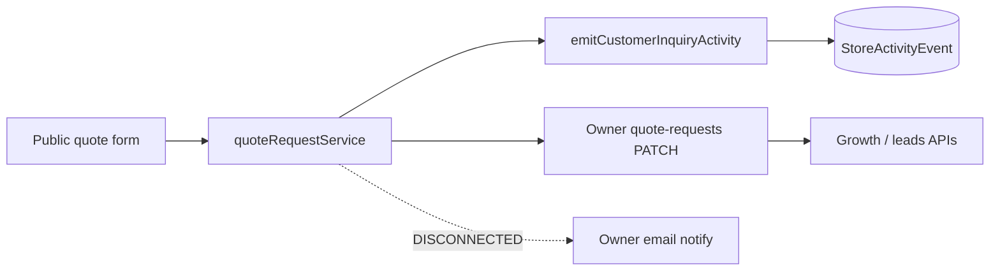

---

## Stage 5 — Value / ROI

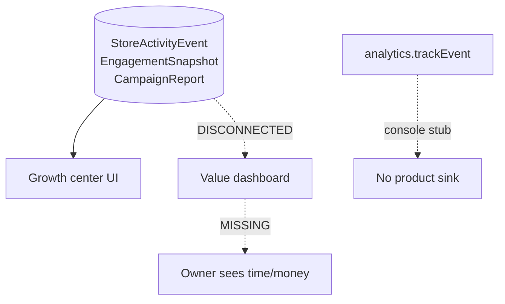

---

## Stage 6 — Morning manager

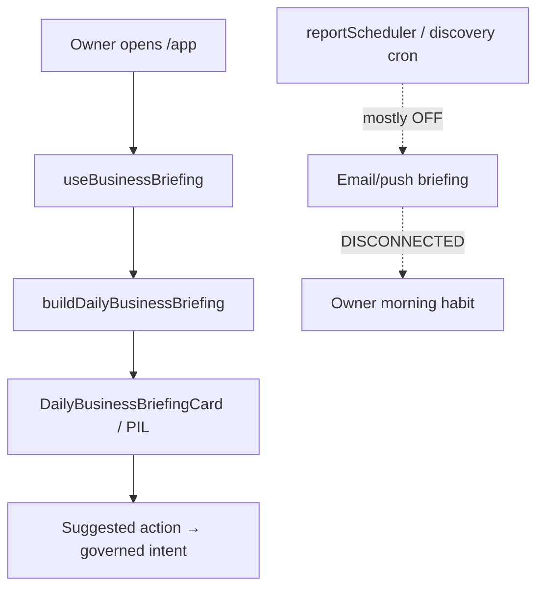

**Staging note:** `VITE_INTELLIGENCE_SURFACE_BRIEFING=true` enables in-app surface; does not create scheduled delivery.

---

## Persistence map

| Artifact | Storage | Multi-instance safe? |
|---|---|---|
| User, Business, Product, DraftStore, Booking, Quote, Loyalty, Campaign, CreatorContent, StoreActivityEvent | Prisma | Yes (with Postgres) |
| Import Kernel snapshots / Studio sessions | Memory | **No** |
| Discovery Intelligence projections | Memory (even if Prisma flag reserved) | **No** |
| Creator Identity default | Memory | **No** until Prisma flag |
| Creator Production default | Memory | **No** |
| Content Graph | Memory | **No** |
| Business discovery candidates | JSON file dir | Fragile |
| Post-profile next step | sessionStorage | Browser-only |
| Briefing quiet/snooze | localStorage | Browser-only |

---

## Feature-flag dependency hazards

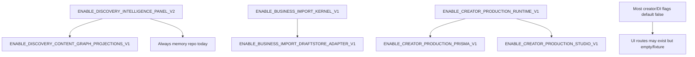

**Dead-end UX examples:** navigating to Studio import (404); enabling DI panel with empty memory projections; Creator Production Studio with fixtures while SME expects real media.

---

## Production vs staging (from `render.yaml`)

| Concern | Staging | Production |
|---|---|---|
| Performer runtime kernel | ON | ON |
| Discovery cron | `DISCOVERY_ENABLED=false` | false |
| Loyalty spine | true | true |
| PIL briefing Vite | true | (check dashboard env) |
| Video transcode | skipped | skipped |
| Import Kernel / DI Prisma | not set ON in yaml | not set ON |

Infer: **staging does not currently turn on Mission 1000 import durability or Discovery Intelligence.**
