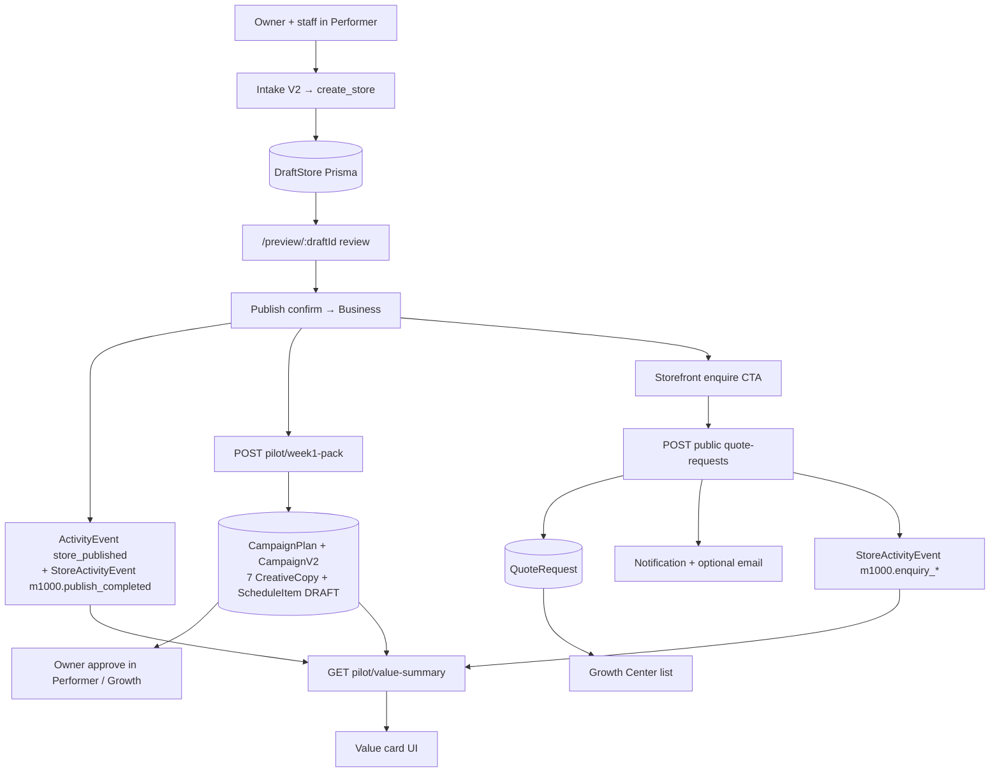

# Mission 1000 — Pilot Closed Loop Implementation Proposal

**Proposal ID:** `PCL-1` (Pilot Closed Loop v1)  
**Date:** 2026-07-21  
**Status:** Proposal only — **no code until approved**  
**Goal:** Smallest coherent vertical slice allowing **one assisted real pilot** to complete:

> import → review → apply/publish → generate seven-day content → launch one enquiry path → record the result → display initial value

---

## 1. Recommendation (slice selection)

### Selected slice: **PCL-1 — Performer Closed Loop**

| Step | Approach |
|---|---|
| Import | **Reuse** Intake V2 → `create_store` → MissionPipeline → durable `DraftStore` (Prisma) |
| Review | **Reuse** `/preview/:draftId` (`StoreDraftReview`) |
| Apply / publish | **Reuse** `publishStoreThroughRuntime` / `publishDraft` (governed confirm) |
| Seven-day content | **New thin orchestrator** composing existing CampaignV2 + copy tools (text-first) |
| Enquiry path | **Reuse** public quote CTA; **wire** Notification + optional email |
| Record result | **Reuse** `StoreActivityEvent` + `ActivityEvent` with Mission 1000 event types |
| Initial value | **New thin Value summary** on Growth Center / briefing (measured + estimated labels) |

### Explicitly **out of** this slice

| Deferred item | Why |
|---|---|
| P0-03 Kernel snapshot durability | Pilot import uses `create_store` → DraftStore (already durable). Kernel memory is not on the critical path. |
| P0-06 Role chooser | Assisted pilot; staff sets context. |
| Business Import Studio UI rebuild | Dead advanced path; not required. |
| Kernel → DraftStore flags | Not needed for PCL-1. |
| Creator Production / Content Graph | Flag forests; avoid. |
| Video generation | Cost/keys; Week-1 is text + optional 1 poster. |
| External social publish | Mock today; owners share manually / in-app schedule. |
| Causal revenue claims | Forbidden until merchant confirm (P2). |
| Morning email cron | In-app briefing + Growth Center enough for one pilot. |
| Places bridge, SEO OG | Helpful later; not blocking one assisted pilot. |

### Size estimate

**M (about 8–12 engineering days)** with one engineer familiar with Core + dashboard, plus 1–2 days assisted dry-run.

---

## 2. Audit assumptions corrected by repo validation

| # | Audit claim | Validation | Impact on slice |
|---|---|---|---|
| 1 | Studio UI missing | **CORRECT** — no `/app/business-import-studio` in `App.jsx` | Do not rebuild Studio |
| 2 | Core navigates to Studio → 404 | **PARTIALLY CORRECT** — `buildOpenBusinessDiscoveryResponse` still sets `navigateTo` Studio URL (`businessDiscoveryRouting.js`), but Intake V2 **does not handle** `open_business_discovery_studio` (falls through to “not sure”). Fix: stay-in-chat / advanced View details — not a 404 for normal create-store | Small routing fix only for **explicit** Studio intents |
| 3 | Kernel memory + Studio `persistToDraftStore:false` | **CORRECT** | Irrelevant if PCL-1 uses `create_store` |
| 4 | `from-discovery` is the live Performer runway | **INCORRECT / OVERSTATED** — API exists (`performerStoreCreationRoutes.js`); **no dashboard client** calls it. Live path = Intake V2 → `create_store` | Build on `create_store`, optionally later wire from-discovery |
| 5 | Draft review + publish work | **CORRECT** | Reuse |
| 6 | Quote has no owner Notification/email | **CORRECT** — `createQuoteRequest` only `emitCustomerInquiryActivity` + console log | Must build notify |
| 7 | No value UI at all | **OVERSTATED** — Growth Center (`/business/growth`), Live Performance, briefing exist; **ROI formulas** missing | Extend Growth/briefing; don’t invent a new app |
| 8 | No 7-day pack | **CORRECT** as product; **fragments exist** (`suggest_campaign_plan`, `generate_social_posts`≈3, `generate_poster`, CampaignV2 `create-from-plan`) | Thin glue, not new platform |
| 9 | Need Creator Production for week content | **INCORRECT** | Tools run without those flags |
| 10 | Need new tables for events | **MOSTLY INCORRECT** — `StoreActivityEvent.eventType` is open string; `ActivityEvent` already records `store_published` | Prefer no migration for events |
| 11 | Completeness checklist missing | **PARTIALLY CORRECT** — post-launch welcome + `audit_store_completeness` exist; no Mission checklist | Light completeness gate only |
| 12 | Staging has import/publish snapshot flags | **PARTIALLY CORRECT** — runtime/PIL on; `PUBLISH_SNAPSHOT_V1` and Kernel flags **not** in `render.yaml` | Enable snapshot flag only if FE requires it; verify legacy publish path first |

**Flow-trace correction:** Stage 1 diagram should show Intake V2 → `create_store` as primary, with `from-discovery` as orphaned API.

---

## 3. Exact scope (in / out)

### In scope (must ship together)

1. **Pilot runbook path** documented: Performer create store (name + location + optional URL) → review → publish → Week-1 pack → ensure enquire CTA → test quote → see value.  
2. **Fix explicit discovery Studio handoff** so it never promises a missing page (`stayInChat` + message / View details only).  
3. **`POST /api/stores/:storeId/pilot/week1-pack`** (or Performer tool `generate_week1_content_pack`) creating **7 durable draft schedule items** grounded on Business + catalog.  
4. **Approve Week-1** endpoint/action (status DRAFT→APPROVED; no external publish).  
5. **Quote owner notify:** Prisma `Notification` + optional `sendMail` on create.  
6. **Ensure enquiry path:** after publish, if `transactionMode` / catalog lacks enquire, set safe default for pilot vertical (or checklist forces enable).  
7. **Mission 1000 activity events** on import_completed (draft ready), publish_completed, week1_generated, week1_approved, enquiry_created, enquiry_notified.  
8. **`GET /api/stores/:storeId/pilot/value-summary`** + UI card on Growth Center (and optional briefing bullet).  
9. **Feature flag** `ENABLE_MISSION_1000_PILOT_LOOP_V1` (default false; on for staging pilot).  
10. Tests + staging deploy steps + rollback.

### Out of scope

- Kernel durability, Studio UI, from-discovery FE revive (unless dry-run proves create_store insufficient)  
- Role chooser, SEO, Places bridge, DI panel, video, social OAuth, morning email, revenue attribution  
- Blocking publish on completeness for all tenants (pilot flag only: warn + override)

---

## 4. End-to-end design (target)



**Durability:** DraftStore, Business, Product, CampaignV2, QuoteRequest, Notification, StoreActivityEvent, ActivityEvent — all Prisma. No new memory SOT.

**Measurable:** event types + value-summary fields.  
**Safe:** publish remains confirmation-gated; Week-1 drafts do not auto-post externally; emails omit sensitive body PII in subject; flag-gated.

---

## 5. Files to modify (expected)

### Core (`apps/core/cardbey-core`)

| File | Change |
|---|---|
| `src/lib/intake/businessDiscoveryRouting.js` | Explicit Studio intent → `stayInChat: true`, remove dead `/app/business-import-studio` navigateTo (or point to documented advanced surface that exists) |
| `src/lib/intake/__tests__/businessDiscoveryRouting.test.js` | Update expectations |
| `src/lib/toolExecutors/store/create_store.js` (or pipeline completion hook) | Emit `m1000.import_completed` when draft ready |
| `src/services/draftStore/publishDraftService.js` | Emit `m1000.publish_completed` metadata; optional completeness score in payload |
| `src/lib/quoteRequest/quoteRequestService.js` | After create: Notification for store owner + `sendMail` if email present; emit `m1000.enquiry_*` |
| `src/lib/pilot/` **new** `week1ContentPackService.js` | Build 7-day pack from Business+products |
| `src/lib/pilot/` **new** `pilotValueSummaryService.js` | Aggregate measured counts + estimated time |
| `src/lib/pilot/` **new** `mission1000Events.js` | Helpers to write StoreActivityEvent |
| `src/routes/pilotLoopRoutes.js` **new** | Mount week1 + value-summary + approve |
| `src/server.js` | Mount `/api/stores/:storeId/pilot/*` behind flag + authz |
| `src/config/features.js` or env reader | `ENABLE_MISSION_1000_PILOT_LOOP_V1` |
| `.env.example` | Document flag + baselines |
| Optional: `src/lib/toolExecutors/pilot/generate_week1_content_pack.js` + registry | Performer-callable tool |

### Dashboard (`apps/dashboard/cardbey-marketing-dashboard`)

| File | Change |
|---|---|
| `src/lib/featureFlags.ts` or env | `VITE_ENABLE_MISSION_1000_PILOT_LOOP_V1` |
| Growth Center page / panel | Value card + Week-1 approve list when flag on |
| Performer post-publish card / PIL opportunity | “Generate Week-1 pack” + “View enquiries” CTAs (`autoSubmit: false`) |
| `useIntakeV2.ts` | Handle explicit discovery response without dead navigation |
| Optional: thin `PilotValueCard.tsx`, `Week1PackCard.tsx` |

### Docs / ops

| File | Change |
|---|---|
| `docs/mission-1000/MISSION_1000_PCL1_PROPOSAL.md` | This doc |
| `docs/mission-1000/PILOT_RUNBOOK.md` **new** | Staff steps for the one business |
| `render.yaml` | Staging env flag ON only after soak |

### Do **not** touch (unless bug blocks slice)

- `businessImportKernel/**` persistence  
- Creator Production / Content Graph / Discovery Intelligence  
- Social mock OAuth  

---

## 6. Data migrations

**Preferred: zero migrations.**

| Need | Approach |
|---|---|
| Week-1 content | Reuse `CampaignPlan` + `CampaignV2` + `CreativeCopy` + `CampaignScheduleItem` (status `DRAFT` / `APPROVED` via existing status strings or metadata) |
| Events | `StoreActivityEvent` with `eventType` = `m1000.*`; publish already writes `ActivityEvent` |
| Notifications | Existing `Notification` model (`type`, `title`, `message`, `meta`, `userId`) |
| Value baselines | Constants in code + optional `Business.storefrontSettings` / metadata JSON — no column required for v1 |

**Optional migration (only if Campaign status vocabulary insufficient):**

- Add `metadata Json?` on `CampaignScheduleItem` for `{ dayIndex, theme, approvedAt }` — **avoid** if `CreativeCopy.text` + schedule `status` suffice.

**Rollback-friendly:** flag off leaves new routes inert; no destructive schema.

---

## 7. API contracts

All pilot routes require auth + store ownership (same pattern as growth/quote owner routes). Gated by `ENABLE_MISSION_1000_PILOT_LOOP_V1`.

### `POST /api/stores/:storeId/pilot/week1-pack`

**Request:**
```json
{
  "clientRequestId": "uuid",
  "startDate": "2026-07-22",
  "timezone": "Australia/Melbourne",
  "includePoster": false
}
```

**Response `201`:**
```json
{
  "ok": true,
  "campaignId": "...",
  "planId": "...",
  "items": [
    {
      "dayIndex": 1,
      "theme": "introduction",
      "scheduleItemId": "...",
      "copyId": "...",
      "title": "...",
      "body": "...",
      "channel": "scheduled_posts",
      "scheduledAt": "...",
      "status": "DRAFT"
    }
  ]
}
```

**Idempotency:** same `clientRequestId` + storeId returns existing pack.  
**Themes (fixed 7):** introduction, product_highlight, promotion, trust, educational, behind_the_scenes, weekend_cta.  
**Grounding:** Business name, category, top N products/services, location, tone defaults.  
**LLM:** optional; if LLM unavailable, deterministic templates (still durable).  
**Governance:** creates drafts only — Autonomy Level 1; no external publish.

### `POST /api/stores/:storeId/pilot/week1-pack/approve`

```json
{ "campaignId": "...", "itemIds": ["..."] }
```

Sets selected items `APPROVED` (or campaign-level approve-all). Emits `m1000.week1_approved`.

### `GET /api/stores/:storeId/pilot/value-summary`

```json
{
  "asOf": "ISO",
  "measured": {
    "importCompleted": true,
    "published": true,
    "catalogItemCount": 12,
    "week1ItemsGenerated": 7,
    "week1ItemsApproved": 7,
    "enquiryCount": 1,
    "enquiryNotifiedCount": 1,
    "importDurationMs": 480000,
    "publishDurationMs": 120000
  },
  "estimated": {
    "timeSavedMinutes": 150,
    "labourValueAud": 112.5,
    "hourlyRateAud": 45,
    "baselines": { "importManualMinutes": 120, "week1ManualMinutes": 180 }
  },
  "labels": {
    "disclaimer": "Estimated values are not verified revenue. Measured counts come from Cardbey activity."
  }
}
```

### Quote create (existing) — behaviour change

`POST /api/public/stores/:storeId/quote-requests` unchanged request shape; after persist:

1. Resolve store owner `userId`  
2. `prisma.notification.create` type `quote_request`  
3. `sendMail` if owner email + mail configured (skip gracefully like mailer today)  
4. `StoreActivityEvent` `m1000.enquiry_created` / `m1000.enquiry_notified`

### Explicit discovery routing (existing response shape)

Change `navigateTo` away from missing Studio; keep `stayInChat: true`; message: advanced review available via View details when implemented — for PCL-1, redirect intent to Performer create_store guidance.

---

## 8. UI changes

| Surface | Change |
|---|---|
| Performer (post-publish) | Card: “Generate your first week of content” → calls week1-pack (`autoSubmit: false` if via PIL) |
| Performer / Growth | List 7 items; Approve; copy-to-clipboard / share link (manual) |
| Storefront | Ensure Request quote / enquire visible for published pilot store |
| Growth Center | Embed `PilotValueCard` when flag on |
| Briefing | One bullet from value-summary / new enquiry (reuse `buildDailyBusinessBriefing` inputs if cheap) |
| Intake V2 | No dead Studio navigation |

**Not required:** new wizard screens, Studio rebuild, Creator Studio for SME.

---

## 9. Analytics / events

Write to `StoreActivityEvent` (`source: 'mission_1000_pilot'`) and optionally mirror critical ones to `ActivityEvent`.

| eventType | When | metadataJson |
|---|---|---|
| `m1000.import_started` | create_store / mission start | missionId, sourceType |
| `m1000.import_completed` | DraftStore ready | draftId, durationMs, correctionCount? |
| `m1000.publish_completed` | publishDraft success | storeId, draftId, completenessScore? |
| `m1000.week1_generated` | week1-pack created | campaignId, itemCount |
| `m1000.week1_approved` | approve | campaignId, itemCount |
| `m1000.enquiry_created` | quote create | quoteRequestId, channel=`storefront_quote` |
| `m1000.enquiry_notified` | notify attempted | channels: [`in_app`,`email?`], ok flags |
| `m1000.value_card_viewed` | FE opens Value card | storeId |

Dashboard may also emit lightweight FE beacon for `value_card_viewed`.

---

## 10. Feature flags

| Flag | Default | Staging pilot | Production |
|---|---|---|---|
| `ENABLE_MISSION_1000_PILOT_LOOP_V1` | `false` | `true` | `false` until go |
| `VITE_ENABLE_MISSION_1000_PILOT_LOOP_V1` | `false` | `true` | `false` |
| `ENABLE_BUSINESS_IMPORT_KERNEL_V1` | unchanged | **leave off** | off |
| `ENABLE_CREATOR_PRODUCTION_*` | off | off | off |
| `ENABLE_DISCOVERY_INTELLIGENCE_PANEL_V2` | off | off | off |
| `PUBLISH_SNAPSHOT_V1` | verify current FE path | enable only if snapshot client required | match FE |
| `ENABLE_CREATIVE_FACTORY_V1` | optional | only if poster path needs it | optional |

**Dead-end rule:** If Core flag off, FE hides Week-1 / Value CTAs (no 404 routes).

---

## 11. Security checks

| Check | Requirement |
|---|---|
| Authz | Pilot routes: authenticated owner/admin of `storeId` only |
| Public quote | Existing rate limit retained; no owner PII leakage in public responses |
| Email | Subject without customer phone/email; body minimal; deep link requires auth |
| Prompt injection | Catalog/business text truncated/sanitized before LLM templates |
| SSRF | No new URL fetch in PCL-1 (defer Kernel URL enrich) |
| Publish | Keep Level 3+ confirmation; never `autoSubmit: true` for publish |
| Week-1 | Drafts only; external channel status stays non-POSTED |
| Tenant isolation | All queries scoped by storeId + ownership |
| Flag | Off = no new behaviour |
| Secrets | Reuse existing SMTP; no new secret classes |

---

## 12. Tests

| Layer | Cases |
|---|---|
| Unit | week1 pack builds 7 themes; idempotent clientRequestId; value formula measured vs estimated |
| Unit | quote create writes Notification; mailer skipped when SMTP off |
| Unit | discovery routing no Studio URL |
| Integration | create_store → publish → week1 → quote → value-summary (test DB) |
| Contract | API shapes + ownership 403 |
| FE | Value card renders labels; Week-1 approve calls API |
| Smoke (staging) | GP-01 from test plan with one fixture business |

**Not required for merge:** full Kernel E2E, Creator Production, DI panel.

---

## 13. Deployment steps

1. Merge Core + dashboard behind flags **default false**.  
2. Deploy Core staging → dashboard staging.  
3. Set `ENABLE_MISSION_1000_PILOT_LOOP_V1=true` and Vite twin on **staging only**.  
4. Confirm SMTP on staging (or accept in-app Notification only).  
5. Staff dry-run GP-01 twice; capture event rows + value-summary JSON.  
6. Run one real pilot business with runbook.  
7. Production: leave flag **false** until acceptance met; then enable for pilot tenant(s) only if env supports per-tenant (else staging-only until Phase A complete).

---

## 14. Rollback plan

| Trigger | Action |
|---|---|
| Notify spam / mail errors | Set flag off; quote create still works without notify block (notify must be try/catch non-fatal) |
| Week-1 bad content | Flag off; delete/cancel CampaignV2 for store; no Business rollback |
| Publish regressions | Flag does not wrap publish core — publish changes limited to event emit in try/catch |
| Full abort | Unset flags in Render; redeploy optional; data left in place (harmless drafts) |

**No** destructive migrations → rollback is flag + optional campaign cleanup.

---

## 15. Acceptance criteria (one real pilot)

Assisted is allowed. Pass if **all** true:

1. Owner (or staff-as-owner) creates draft via Performer `create_store` with real business inputs.  
2. Reviews at `/preview/:draftId`; publishes with confirmation.  
3. Public `/s/:slug` shows non-empty name + ≥1 catalog or service description + enquire CTA.  
4. Week-1 pack generates **7** durable items in &lt;5 minutes; owner approves all (or ≥5) in &lt;15 minutes total content step.  
5. Test customer submits quote; owner receives **in-app Notification** within 60s; email if SMTP configured.  
6. `StoreActivityEvent` (or equivalent) contains publish + week1 + enquiry events for that store.  
7. Value card shows **Measured** enquiry/catalog/week1 counts and **Estimated** time-saved with disclaimer — **no revenue claim**.  
8. Flag off restores prior UX with no broken routes.  
9. No Kernel/Studio/memory path required for the pilot to succeed.

---

## 16. Why this is the smallest coherent slice

- Connects the **already durable** store runway instead of fixing Kernel memory first.  
- Pulls only the **minimum of P1-01 + P1-04 + P0-01 + P0-04** needed for the user’s required outcome (including seven-day content + value).  
- Avoids Studio rebuild, DI, Creator Production, and Kernel durability that do not unblock one assisted pilot.  
- Leaves a clear Phase A follow-on: P0-03/P1-02 only if URL/PDF quality demands Kernel.

---

## 17. Implementation sequence (after approval)

1. Flag + event helpers  
2. Discovery routing fix  
3. Quote Notification + email (non-fatal)  
4. Week-1 pack service + API + Performer CTA  
5. Value summary + Growth card  
6. Emit import/publish hooks  
7. Tests + staging dry-run + runbook  
8. Real pilot  

---

## 18. Approval gate

**Do not write production code until this proposal is accepted** (or revised) with answers to:

1. Confirm pilot vertical (café / beauty / tradie) for template tone.  
2. Confirm SMTP availability on staging for email notify.  
3. Confirm Week-1 = **in-app drafts only** (no Facebook/Instagram post) for PCL-1.  
4. Confirm `create_store` (not Kernel URL import) is acceptable for the first real pilot.

Once approved, implement PCL-1 only as scoped above.
