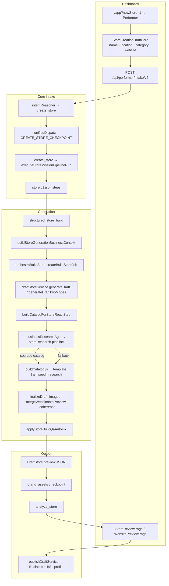

# MISSION 001 — 60-Second Store Creation Fidelity Audit

**Date:** 2026-08-23  
**Mode:** Audit / diagnosis only (no code changes)  
**Repository:** `C:/Projects/cardbey`  
**Branch inspected:** `fix/upload-ask-presentoptions-storename` @ `695f972b2adb35f46f85b64fbe2412cd6d07b18c`

---

## VERDICT

**`60_SECOND_STORE_CREATION_MAJOR_GAPS`**

Cardbey can produce **structurally complete** stores quickly, but the canonical create-store path still too often yields **industry-shaped templates decorated with a business name** rather than a recognisable reconstruction of the supplied business. Strong research, grounding, and fidelity-scoring modules exist; several are **not on the hot path** or **default off in production**. Business-context locking and professional anti-generic guards improved finance/professional cases (unit-tested), but reference fidelity, catalog grounding, image selection, and publish-blocking fidelity gates remain insufficient for launch. End-to-end generation latency is **not instrumented to a 60s SLA**; full paths (research + LLM catalog + batched image fill) likely exceed 60s P90.

---

## CURRENT RUNTIME ARCHITECTURE

### Canonical path (Performer greenfield create-store)



### Stage map (INPUT → PROCESSOR → OUTPUT → NEXT CONSUMER)

| # | Stage | Input | Processor | Output | Next consumer |
|---|--------|-------|-----------|--------|---------------|
| 1 | User entry | Nav / starter / composer | `ConsoleCentreColumn`, `useIntakeV2` | Intake POST body | `performerIntakeV2Routes.js` |
| 2 | Business fields | Name, location, category, website, card OCR | `storeCreationDraft.js`, `StoreCreationDraftCard.tsx` | `storeCreationDraft` bundle | Intake validation |
| 3 | Dispatch | Classified `create_store` | `createStoreCheckpointDispatch.js` → kernel | Mission pipeline run | `executeStoreMissionPipelineRun.js` |
| 4 | Business context lock | Mission metadata | `buildStoreGenerationBusinessContext` in `structured_store_build.js` | `storeGenerationBusinessContext` on draft input | `buildCatalog`, `finalizeDraft` |
| 5 | Research gate | Name + (website \| location \| phone \| email \| category \| OCR \| social) | `shouldRunStoreCreationResearchFromFields` → `businessResearchAgent` / `runStoreResearchPipeline` | Research catalog or fallback reason | `catalogAuthorityDecision.js` |
| 6 | Catalog | Context + research/preload | `buildCatalog.js`, `industryBlueprintRegistry.js`, `seedCatalogBuilder.js` | `products`, `categories`, `meta.catalogSource` | `finalizeDraft` |
| 7 | Copy / hero | Catalog + profile | `runContentResolution`, `businessProfileService.ts` | Tagline, hero text | Preview |
| 8 | Images | Items without URLs | `menuVisualAgent`, `serviceImageResolver.js`, `fillMissingDraftItemImages` (batch 5), `getSeedImageForCategory` | `imageUrl`, `imageSource` | Preview + review UI |
| 9 | Website sections | Preview + commerce profile | `mergeWebsiteIntoPreview` in `websiteSectionsGenerator.js` | `website.sections`, theme | Dashboard website preview |
| 10 | Coherence | Preview + locked context | `validateStoreCoherence`, scaffold repair | `preview.meta.storeCoherence` (advisory) | Logs only — **not publish gate** |
| 11 | QA autofix | Draft + mission | `applyStoreBuildQaAutoFix` in `structured_store_build.js` | Tier-1 silent fixes; Tier-2 approval queue | Performer SSE |
| 12 | Persistence | Preview | `DraftStore` row | `draftId`, SSE to UI | Review routes |
| 13 | Post-build UX | Draft ready | `store.v1.json` brand_assets checkpoint | Logo/hero choices | Re-run / personalization |
| 14 | Render | GET draft | `StoreDraftReview.tsx`, `WebsitePreviewPage.tsx` | Interactive storefront | Owner edit / publish |

**Competing paths (not canonical for Mission 001):** `POST /api/ai/store/bootstrap`, direct `POST /api/draft-store`, prebuilt/multi-market discovery, business-ingestion seed generation, business-card smart store.

---

## WHAT ALREADY WORKS

Verified in code and tests:

| Capability | Evidence |
|------------|----------|
| End-to-end Performer → draft → review | `structured_store_build.js`, `store.v1.json`, dashboard review routes |
| Locked business context at build start | `storeGenerationBusinessContext.js` attached in `structured_store_build.js` |
| Professional/finance anti-generic classification | `businessSpecificStoreGeneration.test.js` — Anison Capital → `service_fixed_booking`, Book consultation |
| Research-backed catalog extraction (when research runs) | `storeCreationResearch.test.js` — Glamshell Beauty services + prices from mocked website |
| Catalog authority decision + fallback reasons | `catalogAuthorityDecision.js` — structured trace (`WEBSITE_NOT_FOUND`, `RESEARCH_CONFIDENCE_TOO_LOW`, etc.) |
| Conditional Shows / fake reviews for professional verticals | `websiteSectionsGenerator.js` — omits `social_proof` when `professionalContext`; Shows only if entertainment + featured items |
| Coherence validator detects generic scaffolds | `storeCoherenceValidator.js` — flags Core Service + Add to cart on finance |
| Source-grounded review UI + fidelity panel | `SourceGroundedStoreReviewPanel.tsx`, `BusinessFidelityPanel.tsx` — shown when research review checkpoint fires |
| Performer grounding engine + fidelity score | `performerGroundingEngine.js`, `businessFidelityScore.js` — **unit-tested** |
| Industry blueprint registry + vertical taxonomy | `industryBlueprintRegistry.js`, `verticalTaxonomy.js` |
| Website template foundation (Phase 2) | `websiteTemplateFoundation.js` — section order + theme when template id set |
| Published-artifact projection | `publishedArtifactProjection/` — post-publish public DTO |
| Seed ingestion / discovery (parallel product) | `businessIngestion/`, `discoveryEngine/` — strong for claimable pages, not seller 60s UX |

---

## BUSINESS FIDELITY RESULTS

**Method note:** This audit did **not** run live generation against external businesses (no production mutation, no publishing). Scores below combine **code-path analysis**, **existing unit/integration tests**, and **`AUDIT_BUSINESS_SPECIFIC_STORE_GENERATION_V1.md`** (2026-08-10). Treat as **directional**, not a measured launch benchmark.

### Scoring model (audit)

| Dimension | Weight | Notes |
|-----------|--------|-------|
| Identity accuracy | 15 | Name/location/contact match reference |
| Business-type accuracy | 10 | Commerce model + CTA fit |
| Product/service fidelity | 20 | Real names/prices; minimal invention |
| Content grounding | 15 | Claims traceable to evidence |
| Visual/brand fidelity | 15 | Images/colours match business |
| Composition fitness | 10 | Sections fit business model |
| Reference fidelity | 10 | URL/reference changes output materially |
| Correction burden | 5 | Owner edit vs rebuild (inverse) |

### Test matrix

| Input / reference | Business type | Real found | Real used | Inferred | Generated | Unknown | **Est. score** | Major defects |
|-------------------|---------------|------------|-----------|----------|-----------|---------|----------------|---------------|
| **Glamshell Beauty** + website (unit mock) | Nail/beauty salon | Services + prices from site | Yes in research path | Type/booking mode | Copy if gaps | Hours/images | **~82** | Requires research path + owner review flow |
| **Anison Capital Group** name only | Financial adviser | Name only | Name | Type/vertical via PROFESSIONAL_RE | Consultation seed, hero copy | Contact, real services | **~58–68** | No reference; minimal catalog; stock images likely |
| **Anison Capital Group** + price list OCR | Finance | Owner prices | Yes when `hasPriceList` | — | Website copy | — | **~75** (tested components) | Images still weak without URI/scrape |
| **Smith & Co Accountants** no price list | Accounting | Name | Name | Professional vertical | "Book our consultations" only | Fee schedule | **~62** | Correct anti-fabrication; thin store |
| **Le Petit Four Bakery** + type bakery | Café/bakery | Category hint | Partial | Vertical food | AI/template menu items | Real menu unless OCR/URL | **~55–65** | Generic food expansion without menu evidence |
| **FixIt Handyman** | Trades | Name + type | Partial | `service_quote_required` | Scaffold services if no research | Pricing | **~50–60** | Quote-mode not proven E2E |
| **Name + website URL** (real SME) | Varies | Website HTML/menu if fetch succeeds | **If** research confidence ≥ threshold | Type from content | Fallback catalog + Pexels | Failed fetch → template | **~45–80** (high variance) | Production: `ENABLE_STORE_RESEARCH_PIPELINE` default **OFF** |
| **Name only** (minimal UX target) | Unknown → often retail | None | Name only | Vertical guess | Full template/AI catalog | Everything else | **~35–50** | **Research does not run** (`shouldRunStoreCreationResearchFromFields` requires extra signals) |
| **Ingestion seed → generateFullStoreFromSeed** | From seed | Rich seed payload | Seed fields | BI snapshot | Gap-fill | — | **~70–85** for seeded cases | Not the default seller journey |

**Screenshots:** Not captured in this audit session. Existing evidence: `docs/screenshots/` (if present), Phase 3 browser fixture scripts under `apps/core/cardbey-core/scripts/seed-phase3-browser-fixture.mjs`.

---

## DATA / GROUNDING FINDINGS

### Does Business DNA exist?

**Partially — no single canonical persisted object named Business DNA.**

| Representation | Location | Consumed by generation? |
|----------------|----------|-------------------------|
| `storeGenerationBusinessContext` | `storeGenerationBusinessContext.js` → `draft.input` / `preview.meta` | **Yes** when attached at `structured_store_build` — but later stages still re-apply commerce (`applyCommerceFieldsToPreview`) |
| BSL `businessProfile` | `storefrontSettings.businessProfile` | **Post-publish only** |
| `businessProfileService` profile | Draft-time AI/template | Ephemeral; no provenance |
| `BusinessCandidate` / `IngestedSeedRecord` | Discovery/ingestion | **Parallel lane** — not default create-store |
| Intelligence brief | JSON sidecar | Public summary only |
| UI label "Business DNA" | i18n / MI debug | **Not a schema** |
| `PerformerGroundingEngine` evidence model | `performerGrounding/` | **Tests only — not called from `generateDraft`** |

### REAL / INFERRED / GENERATED / UNKNOWN

| Layer | Behaviour |
|-------|-----------|
| Research catalog items | Can carry provider/tier/conflict metadata (`businessResearchAgent.js`) |
| Catalog authority | `attachCatalogGrounding` records decision + fallback reason |
| Locked context | `knowledge.primaryCategory`: KNOWN \| INFERRED \| UNKNOWN |
| Blueprint seeds | `offeringProvenance: 'GENERATED'` |
| Public candidate pages | Marketing copy synthesized without GENERATED tag (`resolvePublicCandidatePresentation.ts`) |
| Coherence meta | Stored on preview; **does not suppress fabricated content** |
| Publish | **No per-field provenance on Product rows** |

**Critical gap:** UNKNOWN is not enforced at render time. Template/AI catalog still fills gaps with plausible items. Professional stores avoid invented tax SKUs; retail/food/hospitality still get generic expansions.

### Where provenance is lost

1. `finalizeDraft` → `applyCommerceFieldsToPreview` re-classifies from preview  
2. Research skipped (name-only) → template/AI path with no grounding trace  
3. `PerformerGroundingEngine` not wired → fidelity score never drives generation  
4. Image fill uses Pexels on item **names** → semantic mismatch  
5. Publish drops field-level provenance  
6. Dashboard `BusinessFidelityPanel` only when research review checkpoint surfaces  

---

## REFERENCE RECONSTRUCTION FINDINGS

**Current mode:** **`reference → hints → generic generation`** for most seller inputs; **`reference → reconstruction`** only when research pipeline runs **and** catalog authority selects sourced catalog.

| Step | What happens |
|------|----------------|
| 1. Extract | Website fetch (`websiteEnrichmentExtract.ts`, 8s timeout), Places, social import adapters, OCR |
| 2. Visual | OG image / scrape (`storeImageScraper.ts`, 6s timeout); not URI/Universal Library |
| 3. Business facts | `businessFactsExtractor.js`, `serviceMenuExtractor.js` |
| 4. Reaches generation | Via `buildCatalogForStoreReactStep` when `shouldRunStoreCreationResearch` true |
| 5. Discarded | Low confidence → `RESEARCH_CONFIDENCE_TOO_LOW`; pending review → staged catalog |
| 6. Affects composition | **Weakly** — mainly catalog items + professional section gating; template id from vertical |
| 7. Theme only | `websiteTemplateFoundation` when template id present |
| 8. Content only | Research descriptions/names when applied |
| 9. Products grounded | **Yes** when sourced authority wins |
| 10. Images grounded | **Sometimes** from scrape; otherwise Pexels/stock/letter fallback |

**Production blocker:** `isStoreResearchPipelineEnabled()` returns **`false` unless `ENABLE_STORE_RESEARCH_PIPELINE=true`**; in non-production defaults **on**. Legacy agent path still used with `skipStoreResearchPipeline` in places.

**Name + URL without location:** Research **can** run (website signal). **Name alone:** research **does not run** — contradicts minimal UX target.

---

## PRODUCT / SERVICE FINDINGS

| Question | Finding |
|----------|---------|
| Actual products/services discovered? | Yes **when** research succeeds and authority = sourced |
| Names preserved? | Yes in research path; AI/template path invent names |
| Categories correct? | Vertical + blueprint; can misclassify (historically `product_retail`) |
| Prices preserved? | Yes from research/OCR when present; professional without price list → consultation-only (good) |
| Descriptions grounded? | Research yes; AI menu often generic |
| Images matched to items? | `serviceImageResolver` + semantic QA — env-gated; weak queries → wrong stock |
| Unsupported products invented? | **Yes** — `buildCatalog` AI expansion, `GENERIC_EXPANSION_FALLBACK`, templateItemsData |
| Generic placeholder services? | Blocked for finance in tests; still possible for ambiguous service businesses |
| Cardbey package leakage? | Partial repair for retail-in-service (`shouldRepairRetailCatalogLeakInServiceStore`); not universal |
| Product vs service distinction | BSL `catalogMode` + typed catalog compiler (non-prod default) |

**Stage where generic catalog enters:** `buildCatalog.js` when research absent or fallback → `buildSeedCatalog` / AI menu / industry blueprint with `GENERATED` offerings.

---

## IMAGE / BRAND FINDINGS

### Actual priority (observed)

```
1. Preloaded / research / owner checkpoint logo
2. Web scrape (ReAct step web_scrape_store_images)
3. Service image resolver (Pexels, governed queries)
4. menuVisualAgent / generateImageForDraftItem (Pexels; AI gen mentioned)
5. Seed library category fallback (getSeedImageForCategory)
6. UI letter tile (MiniWebsiteLayout) when imageUrl missing
```

**Not used on create path:** URI / Universal Library (`AUDIT_BUSINESS_SPECIFIC_STORE_GENERATION_V1.md` §8).

**Risk:** Attractive but wrong imagery (dog/plane/coffee on generic service names) documented for Anison-class failures.

**Brand colours:** From `businessProfileService` / template — often **GENERATED**, not extracted from reference site.

---

## COMPOSITION FINDINGS

| Driver | Controls |
|--------|----------|
| Hero type | `mergeWebsiteIntoPreview` + foundation template |
| Navigation | Website preview / storefront shell — not business-specific nav trees |
| Section order | Default hero → usp → show? → social_proof? → about → contact; foundation overrides |
| Product treatment | `classifyBusinessType` → catalogMode, CTA |
| Trust elements | Fake reviews for **non-professional** businesses still injected |
| CTA | Locked context helps; commerce re-apply can override |
| Imagery density | All catalog items shown; Shows section if entertainment + featured ids |
| Typography/colour | Template foundation theme tokens |
| Content depth | AI copy + blueprint |

**Template-driven test:** Remove text/images — many businesses still share **same section skeleton** (hero, usp_bar, about, contact). Professional path removes social_proof; entertainment gets Shows. **Partial business-driven differentiation, not full composition from DNA.**

**Dynamic composition status:** `websiteTemplateFoundation` + Design Library flags exist; `ENABLE_STOREFRONT_PROJECTION_RENDER_CUTOVER_V1` staging-oriented. Generation still defaults to adaptive merge heuristics.

---

## ASSESSMENT / REPAIR FINDINGS

| System | Measures fidelity? | Blocks bad output? |
|--------|-------------------|-------------------|
| `validateStoreCoherence` | Yes — scaffolds, CTA, fake reviews | **No** — meta + console.warn only |
| `computeBusinessFidelityScore` | Yes — identity/catalog/media/fallback ratio | **No** — not on hot path |
| `catalogAuthorityDecision` | Source vs fallback | Influences catalog choice, not publish |
| `storeBuildQaAutoFix` | Completeness, semantic images | Tier 1 silent; Tier 2 needs approval |
| `draftQaAgent` / semantic catalog QA | Image relevance, schema | Advisory / env-gated |
| Seed `QaQualityGates` | Hero, completeness | **Ingestion lane only** |
| `ENABLE_GROUNDED_STORE_CREATION_V1` | N/A | **Flag exists; no runtime consumers** |

**Does Cardbey ask "Does this represent the supplied business?"**  
**Only indirectly** — research review checkpoint + source-grounded panel when staged. **Not** a mandatory pre-reveal fidelity gate for all creates.

---

## 60-SECOND LATENCY FINDINGS

**No end-to-end SLA telemetry** found for seller create-store. Partial timings: `publishDraftService` phase logs, intake `durationMs`, batched image fill.

### Estimated stage budget (full path, unmeasured)

| Stage | Est. duration | Parallelizable? |
|-------|---------------|---------------|
| Intake + mission dispatch | 1–3s | — |
| Business context + job create | 1–2s | — |
| Research (Places + website fetch) | 5–20s | Partial with catalog prep |
| Catalog LLM / template | 5–25s | After research |
| Copy generation (slogan/hero/tagline) | 3–10s | **Promise.all** in two-modes |
| Image fill (batches of 5) | 15–60s+ | Batches sequential |
| Website merge + coherence | 1–3s | — |
| QA autofix | 2–10s | — |
| Persistence + SSE | 1–2s | — |
| **Total (typical full)** | **~45–120s+** | Research + images dominate |

**UX blockers to 60s reveal:** Brand assets checkpoint **after** draft step in blueprint; research owner review when staged; Tier-2 QA approvals.

**Minimal path (name only, no images):** Can reach draft faster (~20–40s) but **fidelity score collapses**.

---

## TOP 3 BOTTLENECKS

### 1. REFERENCE_INTERPRETATION (+ GROUNDING connection)

| | |
|--|--|
| **Problem** | Real business references do not reliably become the store; name-only and low-confidence paths fall back to generic catalog and stock imagery. |
| **Evidence** | `shouldRunStoreCreationResearchFromFields` skips research without website/location/etc.; `ENABLE_STORE_RESEARCH_PIPELINE` off in prod; `catalogAuthorityDecision` fallback reasons; `performerGroundingEngine` unused in `generateDraft`. |
| **Root cause** | Best reconstruction code exists in `storeCreationResearch` + `performerGrounding` but is optional, flag-gated, or disconnected from the default pipeline. |
| **Existing capability** | `businessResearchAgent`, `runStoreResearchPipeline`, `catalogAuthorityDecision`, `SourceGroundedStoreReviewPanel`, `PerformerGroundingEngine`. |
| **Missing connection** | Wire grounding engine (or research catalog authority) as **mandatory** catalog compiler for reference-capable inputs; enable research in prod with SLA bounds. |
| **Fidelity improvement** | **Large** (+15–25 pts on reference cases) |
| **Latency impact** | +5–15s when bounded fetch; can parallelize with classification |

### 2. PRODUCT_SERVICE_RECONSTRUCTION (when research absent)

| | |
|--|--|
| **Problem** | Default catalog is template/AI/seed scaffold, not business offerings. |
| **Evidence** | `buildCatalog.js` branches; `seedCatalogBuilder` generic services; `AUDIT` Anison symptoms; name-only matrix ~35–50 score. |
| **Root cause** | Minimal input does not trigger research; fallback catalog prioritized for "completeness". |
| **Existing capability** | Industry blueprints, professional collapse, research-backed builder. |
| **Missing connection** | Require evidence-backed catalog OR explicit sparse mode ("we only show what we know") for low-signal inputs. |
| **Fidelity improvement** | **Large** for minimal-input UX |
| **Latency impact** | Neutral to **negative** if forced research; positive if sparse mode skips LLM expansion |

### 3. QUALITY_CONTROL (soft gates)

| | |
|--|--|
| **Problem** | System completes generation with generic/invented content; owner must discover mismatch in review. |
| **Evidence** | `validateStoreCoherence` non-blocking; `IMPACT_REPORT_BUSINESS_SPECIFIC_STORE_GENERATION_V1` verdict NOT_READY; fake reviews for non-professional stores. |
| **Root cause** | Completeness and technical QA dominate; fidelity score not a reveal gate. |
| **Existing capability** | `computeBusinessFidelityScore`, coherence validator, catalog authority, owner review UI. |
| **Missing connection** | Pre-reveal gate: block or force sparse template when `fidelity.overall < threshold` or `fallbackRatio > X`. |
| **Fidelity improvement** | **Medium** (prevents worst outcomes) |
| **Latency impact** | +2–5s for scoring; saves owner correction time |

---

## GAP MATRIX

| Capability | Current state | Required state | Gap type | Severity | Existing asset to reuse |
|------------|---------------|----------------|----------|----------|-------------------------|
| Unified Business DNA | Fragmented contexts | Single locked object consumed end-to-end | DUPLICATED | High | `storeGenerationBusinessContext` |
| Reference → reconstruction | Hints → generic fallback | URL/reference drives catalog + media | PRESENT_NOT_CONNECTED | **Critical** | `storeCreationResearch`, `performerGroundingEngine` |
| Research in production | Flag off default | On for reference creates with timeout budget | BLOCKED | **Critical** | `ENABLE_STORE_RESEARCH_PIPELINE` |
| Name-only create | No research | Infer + warn OR require one reference signal | MISSING | High | `researchInputFields` policy change |
| Provenance to UI | Partial meta | Every field tagged REAL/INFERRED/GENERATED/UNKNOWN | PRESENT_NOT_CONNECTED | High | `catalogAuthorityDecision`, grounding types |
| Fidelity pre-reveal gate | Advisory scores | Block/warn before "Your business is ready" | PRESENT_NOT_CONNECTED | **Critical** | `businessFidelityScore.js` |
| Image priority | Pexels on weak names | Business/scraped > matched > generated > fallback | CONNECTED_INEFFECTIVE | High | `storeImageScraper`, `serviceImageResolver` |
| URI/UL on create | Not imported | Optional high-confidence media | MISSING | Medium | Universal Library (admin path) |
| Composition from DNA | Template skeleton + gates | Section set from business model | CONNECTED_INEFFECTIVE | Medium | `websiteTemplateFoundation`, blueprints |
| Fake social proof | Still for non-professional | Never invent reviews | CONNECTED_INEFFECTIVE | Medium | `websiteSectionsGenerator` |
| 60s SLA | Not measured | Instrumented P50/P90 | MISSING | High | Intake `durationMs` pattern |
| Simple UX | Draft card + checkpoints | Describe OR paste link → create | PRESENT_NOT_CONNECTED | Medium | Hide checkpoints behind auto-skip |
| Grounded store flag | Defined unused | Enforce media match threshold | BLOCKED | Medium | `ENABLE_GROUNDED_STORE_CREATION_V1` |
| Publish fidelity gate | Research publish gate only | Business-fit validation | MISSING | High | `storeCoherenceValidator` + fidelity score |

---

## LAUNCH GATE

### `60_SECOND_STORE_CREATION_LAUNCH_READY`

All measured on **production-flag configuration** over **≥30 representative SMEs** (mix of name-only, description, URL, OCR menu) in staging — no public publish.

| Metric | Threshold |
|--------|-----------|
| P50 generation-to-review-ready | ≤ **60s** |
| P90 generation-to-review-ready | ≤ **90s** |
| Median Business Fidelity Score | ≥ **75** |
| P10 Business Fidelity Score | ≥ **60** |
| Factual error rate (wrong business type, wrong city, wrong legal name) | ≤ **5%** |
| Unsupported catalog item rate (invented SKUs/services not plausibly grounded) | ≤ **10%** for reference inputs; ≤ **25%** for name-only with explicit sparse UX |
| Product/service name accuracy (reference cases) | ≥ **80%** match or correctly absent |
| Image relevance (owner blind rating ≥ "acceptable") | ≥ **70%** |
| Reference fidelity (URL provided → catalog from source) | ≥ **75%** of cases |
| Owner correction burden (median edits to accept) | ≤ **8** meaningful edits; **≤ 20%** "rebuild" verdict |
| Hard failure rate (5xx, empty draft, stuck mission) | ≤ **2%** |

**Qualitative gate:** In moderated tests, **≥ 70%** of owners say **"Yes, this looks like my business"** or **"Close — I'd fix not rebuild"** within first 60 seconds of seeing the draft.

---

## MINIMUM PATH TO LAUNCH

### Gate 1 — Connect reference reconstruction (no new framework)

1. Enable `ENABLE_STORE_RESEARCH_PIPELINE` in staging → prod with strict timeouts.  
2. Call `runPerformerGrounding` (or enforce `catalogAuthorityDecision` sourced-only) inside `buildCatalogForStoreReactStep` when website/OCR/social present.  
3. Name-only path: show **sparse store** (identity + consultation CTA) instead of generic 30-item catalog — reuse `collapseProfessionalCatalogWithoutPriceList` pattern broadly.  
4. Thread `storeGenerationBusinessContext` through **disable** `applyCommerceFieldsToPreview` override when locked.

### Gate 2 — Fidelity gate before reveal

1. Run `computeBusinessFidelityScore` at end of `finalizeDraft`.  
2. If below threshold: auto-trigger targeted repair (research re-fetch, image re-match) **once**, else sparse mode.  
3. Remove fake `social_proof` reviews entirely (not only professional).  
4. Block publish (not just warn) on `storeCoherence.critical.length > 0`.

### Gate 3 — Latency + UX simplification

1. Instrument P50/P90 on mission `outputsJson`.  
2. Parallelize research + context lock + template foundation; cap image fill count for first reveal (e.g. top 6 items).  
3. Auto-skip brand checkpoint on first run (optional upload post-reveal).  
4. Single-screen UX: **Describe or paste link → Create** (collapse category/location when inferable from research).

---

## DO NOT BUILD

- New composition framework (extend `websiteTemplateFoundation` + blueprints)  
- New discovery/ingestion pipeline for seller create (reuse `storeCreationResearch`)  
- New provenance schema (unify existing sidecars + `catalogGrounding`)  
- Full URI/UL integration before Gate 1–2 prove lift  
- Compiler-for-stores rewrite (`USE_COMPILER_FOR_STORES` is health-only today)  
- Multi-market prebuilt as default seller path  
- Additional intake forms / wizard steps  
- Beautiful generic website optimisations without fidelity metrics  

---

## FINAL RECOMMENDATION

### 1. What prevents launch today?

The default create path optimises for **complete-looking stores** over **evidence-backed reconstruction**. Research and grounding modules exist but are **flag-gated, skipped on minimal input, and not wired to fidelity gates**. Images and catalog fallbacks introduce plausible-but-wrong content. Assessment is **advisory**, so owners still see "AI website" outcomes too often.

### 2. Single highest-leverage change?

**Make `buildCatalogForStoreReactStep` consume the source-grounded catalog compiler (`PerformerGroundingEngine` or enforced sourced `catalogAuthorityDecision`) whenever any reference signal exists — and switch to an explicit sparse/honest mode when evidence is insufficient**, instead of silent generic fill.

### 3. How much already exists?

**~65–75%** of required capability exists in code: research extractors, catalog authority, business context lock, coherence/fidelity scoring, review UI, industry blueprints, image resolvers, QA repair. Missing pieces are primarily **connections, production flags, gates, and UX simplification** — not greenfield platforms.

### 4. What to stop until solved?

- New storefront visual polish without fidelity metrics  
- Parallel store-generation frameworks  
- Design Library cutover as primary initiative  
- Marketing "60 seconds" claims without measured P90 + fidelity gate  
- Ingestion/discovery expansion that does not feed seller create path  

### 5. Evidence that Mission 001 is launch-ready?

- Staging/prod runs: **30+ SME fixtures** meeting launch gate table  
- Owner moderated study: **≥70%** "looks like my business" / "fix not rebuild"  
- P50 ≤60s, P90 ≤90s **instrumented** on canonical path  
- Reference URL cases: **≥75%** catalog items with OFFICIAL/VERIFIED provenance  
- Zero invented review authors in generated output  
- Production config doc: flags, timeouts, sparse-mode behaviour signed off  

---

## PRIMARY SUCCESS QUESTION (ANSWER)

> If a real SME gives Cardbey its business name, a short description, or a real online reference, what exactly prevents Cardbey today from producing — in roughly 60 seconds — a store where the owner immediately says, "Yes, this is my business"?

**Answer:** Cardbey usually **does not treat the reference as authoritative input to catalog and media compilation**. Minimal inputs skip research; when research runs it is **off by default in production** and can still lose to template/AI fallback. **`PerformerGroundingEngine` and fidelity scoring are not wired into `generateDraft`**, so the system cannot refuse or sparse-out generic fill. Images default to **stock search on invented item names**. **No hard pre-reveal fidelity gate** allows a complete but wrong store to ship to review. Latency and checkpoint UX further delay reveal without improving accuracy. Connecting existing research/grounding/scoring into one enforced path — with sparse honest output when evidence is thin — is the smallest path to the mission outcome.

---

*Audit only. No code, config, production data, or public pages were modified.*
