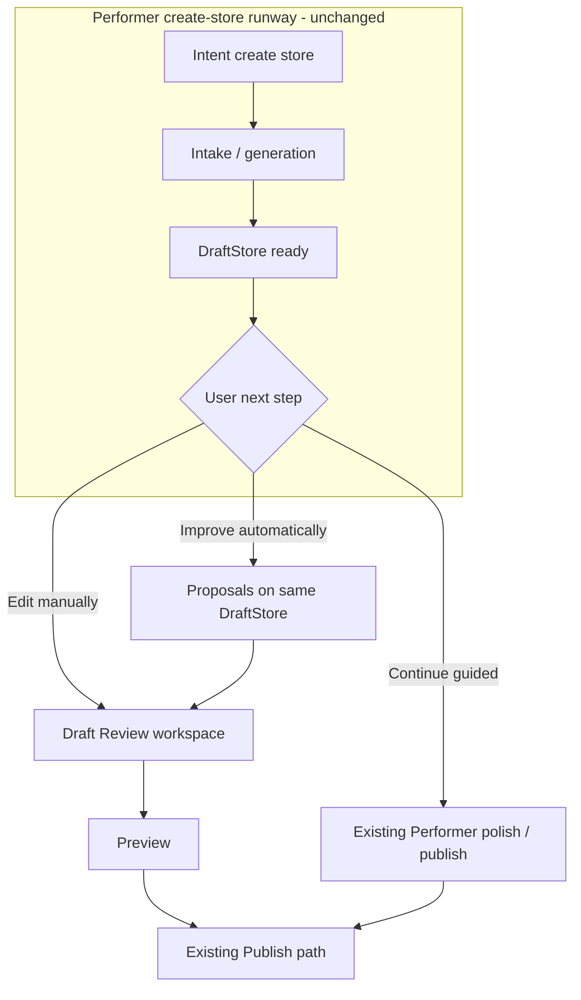

# Plan — Merge Draft Review Manual Editing with Performer Runway

**Date:** 2026-08-21  
**Status:** Proposed (awaiting go-ahead before code)  
**Canonical manual UI:** `/app/store/draft/review` → `StoreDraftReview` (existing)  
**Canonical intelligence UI:** Performer console (existing runway unchanged)

## Goal

Keep **Performer** as the create/improve intelligence layer and **Draft Review** as the manual control layer. One draft/revision model. No second Website Editing product. No parallel Shows CMS UI.

## Non-negotiables (protect Performer runway)

| Keep unchanged | Why |
|----------------|-----|
| Create-store mission flow, blackboard, intake v2, publish gates | Runway regression risk |
| Existing `edit_website` mission family behaviour | Already routes owners into website work |
| Current Draft Review layout, product cards, right-side drawer | User-confirmed working foundation |
| Public storefront publish only via existing publish paths | Governance + safety |

**Rule:** Performer may *open* Draft Review or *propose* draft patches. It must not own a second catalog editor inside chat.

---

## Architecture (target)

```text
┌─────────────────────────────┐
│ Performer (intelligence)    │
│ • Create store runway       │
│ • Improve automatically     │  → writes proposals into DraftStore / revision
│ • Edit manually / Hide now  │  → deep-link into Draft Review
└──────────────┬──────────────┘
               │ shared draftId / storeId / revisionId
               ▼
┌─────────────────────────────┐
│ Draft Review workspace      │  ← ONE manual surface
│ StoreDraftReview            │
│ • Content-type tabs/groups  │
│ • Item adapters (product,   │
│   service, package, show…)  │
│ • Existing item drawer      │
│ • Preview + Publish         │
└──────────────┬──────────────┘
               │ validated APIs
               ▼
┌─────────────────────────────┐
│ Canonical persistence       │
│ DraftStore + Business       │
│ (products, sections,        │
│  featuredWorks / Shows…)    │
└─────────────────────────────┘
```

---

## Phased delivery (smallest safe slices)

### Phase 0 — Resolver + labels (no runway change)

**Deliver**
- Canonical opener: `resolveWebsiteEditingTarget({ storeId, draftId, generationRunId?, revisionId?, itemId?, section?, returnTo? })`
- Opens Draft Review **without requiring** `generationRunId` for published stores
- Mode banner: `Generated draft` | `Unpublished changes` | `Published baseline` (read-only until revision fork)
- Owner nav: **Store Dashboard → Website Editing** → resolver
- Admin: **Account Management → [Store] → Edit Website** → same resolver + `adminSupport=1`

**Does not touch:** Performer create-store steps, mission graphs.

### Phase 1 — Content-type adapters inside Draft Review

**Deliver**
- Tabs/groups beside catalog: Products | Services | Packages | **Shows / Featured Content** | Promotions | Website sections | Social | Media | Store details
- Adapter interface: list, select, drawer fields, hide/archive, media replace
- Shows adapter reads/writes existing `featuredWorks` (+ show section sync) — lifecycle: DRAFT / PUBLISHED / HIDDEN / ARCHIVED
- Legacy items with no `status` treat as PUBLISHED (fail-open for existing live stores)
- Fix untranslated `miJob.review.*` keys in the same pass
- Hide-now path for incorrect public cards (urgent, confirmed, audited)

**Does not:** rebuild the page; replace product drawer; invent new product rows for Shows.

### Phase 2 — Performer forks (optional paths only)

**Deliver**
- Decision card after analysis / mismatch:
  - **Improve automatically** → scoped draft proposals (no auto-publish)
  - **Edit manually** → resolver with `section=shows&itemId=…` → Draft Review + drawer open
  - **Hide now** → same hide API as Draft Review (governance confirm)
- Manual Store Editor v2 / idle “Edit manually” points at Draft Review (not a third editor)
- Preserve create-store runway: these forks only appear on post-create / edit_website / support intents

**Guard:** feature-flag Performer forks (`VITE_ENABLE_WEBSITE_EDITING_PERFORMER_FORKS_V1`) default off in production until Phase 1 stable.

### Phase 3 — Improve tools + overwrite protection

**Deliver**
- Generalise Auto-fill / Repair / Improve to adapter-scoped actions
- “Detect irrelevant” → warning + proposals, never silent delete
- Manual field lock / `ownerEditedAt` so regeneration cannot overwrite
- Unsaved-changes warning; save state chrome; Performer FAB no longer covers drawer actions

### Phase 4 — Hardening

**Deliver**
- Owner/admin auth + cross-store isolation tests
- Public rendering filters HIDDEN/ARCHIVED/DRAFT Shows
- Cache invalidation on hide/publish/reorder
- Admin reason + AuditEvent on material admin edits
- Staging fixture workflow for BB Flowers–style correction (manual, no prod mutations in code)

---

## How this merges with Performer store creation (without breaking it)



**Key merge rules**
1. **After create**, Draft Review is an *optional exit*, not a replacement for the runway.
2. **During create**, do not force Draft Review; keep current mission UI.
3. **After publish**, Website Editing always opens Draft Review via a **revision** of the live store (same Business id), never a new Business.
4. **Improve automatically** only mutates the revision/draft; Publish remains the sole live cutover (existing governance).
5. **Manual Store Editor host** becomes a thin launcher into Draft Review (or retired behind the same resolver), not a competing CMS.

---

## Shows / BB Flowers correction (once Phase 1 ships)

1. Website Editing or Performer → Edit manually (`section=shows`)
2. Find Assessment / Basic Package under Shows / Featured Content
3. Hide immediately → public strip drops them after invalidation
4. Archive if confirmed wrong
5. Add flower-relevant drafts → preview → publish explicitly  

No hardcoded BB Flowers IDs; no auto-migration of production data.

---

## Explicitly out of scope for Phase 0–1

- New standalone `/website-editing` redesign
- Parallel Shows-only admin CMS (superseded by Draft Review adapters)
- Changing create-store blackboard / orchestra steps
- Silent AI replacement of published cards

---

## Suggested implementation order for the next coding session

1. Write/update impact report for “Draft Review as Website Editing” (this plan).
2. Implement Phase 0 resolver + owner/admin entry + mode banner.
3. Phase 1 Shows adapter + lifecycle APIs + i18n key fixes.
4. Wire Performer **Edit manually** / **Hide now** behind a flag.
5. Tests for isolation, hide→public, and “no generationRun required”.

---

## Success metric

Owners and admins always land in **the same Draft Review workspace** you confirmed. Performer’s create runway keeps working exactly as today; manual flexibility is an additive fork, not a rewrite.
