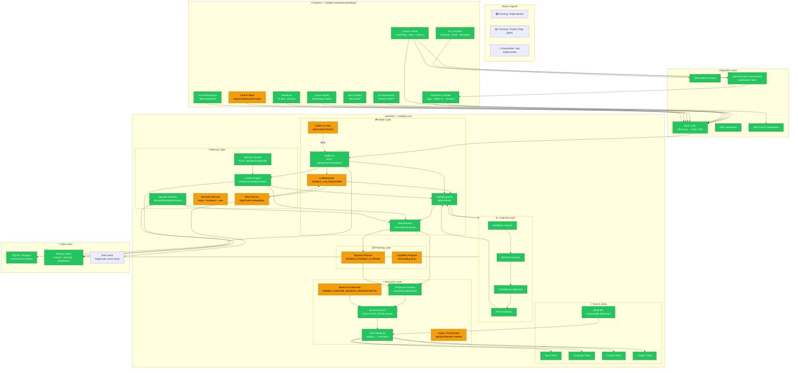
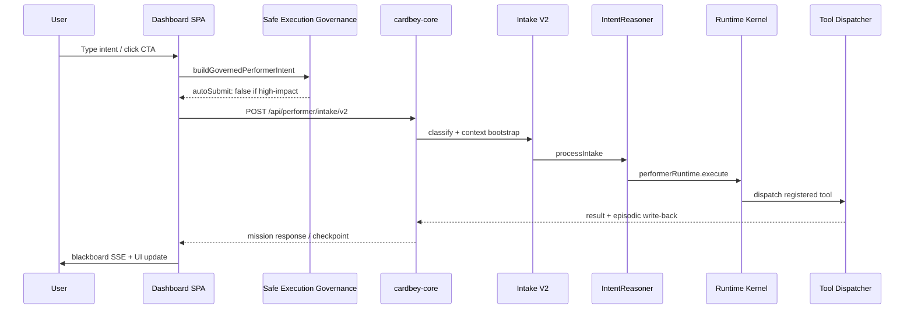

# Cardbey System Architecture

> **North star:** [The Cardbey Philosophy](./CARDBEY_PHILOSOPHY.md) — Independence, Opportunity, Capability.
> Major features should state which principle(s) they advance. Filter: *Build → Share → Multiply*.
> Design contract: [IMPACT_REPORT_TEMPLATE.md](./IMPACT_REPORT_TEMPLATE.md) — Principles Advanced, Trade-offs, Platform Capability Added.
>
> **Layers:** Philosophy (stable) → Platform (years) → Applications (continuous).

Visual map of frontend, backend, integration points, and component maturity.

> **Status legend:** 🟢 Running · 🟡 Freezing / Partial · 🔴 Placeholder / Not implemented

---

## Full System Diagram

---

## Integration Flow (Performer Path)

---

## Component Status Matrix

| Layer | Component | Status | Notes |
|-------|-----------|--------|-------|
| **Frontend** | Performer Console | 🟢 Running | Primary surface at `/app` |
| | Control Center | 🟢 Running | `/marketing` + operations hero |
| | BI Governance | 🟢 Running | `/control-center/*` workflows |
| | PIL | 🟢 Running | Observe → Confirm → Performer handoff |
| | Storefront | 🟢 Running | Canonical renderer + commerce |
| | Ask Cardbey | 🟢 Running | Hidden on Performer-first surfaces |
| | Layout Studio | 🟢 Running | Standalone layout tool |
| | Control Tower | 🟡 Partial | Overview wired; tabs mock |
| | Console sidebar stubs | 🔴 Placeholder | stores/products/integrations |
| **Intake** | Intake V2 | 🟢 Running | Primary API entry |
| | Intake V1 | 🟡 Freezing | Deprecated shim to V2 |
| | LLMReasoner | 🟡 Freezing | Flag-off by default |
| | IntentReasoner | 🟢 Running | Always-on deterministic path |
| | ReactPlanner | 🟢 Running | ask/confirm/execute layer |
| **Planning** | Dynamic Planner | 🟡 Freezing | Flag-off by default |
| | Capability Proposal | 🟡 Partial | Self-building hints |
| **Execution** | Runtime Kernel | 🟢 Running | Default `EXECUTION_MODE=kernel` |
| | Tool Dispatcher | 🟢 Running | Registry → executors |
| | Mission Orchestrator | 🟡 Freezing | Proactive step sequencing |
| | Legacy Orchestrator | 🟡 Partial | Creative `/api/orchestrator` |
| **Memory** | Context Engine | 🟢 Running | Session workflow state |
| | Episodic Memory | 🟢 Running | Blackboard events |
| | Memory Facade | 🟢 Running | Unified bundle API |
| | RAG | 🟡 Partial | Schema + service; reasoner flag-off |
| | Semantic Memory | 🟡 Partial | Distributed (no single module) |
| **Learning** | Feedback / Analysis / Calibration / Personalization | 🟢 Running | Wired into reasoner |
| **Tools** | Store / Campaign / Product / Graphic | 🟢 Running | Registered executors |
| | Skills | 🟢 Running | Mixed real/stub executors |
| **Data** | SQLite / Postgres | 🟢 Running | Prisma dual schema |
| | Memory Store | 🟢 Running | Context + learning + blackboard |
| | RAG Store | 🟡 Partial | RagChunk exists; usage partial |

---

## Summary Statistics

| Status | Count | Share |
|--------|-------|-------|
| 🟢 Running | 24 | 62% |
| 🟡 Freezing / Partial | 13 | 34% |
| 🔴 Placeholder | 2 | 5% |
| **Overall maturity** | — | **~78% production-ready** |

---

## Key Entry Points

| Concern | Path |
|---------|------|
| Frontend routes | `apps/dashboard/cardbey-marketing-dashboard/src/App.jsx` |
| Performer intake client | `src/app/console/performer/useIntakeV2.ts` |
| Control Center | `src/components/controlCenter/CardbeyControlCenter.tsx` |
| Governance | `src/lib/governance/safeExecutionGovernance.ts` |
| Backend server | `apps/core/cardbey-core/src/server.js` |
| Intake V2 pipeline | `apps/core/cardbey-core/src/routes/performerIntakeV2Routes.js` |
| Feature flags | `apps/core/cardbey-core/.env.example` |

---

## Related Docs

- [CARDBEY_CONTROL_CENTER_AUDIT.md](./CARDBEY_CONTROL_CENTER_AUDIT.md)
- [CONTROL_CENTER_PHASE_E_PIL.md](./CONTROL_CENTER_PHASE_E_PIL.md)
- [UNIFIED_PERFORMER_RUNWAY.md](./UNIFIED_PERFORMER_RUNWAY.md)
- [CONTEXT_ENGINE.md](./CONTEXT_ENGINE.md)
